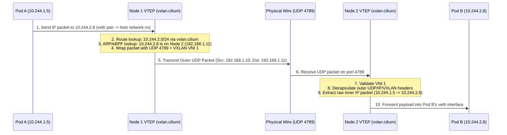
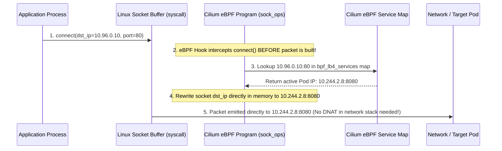

# 00. Kubernetes Networking Deep Dive: VXLAN, BGP, eBPF, and IPAM Mechanics

Understanding lower-layer Kubernetes networking is fundamental to designing robust container platforms and Service Meshes like Istio. This document breaks down the packet-level mechanics of **Overlay Networks (VXLAN/Geneve)**, **Underlay/Direct Routing (BGP)**, **IPAM (IP Address Management)**, **eBPF vs. iptables Datapaths**, **K3s Networking Internals**, and **External DNS Integration**.

---

## 1. Underlay vs. Overlay Networks: Core Architectural Principles

When a container is created inside Kubernetes, it receives a network interface and an IP address. How traffic flows from that IP to another Pod or external VM depends on whether the CNI operates as an **Overlay** or an **Underlay (Direct Routing)** network.

```
┌────────────────────────────────────────────────────────────────────────┐
│                        PHYSICAL / VIRTUAL NETWORK                      │
│                  Physical Routers / ToR Switches / Subnets             │
└───────────────────┬────────────────────────────────┬───────────────────┘
                    │                                │
      ┌─────────────┴──────────────┐   ┌─────────────┴──────────────┐
      │   K8s Node 1 (192.168.1.10)│   │   K8s Node 2 (192.168.1.11)│
      ├────────────────────────────┤   ├────────────────────────────┤
      │ OVERLAY MODE (VXLAN):      │   │ OVERLAY MODE (VXLAN):      │
      │ Encapsulates Pod Traffic   │   │ Encapsulates Pod Traffic   │
      │ Inside UDP Packet (4789)   │   │ Inside UDP Packet (4789)   │
      │ Pod A (10.244.1.5)         │   │ Pod B (10.244.2.8)         │
      │                            │   │                            │
      │ UNDERLAY MODE (BGP/Direct):│   │ UNDERLAY MODE (BGP/Direct):│
      │ Pod IPs advertised to ToR  │   │ Pod IPs advertised to ToR  │
      │ No encapsulation overhead  │   │ No encapsulation overhead  │
      └────────────────────────────┘   └────────────────────────────┘
```

### 1.1 Underlay Network (Direct / Native Routing)
An **Underlay** network uses the physical/virtual network infrastructure directly. 
* Pod IPs are chosen from a subnet that physical routers and switches recognize, OR Pod subnet routes are advertised to top-of-rack (ToR) routers via BGP.
* Packets travel across the network wire with their **original Pod IP headers intact**.
* **Zero Encapsulation Overhead:** Maximum Transmission Unit (MTU) is standard (1500 bytes for standard Ethernet, 9000 bytes for Jumbo frames).

### 1.2 Overlay Network (Encapsulated)
An **Overlay** network creates a virtual logical network on top of the physical network by wrapping (encapsulating) Pod-to-Pod L2/L3 frames inside standard host-level L3/L4 UDP packets.
* Physical network devices (routers, firewalls, switches) **only see the Host Node IPs** (`192.168.1.10` -> `192.168.1.11`). They have no awareness of Pod IPs (`10.244.1.5` -> `10.244.2.8`).
* Every packet incurs header overhead due to encapsulation, reducing usable MTU (e.g., 1500 - 50 = 1450 bytes for VXLAN).

---

## 2. VXLAN Mechanics & Packet Encapsulation Deep Dive

**VXLAN (Virtual Extensible LAN)** is an RFC 7348 standard for running an overlay Layer 2/3 network across a Layer 3 infrastructure using UDP encapsulation on port `4789`.

### 2.1 Key Components of VXLAN
1. **VTEP (VXLAN Tunnel Endpoint):** A virtual network interface created by the CNI (e.g., `flannel.1`, `vxlan.cilium`, `cilium_vxlan`) residing on each Kubernetes node. The VTEP performs the encapsulation (outer header creation) and decapsulation (outer header removal).
2. **VNI (VXLAN Network Identifier):** A 24-bit field in the VXLAN header that identifies the virtual network segment (allowing up to 16.7 million virtual networks, compared to 4096 in standard VLANs). In Kubernetes CNI implementations, VNI `1` is typically used for default pod traffic.

### 2.2 Complete Packet Structure
When Pod A (`10.244.1.5`) on Node 1 (`192.168.1.10`) sends a packet to Pod B (`10.244.2.8`) on Node 2 (`192.168.1.11`), the wire packet looks like this:

```
┌─────────────────────────────────────────────────────────────────────────────────────────────────┐
│ Outer Ethernet Header │ Outer IP Header    │ Outer UDP Header │ VXLAN Header │ Inner Packet Payload│
│ Src: Node1 MAC        │ Src: 192.168.1.10  │ Src Port: 52341  │ VNI: 1       │ Src IP: 10.244.1.5  │
│ Dst: Node2 MAC        │ Dst: 192.168.1.11  │ Dst Port: 4789   │ Flags: 0x08  │ Dst IP: 10.244.2.8  │
└─────────────────────────────────────────────────────────────────────────────────────────────────┘
│◄──────────────────────── Outer Header (50 Bytes Overhead) ─────────────────►│◄── Inner Payload ──►│
```

#### Detailed Breakdown of Overhead (50 Bytes):
* **Outer Ethernet Header:** 14 Bytes (MAC Address destination/source + EtherType `0x0800`)
* **Outer IP Header:** 20 Bytes (Standard IPv4 header containing Node IPs)
* **Outer UDP Header:** 8 Bytes (Source port generated dynamically for entropy/hash balancing, Destination Port `4789`)
* **VXLAN Header:** 8 Bytes (Flags + 24-bit VNI + Reserved fields)
* **Total Overhead:** 14 + 20 + 8 + 8 = **50 Bytes**.
* **MTU Impact:** If the physical network MTU is `1500` bytes, the Pod interface (`eth0`) MTU **MUST** be set to `1450` bytes (`1500 - 50`). Failing to adjust MTU leads to IP packet fragmentation and severe TCP throughput degradation.

### 2.3 Step-by-Step Packet Walk over VXLAN



---

## 3. Direct / Native Routing & BGP Peering

When low latency and high network throughput are required, encapsulation is eliminated by operating in **Native Routing** mode.

```
┌────────────────────────────────────────────────────────────────────────┐
│                        TOP OF RACK (ToR) ROUTER                        │
│                 BGP Peer IP: 192.168.1.1 (ASN 65000)                   │
│         BGP Route Table:                                               │
│         - 10.244.1.0/24 via 192.168.1.10 (Node 1)                      │
│         - 10.244.2.0/24 via 192.168.1.11 (Node 2)                      │
│         - 10.96.0.0/16  via 192.168.1.10 & 192.168.1.11 (ECMP LoadBal)   │
└───────────────────┬────────────────────────────────┬───────────────────┘
                    │ BGP Session                    │ BGP Session
                    ▼                                ▼
      ┌────────────────────────────┐   ┌────────────────────────────┐
      │ Node 1 (192.168.1.10)      │   │ Node 2 (192.168.1.11)      │
      │ Cilium BGP Daemon (ASN 65001)  │ Cilium BGP Daemon (ASN 65001)│
      │ Pod Subnet: 10.244.1.0/24  │   │ Pod Subnet: 10.244.2.0/24  │
      └────────────────────────────┘   └────────────────────────────┘
```

### 3.1 Cilium Direct Routing (`routingMode: native`)
In Cilium Native Routing mode:
1. Cilium does not create `cilium_vxlan` interfaces.
2. Packets emitted by Pod A (`10.244.1.5`) destined for Pod B (`10.244.2.8`) are placed directly onto the host network interface (`eth0`).
3. The underlying network (AWS VPC, Azure VNet, or physical network switches) must know how to route `10.244.2.0/24` to Node 2 (`192.168.1.11`).

### 3.2 BGP Control Plane Mechanics
To inform external physical routers about Pod CIDRs and Kubernetes Service IPs without manual static routes, CNIs run a **BGP Daemon** (e.g., Cilium BGP Control Plane, Calico BIRD, or GoBGP).

* **Peering:** Each Kubernetes node establishes a BGP peering session (TCP port `179`) with the network switch (ToR Router).
* **Pod Subnet Advertisement:** Node 1 advertises: *"I am the next-hop gateway for `10.244.1.0/24`"*.
* **Service IP (ClusterIP / LoadBalancer) Advertisement:** When a Kubernetes Service of `type: LoadBalancer` is assigned IP `10.96.100.50`, the BGP daemon advertises `10.96.100.50/32` from **all** nodes running that service workload.
* **ECMP (Equal-Cost Multi-Path):** The physical router receives routes for `10.96.100.50/32` from Node 1 and Node 2. It performs hardware-level ECMP load balancing across both node IPs.

---

## 4. IPAM (IP Address Management) Deep Dive

IPAM determines how IP addresses are assigned to Pods, Nodes, and Interfaces.

```
┌────────────────────────────────────────────────────────────────────────┐
│                        CILIUM IPAM ARCHITECTURE                        │
└──────────────────────────────────┬─────────────────────────────────────┘
                                   │
      ┌────────────────────────────┼────────────────────────────┐
      ▼                            ▼                            ▼
┌──────────────┐             ┌──────────────┐            ┌──────────────┐
│ cluster-pool │             │  k8s (Node)  │            │ External DHCP│
├──────────────┤             ├──────────────┤            ├──────────────┤
│ Cilium Alloc │             │ Reads K8s    │            │ CNI DHCP     │
│ per-node     │             │ Spec.podCIDR │            │ Plugin queries│
│ /24 subnet   │             │ assigned by  │            │ external DHCP│
│ locally.     │             │ K8s Controller│           │ Server (MAC) │
└──────────────┘             └──────────────┘            └──────────────┘
```

### 4.1 Cilium IPAM Modes Explained

1. **`cluster-pool` (Default):**
   * Cilium operator manages a large Pod CIDR block (e.g., `10.244.0.0/16`).
   * It assigns a smaller slice (e.g., `10.244.1.0/24`) to each node.
   * `cilium-agent` on Node 1 manages `10.244.1.0/24` locally in an eBPF map.
2. **`k8s` Mode:**
   * Delegates subnet assignment to Kubernetes core `kube-controller-manager`.
   * Reads `node.spec.podCIDR` assigned to the Kubernetes Node object.
3. **Cloud-Native IPAM (`aws-eni` / `azure` / `gke`):**
   * Pods do not use `10.244.x.x` IPs.
   * `cilium-agent` communicates directly with AWS/Azure APIs to attach secondary Elastic Network Interfaces (ENIs) or secondary IP addresses to the host.
   * Pods get **real VPC IPs** (e.g., `172.31.10.45`) directly from the cloud subnet.
4. **`dhcp` Plugin Mode:**
   * Uses a standard CNI DHCP binary (`/opt/cni/bin/dhcp`) running as a daemon on the node.
   * When a Pod starts, the DHCP plugin broadcasts a DHCP Request over the physical network using the Pod's virtual MAC address.
   * An **external corporate DHCP server** (e.g., Infoblox, Windows DHCP, or pfSense) responds with an IP address, subnet mask, and default gateway.

### 4.2 Does Cilium still provide IPs when using External DHCP / Cloud ENIs?
**No.** When using `dhcp` or `aws-eni` IPAM:
* Cilium disables its internal IP allocator pool.
* Cilium acts purely as the **Datapath & Enforcement engine** (eBPF packet processing, network policy, security filtering).
* The IP assignment is fully delegated to the external DHCP server or Cloud Provider Control Plane.

---

## 5. Kubernetes Services, Data Plane Mechanics & eBPF Socket Interception

A `ClusterIP` is a virtual IP that does not exist on any physical or virtual netdev interface. How traffic to `10.96.0.10:80` reaches Pod `10.244.1.5:8080` depends on the datapath implementation.

```
┌────────────────────────────────────────────────────────────────────────┐
│                        DATAPATH EVOLUTION                              │
└──────────────────────────────────┬─────────────────────────────────────┘
                                   │
      ┌────────────────────────────┼────────────────────────────┐
      ▼                            ▼                            ▼
┌──────────────┐             ┌──────────────┐            ┌──────────────┐
│  iptables    │             │     IPVS     │            │ eBPF (Cilium)│
├──────────────┤             ├──────────────┤            ├──────────────┤
│ Sequential   │             │ IPVS Hash    │            │ Socket Layer │
│ O(N) chain   │             │ table lookup │            │ Interception │
│ evaluation   │             │ O(1) in Net  │            │ Direct map   │
│ in Kernel    │             │ Namespace    │            │ translation  │
└──────────────┘             └──────────────┘            └──────────────┘
```

### 5.1 Datapath Comparison: `iptables` vs. `IPVS` vs. `eBPF`

#### A. `iptables` (kube-proxy)
* `kube-proxy` generates long sequential rule chains (`KUBE-SERVICES`, `KUBE-SVC-XXX`, `KUBE-SEP-XXX`).
* Every packet must traverse these chains in order (**$O(N)$ complexity**, where $N$ is the number of total endpoints).
* For 10,000 services, packet latency increases drastically, and updating rules consumes high CPU.

#### B. `IPVS` (IP Virtual Server)
* Uses Linux IPVS kernel module based on hash tables (**$O(1)$ complexity**).
* Scales significantly better than `iptables`, but still relies on Netfilterhooks and standard kernel network stack packet traversal.

#### C. `eBPF` Host-Reachable Services (Cilium Host Routing)
Cilium eliminates `kube-proxy` entirely by attaching eBPF programs directly to Linux socket operations (`sock_ops`, `cgroup/connect4`).



### 5.2 Why eBPF Socket Interception is Faster
In standard `iptables`:
1. Application constructs a TCP SYN packet to `10.96.0.10`.
2. Packet enters Linux TCP/IP stack.
3. Passes through Netfilter `PREROUTING` and `OUTPUT` chains.
4. `iptables` rule executes `DNAT` (Destination NAT), changing target to `10.244.2.8`.
5. Packet recalculated (checksum updated) and routed.

In **Cilium eBPF Host-Reachable Services**:
1. When the application executes the `connect()` system call, the eBPF hook **rewrites the socket destination address in kernel memory before the packet is even created**.
2. The application's socket directly connects to `10.244.2.8`. No DNAT, no packet header modifications, no checksum updates, and zero Netfilter overhead!

---

## 6. K3s Networking Internals & Cilium Migration

**K3s** is a lightweight Kubernetes distribution that packages networking components in a single binary.

```
┌────────────────────────────────────────────────────────────────────────┐
│                        K3S DEFAULT NETWORKING                          │
│                                                                        │
│  ┌──────────────────────────────────────────────────────────────────┐  │
│  │ K3s Process (k3s server / agent)                                 │  │
│  │  ├── Flannel CNI (Embedded, VXLAN backend on port 8472)          │  │
│  │  ├── kube-proxy (Embedded, iptables mode)                        │  │
│  │  └── Klipper LoadBalancer (svclb DaemonSet using hostPorts)      │  │
│  └──────────────────────────────────────────────────────────────────┘  │
└────────────────────────────────────────────────────────────────────────┘
```

### 6.1 Default K3s Stack
* **Flannel CNI:** Runs embedded inside K3s. Uses VXLAN on UDP port `8472` (Note: standard Flannel uses `8472`, whereas standard IANA VXLAN is `4789`).
* **kube-proxy:** Runs embedded in iptables mode.
* **Klipper LoadBalancer (`svclb`):** Uses hostPorts to forward incoming traffic on port 80/443 to service pods.

### 6.2 Disabling Default K3s Components for Cilium eBPF Setup
To run Cilium in full eBPF mode (replacing kube-proxy, Flannel, and Klipper), K3s must be booted with specific flags:

```bash
# Installing K3s Server with Flannel, Kube-Proxy, and Klipper disabled:
curl -sfL https://get.k3s.io | INSTALL_K3S_EXEC="--flannel-backend=none \
  --disable-network-policy \
  --disable=servicelb \
  --disable=traefik \
  --disable-kube-proxy" sh -
```

### 6.3 Deploying Cilium on K3s in Full eBPF Mode with BGP
Once K3s is running, install Cilium via Helm:

```bash
helm install cilium cilium/cilium \
  --namespace kube-system \
  --set kubeProxyReplacement=true \
  --set k8sServiceHost=127.0.0.1 \
  --set k8sServicePort=6443 \
  --set routingMode=native \
  --set autoDirectNodeRoutes=true \
  --set bgpControlPlane.enabled=true \
  --set ipam.mode=cluster-pool
```

---

## 7. Cross-Boundary DNS Integration & External DNS

When workloads on external VMs need to discover Kubernetes Pods or Services, standard internal CoreDNS (`10.96.0.10`) is inaccessible without external integration.

```
┌────────────────────────────────────────────────────────────────────────┐
│                  EXTERNAL / CORPORATE DNS INFRASTRUCTURE               │
│                  (BIND9 / Infoblox / AWS Route53 / PowerDNS)           │
└──────────────────────────────────┬─────────────────────────────────────┘
                                   │
                                   │ 3. Syncs A Records
                                   ▼
┌────────────────────────────────────────────────────────────────────────┐
│ KUBERNETES CLUSTER                                                     │
│                                                                        │
│  ┌────────────────────────┐         ┌──────────────────────────────┐  │
│  │ ExternalDNS Controller │ ──────► │ Service / WorkloadEntry      │  │
│  │ (Watches K8s Resources)│         │ my-app.example.com           │  │
│  └────────────────────────┘         └──────────────────────────────┘  │
│                                                                        │
│  ┌──────────────────────────────────────────────────────────────────┐  │
│  │ CoreDNS (ClusterIP: 10.96.0.10)                                  │  │
│  │ - Answers *.cluster.local for internal pods                      │  │
│  │ - Forwards unknown domains to upstream corporate DNS             │  │
│  └──────────────────────────────────────────────────────────────────┘  │
└────────────────────────────────────────────────────────────────────────┘
```

### 7.1 How ExternalDNS Works
**ExternalDNS** is a Kubernetes controller that monitors Kubernetes `Services`, `Ingresses`, and Istio `WorkloadEntries`/`ServiceEntries`.
1. A developer deploys a service with an annotation:
   `external-dns.alpha.kubernetes.io/hostname: my-vm-app.example.com`.
2. ExternalDNS detects the resource and extracts the target IP (e.g., LoadBalancer IP or East-West Gateway IP).
3. ExternalDNS makes an API call to the external DNS provider (Infoblox, Route53, BIND) to create an `A` record pointing `my-vm-app.example.com` to that external/gateway IP.

### 7.2 Resolving `.cluster.local` from External VMs
If an external VM needs to resolve `my-service.default.svc.cluster.local`:

* **Method 1: CoreDNS BGP / LoadBalancer Exposure:**
  Expose CoreDNS service (`udp/53`) via BGP or LoadBalancer IP (`192.168.1.200`). Configure the VM's `/etc/systemd/resolved.conf` or `/etc/resolv.conf` to use `192.168.1.200` as a conditional forwarder for domain `cluster.local`.
* **Method 2: Istio DNS Proxying:**
  Istio sidecars running on VMs intercept DNS queries locally on `127.0.0.1:53`. When the VM queries `my-service.default.svc.cluster.local`, Envoy answers directly from its xDS memory cache without making a wire network call!

---

## 8. Comprehensive Comparison Tables

### 8.1 Overlay vs. Direct Routing vs. Cloud CNI

| Feature | Overlay (VXLAN / Geneve) | Native Routing (BGP) | Cloud CNI (AWS ENI / Azure) |
| :--- | :--- | :--- | :--- |
| **Encapsulation** | **Yes** (UDP Port 4789) | **None** | **None** |
| **Header Overhead** | **50 Bytes** (MTU = 1450) | **0 Bytes** (MTU = 1500) | **0 Bytes** (MTU = 1500) |
| **Network Hardware Requirement** | Any basic L2/L3 switch | BGP-capable ToR Router | Cloud Provider VPC |
| **Cross-Subnet Pod Communication** | Seamless (Encapsulated in Node IP) | Requires ToR routes/BGP | Seamless inside VPC |
| **VM Direct Reachability** | ❌ Requires Gateway | ✅ Direct IP Reachable | ✅ Direct IP Reachable |
| **Performance / CPU** | Slight CPU cost for encap/decap | Maximum Wire Speed | Maximum Wire Speed |

### 8.2 Datapath Performance Matrix

| Metric | `iptables` (kube-proxy) | `IPVS` | `eBPF` (Cilium) |
| :--- | :--- | :--- | :--- |
| **Complexity** | $O(N)$ Sequential | $O(1)$ Hash Table | $O(1)$ Direct Map Lookup |
| **Scale Limit** | ~5,000 Services | ~50,000 Services | 100,000+ Services |
| **Socket Interception** | ❌ No (Netfilter Layer) | ❌ No (Netfilter Layer) | ✅ **Yes** (`sock_ops` / `connect4`) |
| **CPU Usage on Rule Updates** | High (Full table reload) | Low (Incremental update) | Near-Zero (Atomic BPF map edit) |
| **Network Policy Enforcement** | Sequential iptables | Sequential iptables | eBPF Map lookup at egress/ingress |

### 8.3 K3s Default vs. K3s + Cilium eBPF

| Component | Default K3s | K3s + Cilium eBPF |
| :--- | :--- | :--- |
| **CNI Engine** | Flannel (VXLAN UDP 8472) | Cilium (eBPF / Direct Routing BGP) |
| **Service Proxy** | `kube-proxy` (iptables) | Cilium eBPF Host-Reachable Services |
| **LoadBalancer** | Klipper (`svclb` hostPorts) | Cilium BGP / L2 Announcements |
| **Network Policy** | Basic (or disabled) | Full L3/L4/L7 eBPF Filtering + FQDN rules |
| **MTU** | 1450 Bytes | 1500 Bytes (in Native Routing mode) |


### 8.4 VM vs. Pod vs. Service Reachability Matrix

| From Source | To Destination | Overlay Mode | Direct BGP Mode | Multi-Network (Istio Mesh) |
| :--- | :--- | :--- | :--- | :--- |
| **External VM** | **Pod IP** | ❌ Unreachable | ✅ Direct Reachable | ❌ Via East-West Gateway |
| **External VM** | **ClusterIP** | ❌ Unreachable | ✅ Reachable (if BGP advertised) | ❌ Via East-West Gateway |
| **External VM** | **ServiceEntry / WorkloadEntry** | ❌ Unreachable | ✅ Direct Reachable | ✅ Reachable via East-West GW (:15443) |
| **Pod inside K8s** | **External VM IP** | ✅ Via Node NAT / Egress | ✅ Direct Reachable | ✅ Direct or via Gateway |
| **Pod inside K8s** | **Pod in Remote Cluster** | ❌ Unreachable | ✅ Direct Reachable | ✅ Reachable via East-West GW (:15443) |

---

## 9. In-Depth Technical Clarifications & Advanced Q&A

### 9.1 What are the VXLAN Flags (`Flags: 0x08`)?
In the 8-byte VXLAN header, `0x08` represents the **Instance Bit (I-flag)** set to `1` in binary (`0000 1000`).
* **Why it exists:** The RFC 7348 spec states that when the `I` bit is set to `1`, the 24-bit VNI field inside the header contains a valid Virtual Network Identifier. If this flag bit is not set, the receiving VTEP drops the packet as malformed.
* **Other Flags:** Remaining flag bits are reserved for extensions (e.g., GBP - Group Based Policy flags `0x80` used by Cisco ACI/Cilium for security identity tagging).

### 9.2 MTU Configuration & Jumbo Frames (MTU 9000)
The recommendation depends on whether you control the physical network hardware:

* **Scenario A: Standard Physical Infrastructure (MTU 1500)**
  * Physical Switches / Routers: `1500` Bytes.
  * Node `eth0` Interface: `1500` Bytes.
  * Pod `eth0` Interface (Overlay): **`1450` Bytes** (`1500 - 50` VXLAN overhead).

* **Scenario B: Enterprise / Private Cloud with Jumbo Frames Enabled (MTU 9000)**
  * Physical Switches / ToR Routers / Node `eth0`: Configured to **`9000` Bytes**.
  * Pod `eth0` Interface (Overlay): Configured to **`8950` Bytes** (`9000 - 50`).
  * **Result:** Massively increases TCP throughput and reduces CPU utilization during heavy pod-to-pod data transfers because 6x fewer packets are processed per gigabyte of data.

### 9.3 Who Advertises Service VIPs (`10.96.0.0/16`) to the ToR Router?
Service VIP routes are **never manually configured as static routes**. They are advertised dynamically by the CNI's BGP daemon:

1. **Cilium BGP Daemon / GoBGP:** Cilium runs an embedded GoBGP speaker inside `cilium-agent`.
2. **ClusterIP / LoadBalancer Watching:** When a K8s Service is created with `type: LoadBalancer` or when `bgpControlPlane` is configured to export `ClusterIP` CIDRs, Cilium automatically generates a BGP `UPDATE` message.
3. **Advertisement:** Cilium sends `10.96.0.0/16 via <Node_IP>` to the physical ToR router over TCP port `179`.
4. **ECMP Multipathing:** Since every node running Cilium advertises this route, the ToR router uses **Equal-Cost Multi-Path (ECMP)** to distribute incoming traffic evenly across all K8s node IPs.

### 9.4 CNI Selection & IPAM Architecture Choices
* **Is Cilium the best overall CNI?** For modern enterprise Kubernetes, **Yes**. Cilium is currently the industry standard due to its native eBPF datapath, built-in BGP control plane, L7 security policy enforcement, and Hubble observability.
* **`k8s` IPAM Mode & `node.spec.podCIDR`:**
  * **Who assigns it?** The **`kube-controller-manager`** (running on the control plane) assigns `spec.podCIDR` (e.g., `10.244.1.0/24`) to each Node object during node registration.
  * **Does Kubelet do it?** Kubelet accepts the flag `--pod-cidr` from the control plane, but the allocation authority is `kube-controller-manager` (via flag `--allocate-node-cidrs=true`).
  * **Manual Assignment:** You can manually assign `podCIDR` per node in the Node manifest if desired, but letting `kube-controller-manager` or `cilium-operator` (`cluster-pool` mode) allocate it automatically provides maximum flexibility and avoids human allocation errors.

### 9.5 `dhcp` CNI Plugin Mode & Private Cloud DHCP/DNS Architecture

#### A. Private Cloud DHCP Server Recommendation
For private clouds using standard CNI `dhcp` mode:
* **Recommended Servers:** **Infoblox NIOS**, **Kea DHCP** (the modern open-source successor to ISC DHCP), or **pfSense / OPNSense DHCPd**.
* **Cloud-Native Design:** **Kea DHCP** is the best open-source choice. It features a REST API, supports dynamic lease updates, and can store subnet leases in PostgreSQL or MySQL.
* **Per-Node DHCP Subnets for BGP:** Yes! Configure your DHCP server with **DHCP Relay** or distinct DHCP Scopes based on the Node's MAC/Option 82 identifier. This ensures Node A's pods receive IPs from `10.100.1.0/24` and Node B's pods receive IPs from `10.100.2.0/24`, allowing ToR routers to aggregate routes per node.

#### B. Open-Source Programmable DNS for ExternalDNS Integration
To allow ExternalDNS to program external DNS records dynamically:
* **Best Open-Source Enterprise DNS:** **PowerDNS** or **CoreDNS** (running externally in standalone server mode).
* **Why PowerDNS?** PowerDNS has a built-in, production-grade **REST API** (`/api/v1/servers/localhost/zones`). ExternalDNS has native support for PowerDNS out of the box.
* **Using CoreDNS externally:** You can run CoreDNS as a standalone systemd service on an external VM using the `etcd` or `pdns` backend plugin. ExternalDNS updates `etcd`, and CoreDNS serves queries to external VMs.

### 9.6 Inspecting Datapaths: eBPF & `iptables` Inspection Tools

Unlike `iptables`, eBPF rules do not exist in `/etc/sysconfig/iptables` or standard kernel chains. They live as compiled bytecode inside kernel BPF maps.

#### A. eBPF CLI & Web GUI Inspection Tools
1. **`cilium` CLI (Command Line):**
   ```bash
   # Inspect all eBPF endpoints managed on the node
   cilium endpoint list

   # View the active eBPF LoadBalancer/Service maps (O(1) table)
   cilium bpf lb list

   # View active eBPF network policy map
   cilium bpf policy get --all
   ```
2. **`bpftool` (Native Linux Kernel Inspection Tool):**
   ```bash
   # List all loaded eBPF programs in the Linux kernel
   bpftool prog list

   # List all active BPF maps storing state
   bpftool map list

   # Dump contents of a specific BPF map
   bpftool map dump id <map_id>
   ```
3. **Hubble UI (Web-Based GUI for Cilium eBPF):**
   **Hubble** is the official web GUI and observability platform for Cilium eBPF. It provides a real-time service map, network flow visualization, HTTP/gRPC L7 metric tracing, and drop reason analysis directly extracted from eBPF tracepoints.

#### B. `iptables` GUI Inspection Tools
* While `iptables -L -n -v` or `iptables-save` are the standard CLI methods, open-source GUIs like **fwbuilder** (Firewall Builder) or **Webmin Networking Module** exist for visualizing legacy iptables chains. However, in Kubernetes, `iptables` chains are auto-generated and read-only, so inspecting them via `cilium bpf lb list` or `iptables-save` is standard practice.
