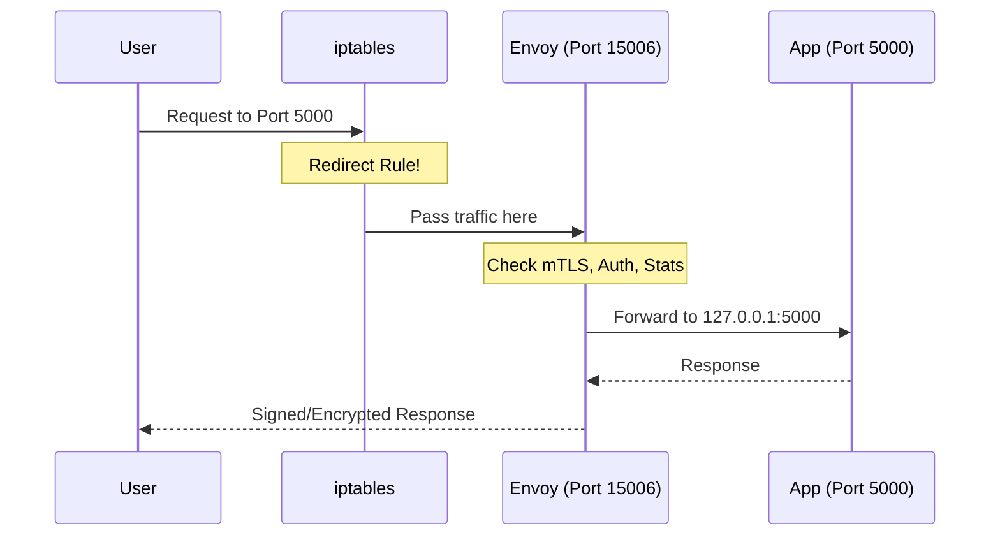
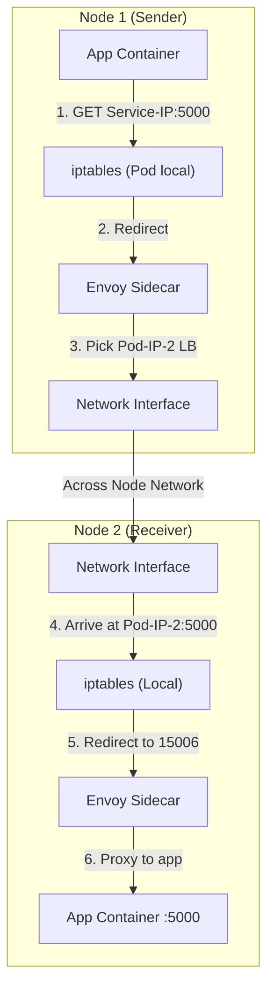
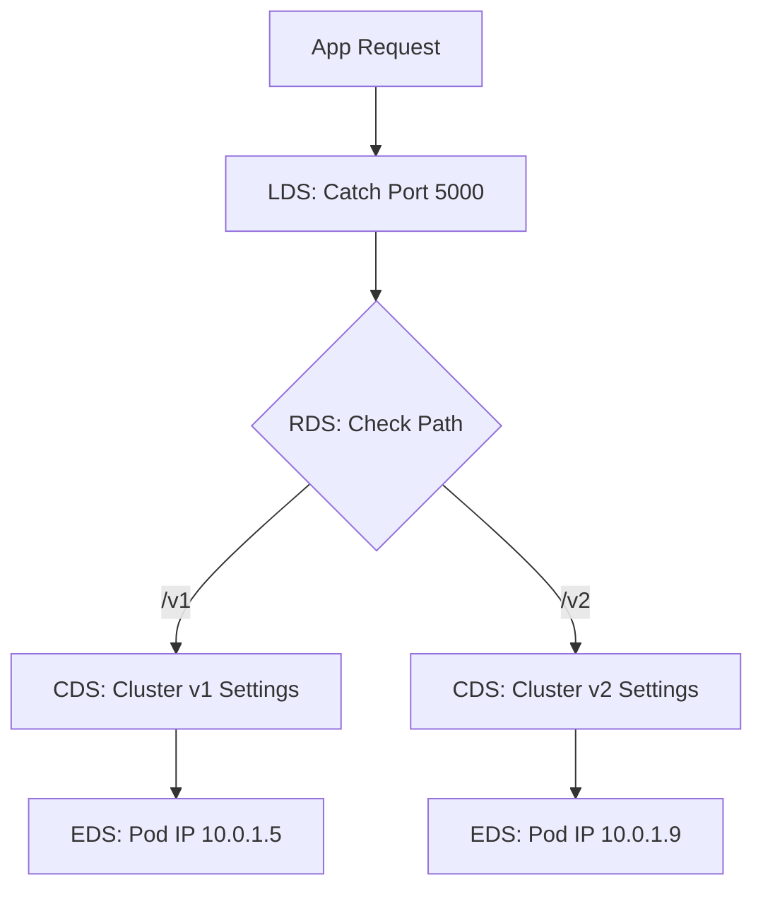

## Understanding the Ports: 15001 and 15006

### My Application is listening on port 5000. How does Istio intercept traffic without breaking my app?

This is the most critical part of understanding **Sidecar Injection**. It is often confusing because it seems like two things (Envoy and your App) are trying to use the same port, which is normally impossible in Linux.

Here is exactly how Istio solves this using **iptables** and the specific ports you mentioned.

---

### 1. The Short Answers
*   **Does Istio listen on port 5000?** No. 
*   **Does your pod still listen on port 5000?** Yes, your application container still listens on port 5000.
*   **How does it intercept?** Istio uses **iptables** (at the Network Layer) to "steal" the packets and redirect them to itself before they reach your app.

---

### 2. The Purpose of 15001 and 15006

Think of Envoy as a "Security Guard" standing in front of your App.

#### **Port 15001 (The Outbound Gate)**
*   **Role:** This is where **Outbound** traffic goes.
*   **Flow:** When your app tries to call `http://google.com`, the request leaves your container. `iptables` sees it leaving, pauses it, and forces it into Envoy on port **15001**. 
*   **Why?** So Envoy can apply your `VirtualService` rules, retries, and headers before the packet actually leaves the pod.

#### **Port 15006 (The Inbound Gate)**
*   **Role:** This is where all **Inbound** traffic is captured.
*   **Flow:** When someone calls your service on `http://pod-ip:5000`, the packet hits the Pod. `iptables` sees it arriving on port 5000 and says: *"Aha! You don't go to port 5000 yet. Go to Envoy on port **15006** first."*
*   **Why?** So Envoy can check mTLS certificates, verify permissions (AuthorizationPolicies), and log the traffic before handing it to your app.

---

### 3. How the "Hand-off" works (The Visual Flow)

When a request arrives at your pod on port **5000**:

1.  **Packet hits the Network Interface (eth0)**.
2.  **`iptables` Rule**: *"If traffic is for port 5000, redirect it to local port 15006"*.
3.  **Envoy (on 15006)**: Receives the packet. It sees the "Original Destination" was actually port 5000.
4.  **Envoy processing**: Envoy checks mTLS, stats, etc.
5.  **Envoy Forward**: Envoy then opens a *new* connection to `127.0.0.1:5000`.
6.  **Your App (on 5000)**: Receives the request from `localhost` (not from the original internet IP!).



---

### 4. Configuration in `meshConfig`

In your `IstioOperator` or `MeshConfig`, you generally don't change these unless you have a serious port conflict (e.g., your app also happens to use 15001).

```yaml
apiVersion: install.istio.io/v1alpha1
kind: IstioOperator
spec:
  meshConfig:
    defaultConfig:
      proxyListenPort: 15001         # Outbound capture
      proxyInboundListenPort: 15006  # Inbound capture
```

### 5. Why do we need this?
If Envoy simply listened on port 5000 instead of your app:
1.  You would have to change your application code to listen on a different port.
2.  Transparent mTLS would be impossible because the app wouldn't know when to start the "handshake."

**By using 15001/15006 + `iptables`, Istio achieves "Transparency." Your app thinks it's talking directly to the internet, but Envoy is secretly managing everything in the middle.**

**Pro-tip for CKA/ISTIO:** If you ever see an error like `loopback` or `connection refused` on port 15006, it usually means your `iptables` redirection is working, but Envoy itself has crashed or hasn't finished loading its config!

---
---


### 3. Istio and Linux Networking Fundamentals

This is where we move from "Istio the Controller" to **"Linux Networking Fundamentals."** To understand this, you need to understand the concept of **Network Namespaces.**

---

### 1. Who modifies the iptables?
It is **not** `istiod`. `istiod` stays safely on its own pods. 

When you deploy a pod with a sidecar, one of two things happens:
*   **Method A (Default): `istio-init` container.** A temporary container runs *before* your app starts. It has `NET_ADMIN` privileges and runs a script to "program" the iptables instructions.
*   **Method B (Production/Secure): `istio-cni`.** This is a separate service running on every host. It sees a new pod starting and "programs" the network from the *outside* so the pod doesn't need root/admin network permissions.

---

### 2. Is the Pod's iptables isolated from the Host?
**Yes. Absolutely.**

Kubernetes uses **Network Namespaces (netns)**. 
*   Think of the **Host** as a big house with its own plumbing (iptables).
*   Think of each **Pod** as a small apartment inside that house.
*   Each apartment has its **own private plumbing**. If you change a valve (iptable rule) inside the Pod, the Host and other Pods are **not affected**.

This is why Istio can redirect port 5000 inside "Pod A" without breaking port 5000 on the host or in "Pod B."

---

### 3. How is traffic routed? (Direct Pod IPs)

This is the biggest secret of Istio: **Istio bypasses `kube-proxy` logic for most traffic.**

#### How standard K8s works (Without Istio):
1. App calls `http://helloworld`.
2. DNS gives the **Service IP** (ClusterIP).
3. Packet hits the Host bridge.
4. Host `kube-proxy` (iptables) says: *"If traffic is for this Service IP, pick a Pod IP and NAT it."*

#### How Istio works:
1.  **App** calls `http://helloworld`. DNS returns the **Service IP**.
2.  **Envoy (Sidecar)** intercepts the request.
3.  **Envoy's Database:** Envoy already knows every single Pod IP for `helloworld` (it got this list from `istiod`).
4.  **Load Balancing:** Envoy chooses a specific **Pod IP** (e.g., `10.244.1.45`) based on its own logic (Round Robin, Least Conn, etc.).
5.  **Direct Connection:** Envoy sends the packet directly to that **Pod IP**.

#### Does Host Location matter?
*   **Same Host:** The CNI (like Calico or Cilium) sees the packet and sends it through the local virtual bridge (`cni0`).
*   **Different Host:** The CNI sees the IP is on another node. It "wraps" the packet (Encapsulation like VXLAN) and sends it to the other node's IP. 

---

### 4. Visual Summary: The Journey of a Packet



### Why do we use Service IPs at all then?
Even though Envoy sends traffic to **Pod IPs**, the **Service Name** is still used for:
1.  **Discovery:** Resolving the name to *something* so the app doesn't crash.
2.  **Identity:** Envoy uses the service name to look up which `VirtualService` or `DestinationRule` applies to this request.

**Summary for your memory:**
*   **Iptables:** Private to the pod (Network Namespace).
*   **Modification:** Done by `istio-init` or `istio-cni`.
*   **Routing:** Envoy bypasses Service-IP logic and talks directly to **Pod IPs**.

Does this "Private Plumbing" (Namespace) explanation make sense? It's the core of how containers stay isolated!

---
---

## 5. The DNS "Hand-off" (Why Istio doesn't use CoreDNS for every request)

You have captured the technical flow almost perfectly. Your `istioctl` output shows exactly how the "Source of Truth" shifts from **CoreDNS** to **Envoy's internal memory**.

Here is the exact step-by-step logic to solidify your understanding:

### 1. The DNS "Hand-off"
When your app calls `http://helloworld:5000`:
*   **Step A:** The **Application** asks the local OS for the IP of `helloworld`.
*   **Step B:** The OS asks **CoreDNS**. CoreDNS returns the **Service IP** (ClusterIP). 
*   **Crucial Point:** From this moment on, standard DNS is **finished**. The application now tries to send a packet to that Service IP.

### 2. Interception
*   The packet leaves the App container headed for the Service IP.
*   `iptables` inside the pod (the "Redirector") catches it and forces it into Envoy on port **15001** (Outbound) on the loopback interface (`127.0.0.1`).

### 3. Envoy's Database Lookup (No more DNS!)
Now Envoy has the packet. It looks at the **Destination Service IP** and the **Host Header**. It consults the tables you provided in your message:

`istioctl proxy-config all <pod-name> -o json`, get the listeners, clusters, endpoints, and routes.

#### **A. The Listener (WHERE are you talking to?)**
Envoy checks its **Listeners**. It sees a match for your Service IP/Port:
> `listener/10.97.63.16_5000` (The internal logic for your Helloworld Service IP).

#### **B. The Cluster (WHAT service is this?)**
The Listener points to a **Cluster**. In your output, you see things like:
> `cluster/outbound|80||fakeservice.default.svc.cluster.local ... EDS`
*   **EDS (Endpoint Discovery Service):** This tells Envoy: *"Do not use DNS to find these pods. Use my internal live list of actual Pod IPs."*

#### **C. The Endpoint (WHO exactly gets the packet?)**
Envoy looks at the **Endpoint** table for that cluster (the list you showed):
> `endpoint/10.0.1.33:9090  HEALTHY  outbound|80||fakeservice...`
> `endpoint/10.0.1.114:9090 HEALTHY  outbound|80||fakeservice...`
*   Envoy picks one of these **direct Pod IPs** based on its load-balancing math.

### 4. The Packet is sent
Envoy wraps the request and sends it directly to `10.0.1.33:9090`. 
*   **The Service IP is gone.** The packet traveling across the network is now addressed to the specific Pod IP.

---

### Why is this better than CoreDNS?
If Envoy used CoreDNS for every request:
1.  **Stale Data:** CoreDNS might point to a pod that just crashed 1 second ago.
2.  **Lack of Intelligence:** CoreDNS doesn't know about "Circuit Breakers" or "Outlier Detection."
3.  **Speed:** Looking up a table in memory (Envoy's database) is much faster than a network call to a DNS server.

### What if I call an External API? (e.g., `google.com`)
This uses the **`ORIGINAL_DST`** cluster you saw in your output:
> `cluster/... ORIGINAL_DST`
*   Envoy says: *"I don't have a list of IPs for google.com in my database. I will just let the packet go to exactly where the app originally intended (the IP resolved by DNS)."*

---

### Summary Checklist for you:
1.  **App -> CoreDNS:** "Give me the Service IP."
2.  **App -> Service IP:** Packet is sent.
3.  **App-Sidecar:** Intercepts. Bypasses Service IP.
4.  **Sidecar Table:** Finds actual Pod IPs (EDS).
5.  **Sidecar -> Pod IP:** Packet travels to its final destination.

**Does seeing the `EDS` label in your `istioctl` output help connect the dots? It's the flag that tells Envoy: "I'm the boss of the IPs now, ignore DNS."**

---
---

## 6. Why is the Route Table the most important part of Istio?

Your logic for the **L4 (Layer 4)** flow is excellent, but you are missing the **Layer 7 (L7) "Brain"**—and that is exactly what the **Route Table** is.

Without the Route Table, Istio would just be a simple TCP load balancer. With the Route Table, it becomes a sophisticated **Traffic Manager**.

---

### 1. The Envoy "Big Four" (LDS, RDS, CDS, EDS)

To remember the logic inside Envoy, think of it as a 4-step filtering process. Each step has its own abbreviation and purpose:

#### **Step 1: LDS (Listener Discovery Service) — THE DOOR**
*   **Envoy Table:** `listener`
*   **Logic:** "I see a packet on IP `10.97.63.16` and Port `5000`. Do I have a listener for this?"
*   **Action:** 
    *   If no, it allows the packet to continue to its original destination (if Istio configured as `outboundTrafficPolicy.mode: ALLOW_ANY`).
    *   If yes, it accepts the connection. If this is an HTTP connection, it hands it off to the...

#### **Step 2: RDS (Route Discovery Service) — THE BRAIN**
*   **Envoy Table:** `route` (This is where your **`VirtualService`** lives!) it looks inside the `VirtualService.spec.http.route` to see if it is defined?
    * if no, it uses the default route for that listener.
    * if yes, the istio-proxy buffers the first few bytes of the packet so it can read the Headers and Path. <br/>It "upgrades" its understanding from L4 to L7. It applies the rules (like path matching, header matching, etc.) to determine which **Cluster** to send the traffic to.
    
*   **Logic:** "I am looking **inside** the packet at the HTTP layer. I see the path is `/v1` and the user header is `QA-Tester`."
*   **Action:** It looks at the `route` table you provided. It sees:
    *   Match Path: `/v1` $\rightarrow$ Target: `version-one` cluster.
    *   Match Path: `/v2` $\rightarrow$ Target: `version-two` cluster.
*   **Purpose:** This is how Istio does **Canary deployments**, **Header-based routing**, and **Path-based routing**.

#### **Step 3: CDS (Cluster Discovery Service) — THE POLICY**
*   **Envoy Table:** `cluster` (This is where your **`DestinationRule`** lives!)
*   **Logic:** "Okay, the Route said go to the `version-one` cluster. How should I talk to them?"
*   **Action:** It checks the `cluster` settings for:
    *   **mTLS:** Should I encrypt this?
    *   **Connection Pool:** What are my `maxConnections`?
    *   **Load Balancer Setting:** Should I use Round Robin or Least Request?
*   **Purpose:** This defines the **behavior** of the connection.

#### **Step 4: EDS (Endpoint Discovery Service) — THE PHONEBOOK**
*   **Envoy Table:** `endpoint`
*   **Logic:** "I know I'm going to the `version-one` cluster and I'm using Round Robin. Now, I need the actual IP addresses."
*   **Action:** It grabs the list of **Pod IPs** (e.g., `10.0.1.33`) and sends the packet.

---

### 2. Why do we need the Route table? (Practical Example)

Look at your own `istioctl` output for `helloworld`:

```text
route/5000  ...  /v1*    helloworld-vs.default
route/5000  ...  /v2*    helloworld-vs.default
```

If you didn't have the `route` table:
1.  You call `helloworld:5000/v1`.
2.  Envoy would just see "Host: helloworld" and "Port: 5000".
3.  It would send the traffic randomly to any pod.

**Because of the `route` table:**
1.  Envoy sees `/v1`.
2.  It matches the specific line in the `route` table.
3.  It sends the traffic **ONLY** to the `version-one` instances.

---

### 3. Let's Correct your "Manual" logic:
You said: *"istio-proxy only looks in layer 4 port and ip"*. 
**Correction:** If the traffic is HTTP (which Istio detects automatically or you define in your `VirtualService`), the `istio-proxy` **buffers** the first few bytes of the packet so it can read the Headers and Path. It "upgrades" its understanding from L4 to L7.

### 4. Direct Mapping for your CKA/ISTIO exam:

| Istio Kubernetes Object | Envoy Config Component |
| :--- | :--- |
| **`Service` (ClusterIP/Port)** | **LDS** (Listener) |
| **`VirtualService` (Paths/Headers)** | **RDS** (Route) |
| **`DestinationRule` (mTLS/Circuit Breaker)** | **CDS** (Cluster) |
| **`Endpoints/Pod IPs`** | **EDS** (Endpoint) |

---

### 5. Summary Visualization



**Does this explain why the `route` table is the most important part of your "Traffic Steering" logic? It's the decision-maker!**