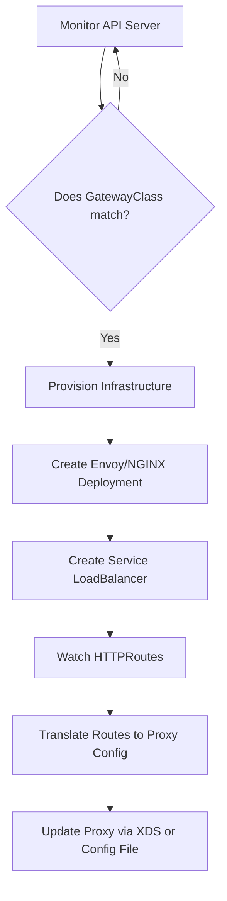

# Chapter 5: Managing Ingress and Egress Traffic

**Course:** LFS245 — Istio Service Mesh Essentials  
**Topic:** North-South Traffic — Gateways, TLS Termination, K8s Gateway API

---

## Table of Contents
1. [Chapter Objectives](#1-chapter-objectives)
2. [What Is North-South Traffic?](#2-what-is-north-south-traffic)
3. [Does Each Ingress/Egress Create a New Envoy Instance?](#3-does-each-ingressegress-create-a-new-envoy-instance)
4. [GatewayClass — The Root of the Hierarchy](#4-gatewayclass--the-root-of-the-hierarchy)
5. [The Full Hierarchy: GatewayClass → Gateway → Route](#5-the-full-hierarchy-gatewayclass--gateway--route)
6. [Istio Gateway API vs. Kubernetes Gateway API](#6-istio-gateway-api-vs-kubernetes-gateway-api)
7. [VirtualService vs. HTTPRoute — Full Comparison](#7-virtualservice-vs-httproute--full-comparison)
8. [TLS Termination — All 6 Modes](#8-tls-termination--all-6-modes)
9. [How GatewayClasses Get Installed Automatically](#9-how-gatewayclasses-get-installed-automatically)
10. [Will K8s Gateway API Replace Istio Gateway API?](#10-will-k8s-gateway-api-replace-istio-gateway-api)
11. [Lab 4 Part 1: Configuring the Ingress Gateway (Istio API)](#11-lab-4-part-1-configuring-the-ingress-gateway-istio-api)
12. [Lab 4 Part 2: Configuring the Ingress Gateway (K8s Gateway API)](#12-lab-4-part-2-configuring-the-ingress-gateway-k8s-gateway-api)

---

## 1. Chapter Objectives

By the end of this chapter, you should be able to:

- Describe the purpose and functionality of ingress and egress gateways
- Configure an Istio ingress gateway
- Expose a Kubernetes Service through the gateway
- Enable TLS termination at the gateway
- Explain the Kubernetes Gateway API and its usage in Istio
- Understand what GatewayClass is and how it differs from Gateway

---

## 2. What Is North-South Traffic?

Traffic in a service mesh is classified into two directions:

```
                 ┌─────────────────────────────────┐
  Internet  ──► │   NORTH-SOUTH (This Chapter)    │ ──► [Ingress/Egress Gateway]
                │   Traffic entering/leaving       │
                │   the cluster boundary           │
                └─────────────────────────────────┘

                 ┌─────────────────────────────────┐
  Service A ──► │   EAST-WEST (Next Chapter)       │ ──► Service B
                │   Traffic between pods           │
                │   INSIDE the cluster             │
                └─────────────────────────────────┘
```

### Ingress vs. Egress

| Direction | Gateway Type | Default K8s Service Type | Who connects? |
|-----------|-------------|--------------------------|---------------|
| **Inbound** (external → cluster) | Ingress Gateway | `LoadBalancer` (gets external IP) | External clients, browsers, APIs |
| **Outbound** (cluster → external) | Egress Gateway | `ClusterIP` (no external IP needed) | Pods inside the mesh connecting to the internet |

**Key Insight:** Functionally, both ingress and egress gateways are the **exact same thing** — they are both standalone Envoy proxy instances. The difference is only the *direction of traffic flow* and *which Service type is used*.

---

## 3. Does Each Ingress/Egress Create a New Envoy Instance?

**YES. Each entry in the `ingressGateways` or `egressGateways` list creates its own:**
- 1 `Deployment` (running an Envoy proxy pod)
- 1 `Service` (exposing the Envoy proxy)
- 1 `ServiceAccount`
- 1 `HorizontalPodAutoscaler` (if autoscaling is enabled)

### Example:

```yaml
# IstioOperator with 2 ingress and 2 egress gateways
apiVersion: install.istio.io/v1alpha1
kind: IstioOperator
spec:
  components:
    ingressGateways:
    # Gateway #1 — creates: Deployment "public-gw", Service LoadBalancer
    - name: public-gateway
      enabled: true
      namespace: istio-system

    # Gateway #2 — creates: Deployment "internal-gw", Service ClusterIP
    - name: internal-gateway
      enabled: true
      namespace: internal-apps
      k8s:
        service:
          type: ClusterIP   # Internal access only — no external IP

    egressGateways:
    # Gateway #3 — creates: Deployment "egress-gw", Service ClusterIP
    - name: egress-gateway
      enabled: true
      namespace: istio-system

    # Gateway #4 — creates: Deployment "restricted-egress", Service ClusterIP
    - name: restricted-egress
      enabled: true
      namespace: secure-apps
```

**Result in the cluster:**

```bash
kubectl get deployments -A | grep gateway
# NAMESPACE      NAME                  READY
# istio-system   public-gateway        1/1      ← Envoy instance #1
# internal-apps  internal-gateway      1/1      ← Envoy instance #2
# istio-system   egress-gateway        1/1      ← Envoy instance #3
# secure-apps    restricted-egress     1/1      ← Envoy instance #4

kubectl get svc -A | grep gateway
# NAMESPACE      NAME                  TYPE           CLUSTER-IP
# istio-system   public-gateway        LoadBalancer   10.96.1.1   ← External IP
# internal-apps  internal-gateway      ClusterIP      10.96.1.2   ← No external IP
# istio-system   egress-gateway        ClusterIP      10.96.1.3
# secure-apps    restricted-egress     ClusterIP      10.96.1.4
```

So: **2 ingress + 2 egress = 4 separate Envoy Deployments + 4 Services**.

### Why have multiple gateways?
- **Isolation:** Public traffic (port 80/443) on one gateway, internal API traffic on another.
- **Security:** A stricter egress gateway for the `secure-apps` namespace.
- **Revision labels:** Different gateways running different Istio versions for canary upgrades.

---

## 4. GatewayClass — The Root of the Hierarchy

### 4.1 How Controllers "Know" What to Program (Internal Mechanics)

You might have expected a `MutatingWebhookConfiguration` or for the API Server to "contact" the controller. **This is NOT how it works.**

In Kubernetes, controllers use an **Active Watch** pattern (Control Loop), not a Push pattern.

#### The Reconciliation Loop:
1.  **Passive API Server:** The API Server is just a storage front-end (etcd). When you `kubectl apply -f gateway.yaml`, it simply saves the resource and assigns it a `uid`. It does not "send" it anywhere.
2.  **Active Controllers (Subscription - The "Watch" Mechanism):**
    *   **Under the Hood:** Controllers do NOT use Webhooks to receive updates. Instead, they use a **Long-lived HTTP Streaming connection** (technically an `HTTP GET` with a `?watch=true` parameter).
    *   **Is it a WebSocket?** No, it usually uses **HTTP Chunked Transfer Encoding** (Streaming). The controller opens a connection to the API Server, and the server keeps that specific connection open indexed to that request.
    *   **Is it gRPC?** Most Kubernetes machinery currently uses **Protobuf over HTTP** for performance, but the logic is basic HTTP streaming.
    *   **The Workflow:** 
        *   `istiod` starts up and calls `GET /api/v1/gateways?watch=true`.
        *   The connection stays **OPEN** (idle) for hours/days.
        *   The moment you `kubectl apply`, the API server "pushes" a small JSON/Protobuf packet through that **already-open** pipe to `istiod`.
        *   There is no "Broadcast" POST request; each controller maintains its own unique pipe.
    *   **Mutating Webhook vs. Watch:**
        *   **Webhook (PUSH):** API Server calls YOU. Used for "Stop! Before you save this, let me check/change it." (Synchronous).
        *   **Watch (PULL-STREAM):** YOU call API Server. Used for "I see you saved something, now I will go do my job." (Asynchronous).
3.  **Filtering by `controllerName`:** 
    *   When the API server notifies all subscribers about your new `Gateway`, **istiod** looks at the `GatewayClass` it refers to.
    *   If the `GatewayClass` has `controllerName: istio.io/gateway-controller`, **istiod** says: *"Aha! This one has my badge on it. I will process it."*
    *   The **NGINX controller** sees the same update, but notices the `controllerName` isn't hers, so she ignores it completely.
4.  **Provisioning:**
    *   Once a controller identifies a resource as "theirs", they trigger a **Reconciliation Loop**.
    *   For Istio, this means creating the Deployment, Service, and envoy configuration.

| Action | Who does it? | Pattern |
|--------|--------------|---------|
| Store YAML | API Server (etcd) | Passive Storage |
| Notification | API Server (Watch event) | Broadcast |
| Filter & Act | Controller (istiod/NGINX) | **Active Filtering** |
| Validation | Admission Webhooks | Sync Check (Blocking) |

---

### 4.2 What is a GatewayClass?

A `GatewayClass` is a **cluster-scoped** resource that points to the **controller** (the operator) that will manage gateways of that class. Think of it like `StorageClass` — just as a `StorageClass` points to a storage provisioner, a `GatewayClass` points to a gateway controller.

```
StorageClass  →  provisioner (e.g., ebs.csi.aws.com)   → creates PersistentVolumes
GatewayClass  →  controller  (e.g., istio.io/gateway-controller) → programs data planes (Envoy)
```

### Annotated GatewayClass YAML

```yaml
# This is the GatewayClass that Istio auto-installs when K8s Gateway API CRDs are present.
apiVersion: gateway.networking.k8s.io/v1
kind: GatewayClass
metadata:
  name: istio                         # The "brand" name of this gateway class
spec:
  # The controller field is the KEY:
  # It tells K8s "which operator is responsible for programming gateways of this class".
  # istiod (the control plane) watches for Gateways with class "istio" and configures them.
  controllerName: istio.io/gateway-controller

  description: The default Istio GatewayClass

status:
  conditions:
  - type: Accepted
    status: "True"                    # istiod saw this class and accepted responsibility for it
    reason: Accepted
    message: Handled by Istio controller
```

```yaml
# The "remote" class — for multi-cluster scenarios.
# The controller is "unmanaged" — it does NOT deploy or configure any Envoy proxy.
# It only records the external gateway address for remote clusters to use.
apiVersion: gateway.networking.k8s.io/v1
kind: GatewayClass
metadata:
  name: istio-remote
spec:
  controllerName: istio.io/unmanaged-gateway   # ← Does NOT auto-provision pods
  description: Remote to this cluster. Does not deploy or affect configuration.
```

```yaml
# This is an NGINX GatewayClass — completely separate from Istio.
# When you create a Gateway with class "nginx-fabric",
# the NGINX Fabric controller manages it, not istiod.
apiVersion: gateway.networking.k8s.io/v1
kind: GatewayClass
metadata:
  name: nginx-fabric
  annotations:
    meta.helm.sh/release-name: ngf             # Installed by Helm
    meta.helm.sh/release-namespace: nginx-gateway
spec:
  controllerName: gateway.nginx.org/nginx-gateway-controller  # ← NGINX controller
  parametersRef:                               # Extra config specific to NGINX
    group: gateway.nginx.org
    kind: NginxProxy
    name: ngf-proxy-config
    namespace: nginx-gateway
```

### Multiple GatewayClasses Can Coexist

```bash
kubectl get gatewayclass
# NAME           CONTROLLER                                   ACCEPTED
# istio          istio.io/gateway-controller                  True      ← Manages Envoy
# istio-remote   istio.io/unmanaged-gateway                   True      ← Multi-cluster only
# nginx-fabric   gateway.nginx.org/nginx-gateway-controller   True      ← Manages NGINX
```

This is the **power of the Gateway API** — multiple controllers can coexist. You can have one team use `istio` gateways and another team use `nginx-fabric` gateways, all on the same cluster.

---

## 5. The Full Hierarchy: GatewayClass → Gateway → Route

```
┌──────────────────────────────────────────────────────────────────────────┐
│                           CONTROL PLANE                                  │
│                                                                          │
│   GatewayClass (istio)                                                   │
│   └── Points to: istiod (istio.io/gateway-controller)                    │
│       istiod programs ALL Envoy proxies in the mesh.                     │
│                                                                          │
└──────────────────────────────────────────────────────────────────────────┘
                          │  programs/configures
                          ▼
┌──────────────────────────────────────────────────────────────────────────┐
│                           DATA PLANE                                     │
│                                                                          │
│   Gateway (my-gateway) ← K8s Deployment + Service is created HERE       │
│   └── One Envoy proxy per Gateway (when using K8s Gateway API)          │
│       The Gateway defines: host, port, protocol, TLS                     │
│                                                                          │
│   HTTPRoute / VirtualService                                             │
│   └── Attached to a Gateway                                              │
│       The Route defines: WHERE to send the traffic (backend service)     │
│                                                                          │
└──────────────────────────────────────────────────────────────────────────┘
```

### One Controller, Many Data Planes

**Question:** Does each GatewayClass have one data plane?  
**Answer:** No. A GatewayClass has ONE **controller** (operator/istiod). Each **Gateway** object can have its own data plane (Envoy pod). The controller programs ALL of them.

```
GatewayClass "istio"
│
│  ONE controller: istiod
│
├── Gateway: public-gateway      → 1 Envoy Deployment + 1 Service (LoadBalancer)
│   ├── HTTPRoute: app1-route    → routes to service: app1:8080
│   └── HTTPRoute: app2-route    → routes to service: app2:3000
│
├── Gateway: internal-gateway    → 1 Envoy Deployment + 1 Service (ClusterIP)
│   └── HTTPRoute: admin-route   → routes to service: admin:9000
│
└── Gateway: egress-gateway      → 1 Envoy Deployment + 1 Service (ClusterIP)
    └── HTTPRoute: external-api  → routes to: api.external.com
```

**istiod** is the single controller that programs ALL three Envoy instances above. You don't run multiple istiod instances — you run one istiod + multiple Envoy gateways.

---

## 6. Istio Gateway API vs. Kubernetes Gateway API

### Comparison Table: The Gateway Resource

| Field / Concept | Istio Gateway API | K8s Gateway API |
|---|---|---|
| **apiVersion** | `networking.istio.io/v1` | `gateway.networking.k8s.io/v1` |
| **kind** | `Gateway` | `Gateway` |
| **Where proxy is defined** | In `IstioOperator` — pre-provisioned | **Auto-provisioned** when Gateway CRD is created |
| **Proxy selection** | `spec.selector` (label selector) | `spec.gatewayClassName` |
| **Port/Host config** | `spec.servers` | `spec.listeners` |
| **TLS config** | Inside `servers[].tls` | Inside `listeners[].tls` |
| **Route attachment** | Via `VirtualService.spec.gateways[]` | Via `HTTPRoute.spec.parentRefs[]` |
| **Status** | Mature, stable | GA since K8s 1.28, v1.0+ |
| **Future** | Will be deprecated | Will be the default |

---

### YAML Comparison: Istio Gateway vs. K8s Gateway

```yaml
# ════════════════════════════════════════════════════════
# ISTIO GATEWAY API
# ════════════════════════════════════════════════════════
apiVersion: networking.istio.io/v1    # ← Istio-specific API group
kind: Gateway
metadata:
  name: my-gateway
  namespace: istio-system
spec:
  # The selector CHOOSES which already-deployed Envoy pod to configure.
  # This pod was deployed by the IstioOperator BEFOREHAND.
  # The label "istio: ingressgateway" must match the pod's label.
  selector:
    istio: ingressgateway             # ← Target a pre-existing Envoy pod

  # "servers" = list of listeners (hostname + port + protocol)
  servers:
  - port:
      number: 80
      name: http
      protocol: HTTP
    hosts:
    - "example.com"                   # This gateway listens for "example.com"
  - port:
      number: 443
      name: https
      protocol: HTTPS
    tls:
      mode: SIMPLE                    # TLS termination at the gateway
      credentialName: gateway-tls     # K8s Secret containing the certificate
    hosts:
    - "example.com"
```

```yaml
# ════════════════════════════════════════════════════════
# KUBERNETES GATEWAY API
# ════════════════════════════════════════════════════════
apiVersion: gateway.networking.k8s.io/v1   # ← K8s standard API group
kind: Gateway
metadata:
  name: my-gateway
  namespace: default
spec:
  # The gatewayClassName links this gateway to a GatewayClass.
  # istiod sees this, and AUTO-CREATES a new Deployment + Service.
  # You do NOT need to pre-provision the Envoy pod.
  gatewayClassName: istio             # ← Selects the controller (istiod)

  # "listeners" = equivalent of Istio's "servers"
  listeners:
  - name: http                        # Each listener has a unique name
    hostname: "example.com"           # Same as Istio's "hosts"
    port: 80
    protocol: HTTP
    allowedRoutes:                    # Which namespaces can attach routes
      namespaces:
        from: Same                    # Only routes in the same namespace
  - name: https
    hostname: "example.com"
    port: 443
    protocol: HTTPS
    tls:
      mode: Terminate                 # Equivalent of Istio's SIMPLE mode
      certificateRefs:                # Equivalent of Istio's credentialName
      - name: gateway-tls             # K8s Secret name
    allowedRoutes:
      namespaces:
        from: All                     # Routes from ANY namespace can attach
```

### 6.1 Key Difference: Pre-provision vs. Auto-provision

This is the most critical architectural shift to understand. One is a **Configuration Model**, the other is a **Provisioning Model**.

#### 1. Istio Classic API (The Configuration Model)
In this model, the infrastructure (Envoy) is **separate** from the configuration. You must have already deployed the "Gateway Pods" (usually via `istioctl install --set profile=demo`).

```yaml
# ════════════════════════════════════════════════════════
# ISTIO CLASSIC GATEWAY (networking.istio.io)
# ════════════════════════════════════════════════════════
apiVersion: networking.istio.io/v1
kind: Gateway
metadata:
  name: classic-gateway
spec:
  # THE SELECTOR IS THE KEY:
  # This does NOT create a new pod. It tells Istio:
  # "Go find the Envoy deployment that already exists with this label."
  # It then injects the port/host rules into that existing deployment.
  selector:
    istio: ingressgateway       # <--- Refers to the "demo profile" gateway
  servers:
  - port:
      number: 80
      name: http
      protocol: HTTP
    hosts:
    - "*" 
```

#### 2. Kubernetes Gateway API (The Provisioning Model)
In this model, the `Gateway` resource **IS** the infrastructure. When you apply the YAML, Istio acts as an operator and "orders" the creation of new Envoy pods + LoadBalancer Service specifically for this gateway.

```yaml
# ════════════════════════════════════════════════════════
# K8S GATEWAY API (gateway.networking.k8s.io)
# ════════════════════════════════════════════════════════
apiVersion: gateway.networking.k8s.io/v1
kind: Gateway
metadata:
  name: auto-provisioned-gateway
spec:
  # THE GATEWAY CLASS IS THE KEY:
  # There is NO selector. Instead, we specify the "Class".
  # istiod sees this and says: "I will now go and create a brand new 
  # Deployment and Service specifically for this 'auto-provisioned-gateway'."
  gatewayClassName: istio       # <--- Triggers AUTO-PROVISIONING of new pods
  listeners:
  - name: http
    port: 80
    protocol: HTTP
    allowedRoutes:
      namespaces:
        from: Same
```

### Summary Comparison Table

| Feature | Istio Classic (`networking.istio.io`) | K8s Gateway API (`gateway.networking.k8s.io`) |
| :--- | :--- | :--- |
| **Logic** | **"Program the existing proxy"** | **"Create a new proxy for me"** |
| **Infrastructure** | Handled by `IstioOperator` (demo/default profile). | Handled by the **Gateway API Controller** (istiod). |
| **Pod Creation** | No new pods created on `kubectl apply`. | **New pods/services created automatically.** |
| **Best Workflow** | Legacy / Fixed infrastructure environments. | Modern / Dynamic / Multi-team environments. |

#### Comparison in your cluster:

1.  **Using Istio Classic API:** 
    *   You installed the `demo` profile. This created a Deployment named `istio-ingressgateway`.
    *   When you create a `kind: Gateway (networking.istio.io)`, it uses the **selector** to find that existing pod.
    *   **Result:** 0 new pods. It just updates the config of the one already running.

2.  **Using K8s Gateway API:**
    *   You create a `kind: Gateway (gateway.networking.k8s.io)`.
    *   `istiod` sees this, realizes it's a "Provisioning" request, and creates a **brand new** Deployment called `my-gateway-istio`.
    *   **Result:** 1 new pod.

---

## 7. VirtualService vs. HTTPRoute — Full Comparison

### Comparison Table

| Field / Concept | Istio VirtualService | K8s HTTPRoute |
|---|---|---|
| **apiVersion** | `networking.istio.io/v1` | `gateway.networking.k8s.io/v1` |
| **kind** | `VirtualService` | `HTTPRoute` |
| **Attach to Gateway** | `spec.gateways[]` (name reference) | `spec.parentRefs[]` (name + namespace) |
| **Hostname matching** | `spec.hosts[]` | `spec.hostnames[]` |
| **Traffic rules** | `spec.http[]`, `spec.tcp[]`, `spec.tls[]` | `spec.rules[]` |
| **Route match** | `http[].match[].uri`, `.headers`, `.method` | `rules[].matches[].path`, `.headers`, `.method` |
| **Backend** | `http[].route[].destination.host` | `rules[].backendRefs[].name` |
| **Weighted routing** | `route[].weight` | `backendRefs[].weight` |
| **Retries** | `http[].retries` | Not natively supported (use policy) |
| **Fault injection** | `http[].fault` | Not natively supported |
| **Timeout** | `http[].timeout` | Via `HTTPRoute` filters |
| **Works with east-west?** | Yes (mesh traffic too) | Stable for ingress; mesh use is in beta |

---

### YAML Comparison: VirtualService vs. HTTPRoute

```yaml
# ════════════════════════════════════════════════════════
# ISTIO: VirtualService
# ════════════════════════════════════════════════════════
apiVersion: networking.istio.io/v1
kind: VirtualService
metadata:
  name: my-routing-rules
spec:
  # The hostnames this VirtualService applies to.
  # MUST match the host in the Gateway "servers" section.
  hosts:
  - "example.com"

  # Which Gateways to attach to.
  # If you omit this, the rules apply to mesh-internal traffic only.
  gateways:
  - my-gateway                        # Name of the Istio Gateway resource
  # - mesh                            # "mesh" is a reserved keyword = apply to sidecars too

  http:
  # Rule 1: Route /api/v2 traffic to the new version (90%) and old version (10%)
  - match:
    - uri:
        prefix: /api/v2               # Match any path starting with /api/v2
      headers:
        x-user-type:
          exact: premium              # AND header matches exactly
    route:
    - destination:
        host: my-service-v2.default.svc.cluster.local
        port:
          number: 8080
      weight: 90                      # 90% of matching traffic → v2
    - destination:
        host: my-service-v1.default.svc.cluster.local
        port:
          number: 8080
      weight: 10                      # 10% of matching traffic → v1
    timeout: 10s                      # Retry/timeout settings (Istio-only feature)
    retries:
      attempts: 3
      perTryTimeout: 3s

  # Rule 2: Default — all other traffic → v1
  - route:
    - destination:
        host: my-service-v1.default.svc.cluster.local
        port:
          number: 8080
```

```yaml
# ════════════════════════════════════════════════════════
# K8s GATEWAY API: HTTPRoute
# ════════════════════════════════════════════════════════
apiVersion: gateway.networking.k8s.io/v1
kind: HTTPRoute
metadata:
  name: my-routing-rules
  namespace: default
spec:
  # Attach to a Gateway by name + namespace reference.
  parentRefs:
  - name: my-gateway                  # Name of the K8s Gateway resource
    namespace: default                # Namespace where the Gateway lives
    # sectionName: http               # Optional: attach to a specific listener

  # The hostnames this route applies to.
  hostnames:
  - "example.com"

  rules:
  # Rule 1: Route /api/v2 traffic — 90% v2, 10% v1
  - matches:
    - path:
        type: PathPrefix
        value: /api/v2                # Match paths starting with /api/v2
      headers:
      - name: x-user-type
        value: premium                # AND this header exists
    backendRefs:
    - name: my-service-v2            # K8s Service name (no FQDN needed)
      port: 8080
      weight: 90                      # 90% of matching traffic → v2
    - name: my-service-v1
      port: 8080
      weight: 10                      # 10% → v1

  # Rule 2: Default — all other traffic → v1
  - backendRefs:
    - name: my-service-v1
      port: 8080
```

---

## 8. TLS Termination — All 6 Modes

The `tls.mode` field in an Istio Gateway (or equivalent in K8s Gateway API) controls how TLS is handled.

### Visual Explanation

```
CLIENT ──────────────────────── GATEWAY ──────────────────── BACKEND APP
         [ TLS Handshake ]                  [ connection ]
```

| Mode | Client → Gateway | Gateway → Backend | Client cert required? | Use case |
|------|-----------------|-------------------|----------------------|----------|
| **SIMPLE** | TLS (encrypted) | Plain HTTP | No | Standard HTTPS website |
| **MUTUAL** | TLS + Client Cert | Plain HTTP | Yes (custom CA) | B2B APIs, service-to-service |
| **ISTIO_MUTUAL** | TLS + Istio-issued Cert | Plain HTTP | Yes (Istio CA auto-managed) | Internal mesh services with Istio identity |
| **OPTIONAL_MUTUAL** | TLS ± Client Cert | Plain HTTP | Optional | Mixed clients (some have certs, some don't) |
| **PASSTHROUGH** | TLS (not terminated) | TLS (forwarded as-is) | No (gateway doesn't see it) | Apps that must handle their own TLS |
| **AUTO_PASSTHROUGH** | TLS (not terminated) | TLS (forwarded by SNI) | No | Multi-cluster routing via SNI |

---

### Mode 1: SIMPLE (Most Common)

```yaml
# Gateway terminates TLS, then sends plain HTTP to the backend.
# Backend does NOT need TLS configured.
apiVersion: networking.istio.io/v1
kind: Gateway
metadata:
  name: simple-tls-gateway
spec:
  selector:
    istio: ingressgateway
  servers:
  - port:
      number: 443
      name: https
      protocol: HTTPS
    tls:
      mode: SIMPLE                      # Gateway terminates TLS
      credentialName: gateway-tls       # K8s Secret: tls.crt + tls.key
    hosts:
    - "example.com"
```

```bash
# Create the TLS secret
kubectl create secret tls gateway-tls \
  --cert=server.crt \
  --key=server.key \
  -n istio-system
```

---

### Mode 2: MUTUAL (mTLS — Both sides present certs)

```yaml
# Both the client AND the gateway present certificates.
# The gateway verifies the client's certificate against a CA.
apiVersion: networking.istio.io/v1
kind: Gateway
metadata:
  name: mutual-tls-gateway
spec:
  selector:
    istio: ingressgateway
  servers:
  - port:
      number: 443
      name: https
      protocol: HTTPS
    tls:
      mode: MUTUAL                      # Client MUST present a certificate
      credentialName: mutual-tls        # K8s Secret: tls.crt + tls.key + cacert.pem
    hosts:
    - "api.example.com"
```

```bash
# Secret must contain: server cert, server key, AND CA cert to verify clients
kubectl create secret generic mutual-tls \
  --from-file=tls.crt=server.crt \
  --from-file=tls.key=server.key \
  --from-file=cacert.pem=ca.crt \      # Used to validate client certificates
  -n istio-system
```

---

### Mode 3: ISTIO_MUTUAL (For Istio-managed workloads)

```yaml
# Like MUTUAL, but you DON'T provide the CA cert manually.
# Istio uses its own CA (istiod) to issue and verify the client certificate.
# The gateway workload's SPIFFE identity is used (no credentialName needed).
apiVersion: networking.istio.io/v1
kind: Gateway
metadata:
  name: istio-mutual-gateway
spec:
  selector:
    istio: ingressgateway
  servers:
  - port:
      number: 443
      name: https
      protocol: HTTPS
    tls:
      mode: ISTIO_MUTUAL               # Uses Istio's built-in PKI — no credentialName needed
    hosts:
    - "internal.example.com"
```

---

### Mode 4: OPTIONAL_MUTUAL

```yaml
# Gateway accepts connections with OR without a client certificate.
# If the client sends a cert, the gateway validates it.
# If not, the connection is still allowed.
apiVersion: networking.istio.io/v1
kind: Gateway
metadata:
  name: optional-mutual-gateway
spec:
  selector:
    istio: ingressgateway
  servers:
  - port:
      number: 443
      name: https
      protocol: HTTPS
    tls:
      mode: OPTIONAL_MUTUAL            # Client cert optional
      credentialName: gateway-tls      # Still need server cert + CA for validation
    hosts:
    - "mixed.example.com"
```

---

### Mode 5: PASSTHROUGH (SNI-based routing, no TLS termination)

```yaml
# The gateway does NOT decrypt the traffic.
# It reads the SNI from the TLS handshake (Client TLS Hello packet includes the SNI Server Name Indication field)
# and forwards the encrypted connection to the correct backend.
# The backend application handles TLS itself.
apiVersion: networking.istio.io/v1
kind: Gateway
metadata:
  name: passthrough-gateway
spec:
  selector:
    istio: ingressgateway
  servers:
  - port:
      number: 443
      name: tls-passthrough
      protocol: TLS                   # Use TLS (not HTTPS) protocol for passthrough
    tls:
      mode: PASSTHROUGH               # Gateway does NOT terminate TLS
    hosts:
    - "*.example.com"
---
# VirtualService MUST use the tls section and match sniHosts
apiVersion: networking.istio.io/v1
kind: VirtualService
metadata:
  name: passthrough-routing
spec:
  hosts:
  - "*.example.com"
  gateways:
  - passthrough-gateway
  tls:                                # Use tls routing (not http)
  - match:
    - port: 443
      sniHosts:
      - hello.example.com             # Route based on the SNI hostname
    route:
    - destination:
        host: hello.default.svc.cluster.local   # Backend handles its own TLS
```

---

### Mode 6: AUTO_PASSTHROUGH (For multi-cluster)

```yaml
# Like PASSTHROUGH, but does NOT require a VirtualService.
# The Envoy proxy reads the destination from the SNI value directly
# and forwards to the correct service automatically.
# Used in multi-cluster Istio deployments.
apiVersion: networking.istio.io/v1
kind: Gateway
metadata:
  name: auto-passthrough-gateway
spec:
  selector:
    istio: ingressgateway
  servers:
  - port:
      number: 15443
      name: tls-auto
      protocol: TLS
    tls:
      mode: AUTO_PASSTHROUGH          # No VirtualService needed — uses SNI directly
    hosts:
    - "*.local"
```

### TLS Mode Summary

```
CLIENT                       GATEWAY                      BACKEND
  │                             │                             │
  │──── encrypted (TLS) ───────►│                             │
  │                             │                             │
  │  SIMPLE:     gateway decrypts, sends plain HTTP ─────────►│
  │  MUTUAL:     gateway decrypts + verifies client cert ─────►│
  │  ISTIO_MUTUAL: same but Istio manages the CA ─────────────►│
  │  PASSTHROUGH: gateway reads SNI, forwards as-is ──────────►│ (backend does TLS)
  │  AUTO_PASSTHROUGH: same but no VirtualService needed ──────►│
```

---

### K8s Gateway API TLS Modes

```yaml
# K8s Gateway API equivalent of SIMPLE mode
apiVersion: gateway.networking.k8s.io/v1
kind: Gateway
metadata:
  name: k8s-tls-gateway
spec:
  gatewayClassName: istio
  listeners:
  - name: https
    hostname: "example.com"
    port: 443
    protocol: HTTPS
    tls:
      mode: Terminate                   # Equivalent of Istio's SIMPLE mode
      certificateRefs:
      - name: gateway-tls              # K8s Secret name
        kind: Secret
---
# K8s Gateway API equivalent of PASSTHROUGH mode
  - name: tls-passthrough
    hostname: "*.example.com"
    port: 443
    protocol: TLS
    tls:
      mode: Passthrough               # Equivalent of Istio's PASSTHROUGH mode
      # No certificateRefs needed — backend handles its own TLS
```

**K8s Gateway API TLS Modes:**

| K8s Mode | Istio Equivalent | Description |
|----------|-----------------|-------------|
| `Terminate` | `SIMPLE` | Gateway decrypts, sends plain to backend |
| `Passthrough` | `PASSTHROUGH` | Gateway forwards encrypted without decrypting |

The K8s Gateway API only has 2 TLS modes (Terminate and Passthrough). The more advanced Istio modes (MUTUAL, ISTIO_MUTUAL, OPTIONAL_MUTUAL, AUTO_PASSTHROUGH) are Istio-specific extensions.

---

## 9. How GatewayClasses Get Installed Automatically

**Question:** I installed Istio using `istioctl install`, but I never applied any GatewayClass manifest. How did the `istio` and `istio-remote` GatewayClasses appear?

**Answer:** Istio detects whether the K8s Gateway API CRDs are present in the cluster and auto-registers its GatewayClasses.

### The Flow:

```
Step 1: Install K8s Gateway API CRDs
kubectl apply -f https://github.com/kubernetes-sigs/gateway-api/releases/download/v1.3.0/standard-install.yaml
# This installs: GatewayClass, Gateway, HTTPRoute, GRPCRoute, ReferenceGrant CRDs

Step 2: Install Istio (or Istio was already running)
istioctl install --set profile=demo
# istiod starts, detects that "GatewayClass" CRD exists, and auto-creates:
#   - GatewayClass "istio"        (controllerName: istio.io/gateway-controller)
#   - GatewayClass "istio-remote" (controllerName: istio.io/unmanaged-gateway)

Step 3: You can now use either API
kubectl get gatewayclass
# NAME           CONTROLLER                                   ACCEPTED
# istio          istio.io/gateway-controller                  True
# istio-remote   istio.io/unmanaged-gateway                   True
```

### Why does this work?
`istiod` has the logic built-in to register itself as a GatewayClass controller. It runs a "reconciler" that watches for new `Gateway` objects with `gatewayClassName: istio` and provisions Envoy pods for them automatically.

---

## 10. Will K8s Gateway API Replace Istio Gateway API?

**Short Answer: Yes, but gradually.**

### Timeline and Status

| Phase | Status | Notes |
|-------|--------|-------|
| **Now (2025-2026)** | Both APIs fully supported | Istio Gateway + K8s Gateway API both work |
| **Near Future** | K8s Gateway API becomes the default | Recommended for new projects |
| **Long Term** | Istio's `Gateway` + `VirtualService` deprecated | Migration path will be provided |

### What will be deprecated?

The following Istio-specific CRDs will eventually be deprecated:
- `Gateway` (`networking.istio.io/v1`) — replaced by `Gateway` (`gateway.networking.k8s.io/v1`)
- `VirtualService` — replaced by `HTTPRoute`, `GRPCRoute`, `TCPRoute`, `TLSRoute`

### What will remain?

These Istio-specific CRDs are for **east-west (service-to-service) traffic** and are **NOT part of the Gateway API**. They will stay:
- `DestinationRule` — load balancing, circuit breaking, mTLS between services
- `AuthorizationPolicy` — security policies
- `PeerAuthentication` — mTLS enforcement
- `ServiceEntry` — register external services
- `Sidecar` — sidecar injection configuration

### What should you learn for the exam?

**For the ICA exam (2025-2026): Learn BOTH.**  
The exam tests both Istio's native API and the K8s Gateway API. However, understanding the K8s Gateway API is increasingly important as it is the future direction.

```
Learn Istio API:          Gateway + VirtualService       (Classic, still exam content)
Learn K8s Gateway API:    Gateway + HTTPRoute            (Future standard)
```

---

## 11. Lab 4 Part 1: Configuring the Ingress Gateway (Istio API)

### Setup

```bash
# Install Istio with the demo profile (includes ingressgateway + egressgateway)
istioctl install --set profile=demo -y

# Verify the gateway services are running
kubectl get svc -n istio-system
# NAME                   TYPE           CLUSTER-IP      EXTERNAL-IP      PORT(S)
# istio-ingressgateway   LoadBalancer   10.96.187.147   172.18.255.200   80:31833/TCP,443:30171/TCP
# istio-egressgateway    ClusterIP      10.96.7.86      <none>           80/TCP,443/TCP
# istiod                 ClusterIP      10.96.24.226    <none>           15010/TCP,15012/TCP

# Label the default namespace for sidecar injection
kubectl label namespace default istio-injection=enabled

# Deploy the test httpbin app
kubectl apply -f https://raw.githubusercontent.com/istio/istio/master/samples/httpbin/httpbin.yaml

# Wait for the pod to be ready
kubectl get pods
# NAME                       READY   STATUS    RESTARTS
# httpbin-xxxxxxxxx-xxxxx    2/2     Running   0          ← 2/2 = app + sidecar
```

### Step 1: Create the Gateway resource (Listener)

```yaml
# File: httpbin-gateway.yaml
# This configures the existing istio-ingressgateway Envoy pod
# to listen for HTTP connections to "httpbin.example.com"
apiVersion: networking.istio.io/v1
kind: Gateway
metadata:
  name: httpbin-gateway
  namespace: default
spec:
  # Target the pre-existing ingressgateway pod by its label
  selector:
    istio: ingressgateway       # Matches: kubectl get pod -n istio-system -l istio=ingressgateway

  servers:
  - port:
      number: 80
      name: http
      protocol: HTTP
    hosts:
    - "httpbin.example.com"     # This gateway will only accept traffic for this hostname
```

```bash
kubectl apply -f httpbin-gateway.yaml
```

### Step 2: Create the VirtualService (Router)

```yaml
# File: httpbin-virtualservice.yaml
# This routes traffic from the gateway to the httpbin service
apiVersion: networking.istio.io/v1
kind: VirtualService
metadata:
  name: httpbin-routing
  namespace: default
spec:
  # MUST match the hosts in the Gateway above
  hosts:
  - "httpbin.example.com"

  # Attach to the Gateway we created above
  gateways:
  - httpbin-gateway              # Reference the Gateway resource by name

  http:
  - match:
    - uri:
        prefix: /status          # Match /status/* paths
    - uri:
        prefix: /delay           # OR /delay/* paths
    route:
    - destination:
        host: httpbin            # K8s Service name (short name, resolves to FQDN in-namespace)
        port:
          number: 8000           # httpbin listens on 8000
```

```bash
kubectl apply -f httpbin-virtualservice.yaml
```

### Step 3: Test

```bash
# Get the external IP of the ingress gateway
GATEWAY_IP=$(kubectl get svc istio-ingressgateway -n istio-system -o jsonpath='{.status.loadBalancer.ingress[0].ip}')
echo "Gateway IP: $GATEWAY_IP"

# Test with the hostname header (since we don't have DNS)
curl -H "Host: httpbin.example.com" http://$GATEWAY_IP/status/200
# Expected: HTTP 200 OK

curl -H "Host: httpbin.example.com" http://$GATEWAY_IP/delay/1
# Expected: response after 1 second delay

# Test a path not in the VirtualService — should return 404
curl -H "Host: httpbin.example.com" http://$GATEWAY_IP/headers
# Expected: HTTP 404 (no route matches /headers)
```

### Step 4: Add TLS (HTTPS)

```bash
# Generate a self-signed certificate for httpbin.example.com
openssl req -x509 -nodes -days 365 \
  -newkey rsa:2048 \
  -keyout httpbin.key \
  -out httpbin.crt \
  -subj "/CN=httpbin.example.com" \
  -addext "subjectAltName=DNS:httpbin.example.com"

# Create the K8s Secret in istio-system namespace
# NOTE: The secret MUST be in the same namespace as the gateway pod (istio-system)
kubectl create secret tls httpbin-tls \
  --cert=httpbin.crt \
  --key=httpbin.key \
  -n istio-system
```

```yaml
# File: httpbin-gateway-tls.yaml
# Updated Gateway with HTTPS support
apiVersion: networking.istio.io/v1
kind: Gateway
metadata:
  name: httpbin-gateway
  namespace: default
spec:
  selector:
    istio: ingressgateway
  servers:
  # Redirect HTTP to HTTPS
  - port:
      number: 80
      name: http
      protocol: HTTP
    hosts:
    - "httpbin.example.com"
    tls:
      httpsRedirect: true       # Automatically redirect HTTP → HTTPS

  # HTTPS listener
  - port:
      number: 443
      name: https
      protocol: HTTPS
    tls:
      mode: SIMPLE              # Terminate TLS here; send plain HTTP to the backend
      credentialName: httpbin-tls  # Secret we created above (must be in istio-system)
    hosts:
    - "httpbin.example.com"
```

```bash
kubectl apply -f httpbin-gateway-tls.yaml

# Test HTTPS (skip cert verification since it's self-signed)
curl -k -H "Host: httpbin.example.com" https://$GATEWAY_IP/status/200
```

---

## 12. Lab 4 Part 2: Configuring the Ingress Gateway (K8s Gateway API)

### Step 1: Install K8s Gateway API CRDs

```bash
# Install the standard K8s Gateway API CRDs
kubectl apply -f https://github.com/kubernetes-sigs/gateway-api/releases/download/v1.3.0/standard-install.yaml

# Output:
# customresourcedefinition.apiextensions.k8s.io/gatewayclasses.gateway.networking.k8s.io created
# customresourcedefinition.apiextensions.k8s.io/gateways.gateway.networking.k8s.io created
# customresourcedefinition.apiextensions.k8s.io/grpcroutes.gateway.networking.k8s.io created
# customresourcedefinition.apiextensions.k8s.io/httproutes.gateway.networking.k8s.io created
# customresourcedefinition.apiextensions.k8s.io/referencegrants.gateway.networking.k8s.io created

# Verify Istio auto-registered its GatewayClasses
kubectl get gatewayclass
# NAME           CONTROLLER                                   ACCEPTED
# istio          istio.io/gateway-controller                  True      ← Auto-created by istiod
# istio-remote   istio.io/unmanaged-gateway                   True      ← Auto-created by istiod
```

### Step 2: Create the Gateway (Auto-provisions Envoy pod)

```yaml
# File: httpbin-k8s-gateway.yaml
# IMPORTANT: Creating this resource will AUTO-PROVISION:
#   - A new Deployment named "my-gateway" (running Envoy)
#   - A new Service named "my-gateway" (type: LoadBalancer)
# You do NOT need to pre-create any gateway infrastructure.
apiVersion: gateway.networking.k8s.io/v1
kind: Gateway
metadata:
  name: my-gateway
  namespace: default            # The Gateway (and its auto-provisioned pod) lives here
spec:
  # This links to the "istio" GatewayClass — istiod will manage this gateway
  gatewayClassName: istio

  listeners:
  - name: http
    hostname: "httpbin.example.com"
    port: 80
    protocol: HTTP
    allowedRoutes:
      namespaces:
        from: Same              # Only HTTPRoutes in the "default" namespace can attach
```

```bash
kubectl apply -f httpbin-k8s-gateway.yaml

# A new Deployment and Service are AUTOMATICALLY created:
kubectl get deployment my-gateway -n default
kubectl get svc my-gateway -n default
# NAME         TYPE           CLUSTER-IP    EXTERNAL-IP
# my-gateway   LoadBalancer   10.96.x.x     <pending>   ← New Envoy proxy, auto-provisioned!
```

### 12.3 Understanding the Gateway Status
When you run `kubectl describe gateway my-gateway`, check these critical fields:

#### Why is "Programmed" set to False?
In your output, `PROGRAMMED` is `False`.
*   **Accepted: True** → Means the controller (`istiod`) saw your YAML and it is valid.
*   **Programmed: False** → Means the gateway is **NOT yet ready** to receive external traffic.
*   **The Reason:** Look at your status message: `address pending for hostname "my-gateway-istio.default.svc.cluster.local"`.
    *   This usually means the Kubernetes `Service` (type: `LoadBalancer`) is waiting for an IP address from your cloud provider or your LoadBalancer controller (like MetalLB). 
    *   Until that Service gets an `EXTERNAL-IP`, the Gateway cannot be "Programmed" because it doesn't know what address to tell the world to use.

#### Important Status Indicators:
| Condition | Status | Meaning |
|-----------|--------|---------|
| **Accepted** | `True` | `istiod` has successfully parsed and accepted responsibility for this Gateway. |
| **Programmed** | `True` | **Successful.** The proxy is configured and the IP address is assigned. |
| **Programmed** | `False` | **Wait/Error.** Usually means the LoadBalancer IP is still `<pending>`. |
| **Attached Routes** | `0` | You haven't linked any `HTTPRoute` to this gateway yet. |

### Step 3: Create the HTTPRoute (Router)

```yaml
# File: httpbin-httproute.yaml
# Routes HTTP traffic from the Gateway to the httpbin service
apiVersion: gateway.networking.k8s.io/v1
kind: HTTPRoute
metadata:
  name: httpbin-route
  namespace: default
spec:
  # Attach to the Gateway by name + namespace
  parentRefs:
  - name: my-gateway
    namespace: default

  # Hostnames that this route applies to (must match Gateway listener hostname)
  hostnames:
  - "httpbin.example.com"

  rules:
  # Route /status/* and /delay/* paths
  - matches:
    - path:
        type: PathPrefix
        value: /status          # Matches /status/200, /status/404, etc.
    - path:
        type: PathPrefix
        value: /delay           # Matches /delay/1, /delay/5, etc.
    backendRefs:
    - name: httpbin             # K8s Service name in the same namespace
      port: 8000
```

```bash
kubectl apply -f httpbin-httproute.yaml

# Verify the route is accepted
kubectl get httproute httpbin-route -o yaml | grep -A 5 status
# status:
#   parents:
#   - conditions:
#     - type: Accepted
#       status: "True"          ← Route is attached to the gateway
```

### Step 4: Test

```bash
# Get the external IP of the auto-provisioned gateway
GATEWAY_IP=$(kubectl get svc my-gateway -n default -o jsonpath='{.status.loadBalancer.ingress[0].ip}')
echo "Gateway IP: $GATEWAY_IP"

# Test
curl -H "Host: httpbin.example.com" http://$GATEWAY_IP/status/200
```

### Side-by-Side Comparison: Istio API vs. K8s Gateway API

| Step | Istio API | K8s Gateway API |
|------|-----------|-----------------|
| **1. Deploy proxy** | `IstioOperator` (deploy Envoy before any config) | Auto-provisioned when you create `Gateway` |
| **2. Configure listener** | `kind: Gateway` (networking.istio.io) | `kind: Gateway` (gateway.networking.k8s.io) |
| **3. Route traffic** | `kind: VirtualService` | `kind: HTTPRoute` |
| **4. TLS cert** | `credentialName: my-secret` in `servers[].tls` | `certificateRefs: [{name: my-secret}]` in `listeners[].tls` |
| **5. Attach route** | `gateways: [my-gateway]` in VirtualService | `parentRefs: [{name: my-gateway}]` in HTTPRoute |

---

## Quick Reference: All Resources at a Glance

```
K8s GATEWAY API STACK:              ISTIO CLASSIC API STACK:

GatewayClass                        (Pre-provisioned by IstioOperator)
  └── Gateway (auto-provisions)         └── IstioOperator
        └── HTTPRoute                         └── Gateway (networking.istio.io)
              └── Backend Service                   └── VirtualService
                                                          └── Backend Service
```

---

## 13. Advanced: Developing Your Own Gateway Controller

If you want to build your own controller (like building a custom `istiod` or `nginx-controller`), you need to follow the **Kubernetes Gateway API Implementation Guidelines**.

### Official Resources for Developers:
- **The Specification:** [gateway-api.sigs.k8s.io](https://gateway-api.sigs.k8s.io/) — The primary source of truth for resource behavior.
- **Implementing a Controller Guide:** [Gateway API Design Docs](https://gateway-api.sigs.k8s.io/geps/gep-713-gateway-api-for-mesh/) — Covers architectural expectations.
- **Conformance Test Suite:** [Gateway API Conformance](https://gateway-api.sigs.k8s.io/guides/conformance/) — Tests your controller MUST pass to be "Gateway API Compatible."

### Tools for the Developer:
1.  **Controller-Runtime (Go):** The industry-standard Go library for managing the "Watch" and "Reconciliation Loop."
2.  **Kubebuilder:** A framework for scaffolding Kubernetes APIs and Controllers.
3.  **Gateway API Go Types:** [kubernetes-sigs/gateway-api](https://github.com/kubernetes-sigs/gateway-api) — Import this to get the exact Go structures for `Gateway`, `HTTPRoute`, etc.

### The Developer Logic Workflow:


---

## 14. Useful commands
kubectl get gatewayclass                          # List all gateway controllers
kubectl get gateway -A                            # List all gateway instances
kubectl get httproute -A                          # List all K8s HTTP routes
kubectl get virtualservice -A                     # List all Istio virtual services
istioctl analyze                                  # Validate Istio configuration
istioctl proxy-config listener <pod> -n istio-system  # Inspect Envoy listeners
```
