# Chapter 6 — East-West Traffic Management

> **East-West traffic** = traffic *between* services inside the mesh (service A → service B).  
> This contrasts with North-South traffic (client outside cluster → ingress → service).

---

## Objectives

By the end of this chapter you will be able to:

- Explain the role of VirtualService in traffic routing
- Implement traffic routing using subsets
- Configure HTTP traffic matching, rewrites, redirects, CORS policies
- Implement weight-based routing and traffic mirroring
- Manipulate request and response headers
- Route TLS/HTTPS and TCP traffic
- Define policies using DestinationRule
- Manage external services with ServiceEntry

---

## Table of Contents

1. [VirtualService Resource](#1-virtualservice-resource)
2. [Subsets — Deep Dive](#2-subsets--deep-dive)
3. [DestinationRule Resource](#3-destinationrule-resource)
4. [HTTP Traffic Matching](#4-http-traffic-matching)
5. [Rewrite vs Redirect](#5-rewrite-vs-redirect)
6. [Redirect — Port Field](#6-redirect--port-field)
7. [HTTP/1.1 vs HTTP/2 Headers](#7-http11-vs-http2-headers)
8. [CORS Policy — Deep Dive](#8-cors-policy--deep-dive)
9. [AND / OR Semantics](#9-and--or-semantics)
10. [Weight-based Routing](#10-weight-based-routing)
11. [Traffic Mirroring](#11-traffic-mirroring)
12. [Manipulating Headers](#12-manipulating-headers)
13. [TLS/HTTPS and TCP Traffic Matching](#13-tlshttps-and-tcp-traffic-matching)
14. [DestinationRule — Traffic Policies](#14-destinationrule--traffic-policies)
15. [External Services — ServiceEntry](#15-external-services--serviceentry)

---

## 1. VirtualService Resource

The **VirtualService** is the core traffic-routing object in Istio.  
It answers the question: *"When a request arrives for host X, where should it go and how should it be transformed?"*

### How it fits in the picture

```
Client (Pod A)
    │
    │  calls backend.default.svc.cluster.local
    ▼
[Envoy sidecar in Pod A]
    │
    │  reads VirtualService rules for that host
    ▼
[Destination (Pod B, C, …)]
```

The Envoy sidecar intercepts the outbound call from Pod A, looks up the VirtualService whose `hosts` field matches the target hostname, applies the routing rules, and forwards to the correct destination.

### Minimal example

```yaml
apiVersion: networking.istio.io/v1beta1
kind: VirtualService
metadata:
  name: backend-vs
  namespace: default
spec:
  # Which hostname this VS applies to.
  # Any pod calling this FQDN will have these rules applied.
  hosts:
  - backend.default.svc.cluster.local

  http:
  - route:
    - destination:
        # Where to send the traffic
        host: backend.default.svc.cluster.local
        port:
          number: 5000
```

> **Key point:** Without a VirtualService, Istio still routes traffic using Kubernetes Services (default kube-proxy behavior). The VirtualService only adds/overrides routing logic.

---

## 2. Subsets — Deep Dive

### The problem without subsets

Imagine you run an e-commerce site. You have a `product-service` in production (v1). You build a new version (v2) with a new recommendation engine. You want to:

- Keep existing users on v1 (safe).
- Route 10 % of users to v2 (canary test).

**Naive approach:** Create a second Kubernetes Service `product-service-v2.default.svc.cluster.local` and change every caller's code to sometimes call v2.  
**Problem:** You have to rebuild and redeploy every caller — that breaks the single-responsibility principle and couples services together.

### The Istio solution: subsets

A **subset** is a named group of pods *within the same Kubernetes Service*, selected by an additional label.  
All pods share a common label (e.g. `app: product`), but v1 pods also have `version: v1` and v2 pods have `version: v2`.

```
Kubernetes Service (selector: app=product)
        │
        ├── Pod A  labels: app=product, version=v1  ←── subset "v1"
        ├── Pod B  labels: app=product, version=v1  ←── subset "v1"
        └── Pod C  labels: app=product, version=v2  ←── subset "v2"
```

### Step-by-step YAML walkthrough

#### Step 1 — Kubernetes Deployments (two versions, same Service)

```yaml
# ── Deployment v1 ──────────────────────────────────────────────
apiVersion: apps/v1
kind: Deployment
metadata:
  name: product-v1
  namespace: default
spec:
  replicas: 2
  selector:
    matchLabels:
      app: product       # shared label — the K8s Service selects on this
      version: v1        # discriminating label — used by the Istio subset
  template:
    metadata:
      labels:
        app: product
        version: v1
    spec:
      containers:
      - name: product
        image: myrepo/product:1.0
        ports:
        - containerPort: 5000
---
# ── Deployment v2 ──────────────────────────────────────────────
apiVersion: apps/v1
kind: Deployment
metadata:
  name: product-v2
  namespace: default
spec:
  replicas: 2
  selector:
    matchLabels:
      app: product
      version: v2        # ← only difference from v1
  template:
    metadata:
      labels:
        app: product
        version: v2
    spec:
      containers:
      - name: product
        image: myrepo/product:2.0   # ← new image
        ports:
        - containerPort: 5000
```

```yaml
# ── Kubernetes Service — version-agnostic ───────────────────────
# Uses ONLY the shared label so it load-balances across v1 AND v2.
# Without Istio this gives you 50/50 random traffic split.
apiVersion: v1
kind: Service
metadata:
  name: product              # FQDN: product.default.svc.cluster.local
  namespace: default
spec:
  selector:
    app: product             # matches pods from BOTH deployments
  ports:
  - name: http
    port: 5000
    targetPort: 5000
```

#### Step 2 — DestinationRule (define the subsets)

```yaml
apiVersion: networking.istio.io/v1beta1
kind: DestinationRule
metadata:
  name: product-destinations
  namespace: default
spec:
  # The host this DestinationRule applies to — must match the K8s Service name
  host: product.default.svc.cluster.local

  subsets:
  # Subset "v1": Envoy will only load-balance across pods that have
  # BOTH app=product (from the Service selector) AND version=v1
  - name: v1
    labels:
      version: v1   # additional discriminating label

  # Subset "v2": Envoy will only load-balance across pods that have
  # BOTH app=product AND version=v2
  - name: v2
    labels:
      version: v2
```

> **Important:** The DestinationRule labels are **additive** on top of the Service selector labels. The subset `v1` with label `version: v1` effectively means "all pods that the Service already selects AND ALSO have `version: v1`."

#### Step 3 — VirtualService (use the subsets)

```yaml
apiVersion: networking.istio.io/v1beta1
kind: VirtualService
metadata:
  name: product-vs
  namespace: default
spec:
  hosts:
  - product.default.svc.cluster.local

  http:
  # Rule 1: header-based routing — internal QA team uses v2
  - match:
    - headers:
        x-canary:
          exact: "true"   # if caller sends this header, route to v2
    route:
    - destination:
        host: product.default.svc.cluster.local
        subset: v2        # ← references subset defined in DestinationRule
        port:
          number: 5000

  # Rule 2: catch-all — everyone else goes to v1
  - route:
    - destination:
        host: product.default.svc.cluster.local
        subset: v1
        port:
          number: 5000
```

### Mental model

```
Request to product.default.svc.cluster.local
        │
        ▼
 VirtualService: does x-canary == "true"?
        │
   YES──┴──NO
   │           │
   ▼           ▼
subset v2   subset v1
(version=v2 pods)  (version=v1 pods)
```

---

## 3. DestinationRule Resource

The DestinationRule has two responsibilities:

| Responsibility | Purpose |
|---|---|
| Define subsets | Group pods by extra labels so VirtualService can target them |
| Define traffic policies | Load balancing, connection pool, outlier detection, mTLS settings |

Traffic policies are covered in [Section 14](#14-destinationrule--traffic-policies).

---

## 4. HTTP Traffic Matching

VirtualService can inspect incoming HTTP requests and route them differently based on attributes.

### Match attributes table

| Attribute | Field | Example value |
|---|---|---|
| URI | `uri` | `prefix: /api/v1` |
| HTTP scheme | `scheme` | `exact: https` |
| HTTP method | `method` | `exact: GET` |
| Authority (Host) | `authority` | `exact: backend.prod.svc.cluster.local` |
| Request headers | `headers` | `x-user: { exact: alice }` |
| Without header | `withoutHeaders` | `x-internal: {}` |
| Port | `port` | `5000` |
| Source labels | `sourceLabels` | `app: frontend` |
| Query parameters | `queryParams` | `env: { exact: prod }` |
| Source namespace | `sourceNamespace` | `payments` |

### 4.1 `prefix` match

```yaml
http:
- match:
  - uri:
      prefix: "/api/v1"   # matches /api/v1, /api/v1/, /api/v1/users, etc.
  route:
  - destination:
      host: backend.default.svc.cluster.local
      subset: v1
```

| Request URI | Matches? |
|---|---|
| `/api/v1` | ✅ |
| `/api/v1/users` | ✅ |
| `/api/v2` | ❌ |
| `/helloworld/api/v1` | ❌ (prefix must be at the start) |

### 4.2 `exact` match

```yaml
http:
- match:
  - uri:
      exact: "/api/v1"   # ONLY matches /api/v1 — nothing more, nothing less
  route:
  - destination:
      host: backend.default.svc.cluster.local
      subset: v1
```

| Request URI | Matches? |
|---|---|
| `/api/v1` | ✅ |
| `/api/v1/users` | ❌ |

Use `ignoreUriCase: true` to make the match case-insensitive:

```yaml
- match:
  - uri:
      exact: "/api/v1"
    ignoreUriCase: true   # /API/V1 also matches
```

### 4.3 `regex` match

```yaml
http:
- match:
  - uri:
      regex: "^/api/(v1|v2)/.*"   # matches /api/v1/anything or /api/v2/anything
  route:
  - destination:
      host: backend.default.svc.cluster.local
```

### 4.4 Fallback route (the else block)

Rules are evaluated **top to bottom**. Always add a catch-all (no match clause) at the bottom:

```yaml
apiVersion: networking.istio.io/v1beta1
kind: VirtualService
metadata:
  name: traffic-rules
  namespace: default
spec:
  hosts:
  - backend.default.svc.cluster.local

  http:
  # Rule 1: match /api/v1 → route to v1 subset
  - match:
    - uri:
        prefix: "/api/v1"
    route:
    - destination:
        host: backend.default.svc.cluster.local
        subset: v1
        port:
          number: 5000

  # Rule 2: no match clause = this is the fallback (else block)
  # If no rule above matched, route to the fallback service
  - route:
    - destination:
        host: fallback.default.svc.cluster.local
        port:
          number: 3000
```

> **Without a fallback:** unmatched requests receive HTTP 404 from Envoy.

---

## 5. Rewrite vs Redirect

This is a very common point of confusion. Here is the clearest way to think about it:

### Analogy

| | Real-life analogy |
|---|---|
| **Rewrite** | You ask a hotel receptionist for Room 101. Internally they know that is actually Suite 201, so they take you there directly. You never knew the room changed. |
| **Redirect** | You walk to Room 101. There is a note on the door: "We moved to Suite 201." You have to walk there yourself. You see the room number change. |

### Technical comparison

| | Rewrite | Redirect |
|---|---|---|
| Who changes the request? | Envoy proxy (transparent to caller) | Envoy tells the caller to make a **new** request |
| HTTP response code | None — proxy forwards request transparently | 301 / 302 / 308 sent back to caller |
| Caller sees new URL? | ❌ No | ✅ Yes (via `Location:` header) |
| Round-trip count | 1 (caller → proxy → destination) | 2 (caller → proxy = 301 → caller makes new request) |
| Use case | Internal URI normalization (strip version prefix before forwarding to service) | Canonical URL enforcement, cross-domain, HTTPS enforcement |

### Rewrite example

```yaml
# Scenario: external callers use /v2/payments
# but the payments-v2 service internally expects /payments (no version)
# We rewrite the URI transparently so no code change is needed in the service.

apiVersion: networking.istio.io/v1beta1
kind: VirtualService
metadata:
  name: payments-vs
  namespace: default
spec:
  hosts:
  - payments.default.svc.cluster.local

  http:
  - match:
    - uri:
        prefix: "/v2/payments"   # caller sends /v2/payments/checkout

    rewrite:
      uri: /payments             # Envoy changes the URI to /payments/checkout
                                 # before forwarding upstream
                                 # The service receives /payments/checkout
                                 # The caller never sees this change

    route:
    - destination:
        host: payments.default.svc.cluster.local
        subset: v2
```

Flow:
```
Caller ──→ /v2/payments/checkout
           Envoy rewrites → /payments/checkout
                            → payments-v2 pod receives /payments/checkout
Caller receives: 200 OK (from /payments/checkout)
Caller's browser URL bar: still shows /v2/payments/checkout
```

### Redirect example

```yaml
# Scenario: /api/login is being deprecated, move callers to /login on a new service.
# The caller needs to know about the new URL.

apiVersion: networking.istio.io/v1beta1
kind: VirtualService
metadata:
  name: redirect-route
  namespace: default
spec:
  hosts:
  - backend.prod.svc.cluster.local

  http:
  - match:
    - uri:
        exact: /api/login

    redirect:
      uri: /login                              # new path
      authority: login.prod.svc.cluster.local  # new host
      redirectCode: 301                        # permanent redirect
```

Flow:
```
Caller ──→ GET http://backend.prod.svc.cluster.local/api/login

Envoy responds:
  HTTP/1.1 301 Moved Permanently
  Location: http://login.prod.svc.cluster.local/login

Caller makes a second request:
  GET http://login.prod.svc.cluster.local/login
```

### URI regex rewrite (advanced)

```yaml
# Scenario: URI pattern is /endpoint/<service-name>
# Rewrite to just /<service-name>

apiVersion: networking.istio.io/v1beta1
kind: VirtualService
metadata:
  name: uri-regex-rewrite
  namespace: default
spec:
  hosts:
  - gateway.default.svc.cluster.local

  http:
  - match:
    - uri:
        regex: /endpoint/(.*)    # capture everything after /endpoint/

    rewrite:
      uriRegexRewrite:
        match: /endpoint/(.*)   # same regex — \1 captures e.g. "payments"
        rewrite: /\1            # rewrite to /payments, /reviews, etc.

    route:
    - destination:
        host: some-service.default.svc.cluster.local
        port:
          number: 5000
```

| Incoming URI | After rewrite |
|---|---|
| `/endpoint/payments` | `/payments` |
| `/endpoint/reviews` | `/reviews` |
| `/endpoint/orders/123` | `/orders/123` |

---

## 6. Redirect — Port Field

The redirect block can also control the **port** and **scheme** of the `Location` URL.  
Without it, the port and scheme from the original request are preserved.

```yaml
apiVersion: networking.istio.io/v1beta1
kind: VirtualService
metadata:
  name: http-to-https-redirect
  namespace: default
spec:
  hosts:
  - myapp.example.com

  http:
  - match:
    - port: 80          # match requests coming in on HTTP (port 80)

    redirect:
      scheme: https     # overwrite scheme from http → https in Location header

      # derivePort: FROM_PROTOCOL_DEFAULT
      #   → automatically uses port 80 for http, 443 for https
      #   → since scheme is https, Location will use port 443
      derivePort: FROM_PROTOCOL_DEFAULT

      redirectCode: 301  # permanent redirect
```

Flow:
```
Client → GET http://myapp.example.com/checkout  (port 80)
Envoy →  301 Location: https://myapp.example.com/checkout  (port 443)
Client → GET https://myapp.example.com/checkout
```

### Explicit port example

```yaml
http:
- match:
  - port: 8080            # match requests on port 8080
  redirect:
    port: 443             # force destination port to 443 in Location header
    scheme: https
    redirectCode: 302     # temporary redirect
```

### `derivePort` values

| Value | Behavior |
|---|---|
| `FROM_PROTOCOL_DEFAULT` | Port 80 for http, 443 for https — derived from the **redirected** scheme |
| `FROM_REQUEST_PORT` | Use whatever port the caller originally used |

---

## 7. HTTP/1.1 vs HTTP/2 Headers

### HTTP/1.1 — classic text headers

```
GET /api/users HTTP/1.1
Host: backend.default.svc.cluster.local
Accept: application/json
Authorization: Bearer eyJhbGc...
```

- Plain key: value text format.
- `Host:` header = target hostname.
- Method and path are on the first "request line".

### HTTP/2 — pseudo-headers + HPACK compression

HTTP/2 is a binary framing protocol. The "request line" information is moved into special **pseudo-headers** that start with `:`.

| Pseudo-header | HTTP/1.1 equivalent | Example |
|---|---|---|
| `:method` | First line verb | `GET` |
| `:scheme` | Protocol in URL | `https` |
| `:authority` | `Host:` header | `backend.default.svc.cluster.local` |
| `:path` | URI path + query | `/api/users?page=1` |

> You cannot set `:path`, `:scheme`, or `:method` manually via `curl -H`. They are derived by the HTTP/2 library from the URL and `-X` flag. Setting `Host:` will influence `:authority`.

### curl examples — HTTP/1.1

```bash
# Standard HTTP/1.1 request with custom Host header
# Connects to IP 192.168.178.240, but sends Host: backend.prod.svc.cluster.local
curl -v --http1.1 \
  -H 'Host: backend.prod.svc.cluster.local' \
  http://192.168.178.240/api/users

# What the server sees in HTTP/1.1:
# GET /api/users HTTP/1.1
# Host: backend.prod.svc.cluster.local
```

```bash
# Recommended: --resolve so SNI matches Host (important for TLS)
curl -v --http1.1 \
  --resolve backend.prod.svc.cluster.local:80:192.168.178.240 \
  http://backend.prod.svc.cluster.local/api/users
```

### curl examples — HTTP/2

```bash
# Force HTTP/2 (requires TLS + ALPN negotiation)
curl -v --http2 \
  --resolve backend.prod.svc.cluster.local:443:192.168.178.240 \
  https://backend.prod.svc.cluster.local/api/users

# curl derives the pseudo-headers automatically:
# :method  = GET
# :scheme  = https
# :authority = backend.prod.svc.cluster.local  (from --resolve)
# :path    = /api/users
```

```bash
# HTTP/2 without TLS (cleartext h2c) — useful in-cluster
curl -v --http2-prior-knowledge \
  http://backend.default.svc.cluster.local:5000/api/users
```

```bash
# Add a custom header (works the same in both versions)
curl -v --http2 \
  --resolve backend.prod.svc.cluster.local:443:192.168.178.240 \
  -H 'x-user: alice' \
  -H 'Authorization: Bearer mytoken' \
  https://backend.prod.svc.cluster.local/api/users
```

> **Istio and HTTP/2:** Envoy proxies talk HTTP/2 (h2) between sidecars by default (protocol upgrade via ALPN). The VirtualService `authority` field in redirects maps to the `:authority` pseudo-header.

---

## 8. CORS Policy — Deep Dive

### 8.1 The Same-Origin Policy (why CORS exists)

Browsers enforce a security rule called the **Same-Origin Policy (SOP)**:

> JavaScript running on page `https://site-a.com` is **not allowed** to read the response from a fetch/XHR request to `https://site-b.com`.

An **origin** is defined as: `scheme + hostname + port`

| Origin A | Origin B | Same origin? |
|---|---|---|
| `https://site-a.com` | `https://site-a.com/api` | ✅ (same scheme+host+port) |
| `https://site-a.com` | `http://site-a.com` | ❌ (scheme differs) |
| `https://site-a.com` | `https://api.site-a.com` | ❌ (subdomain differs) |
| `https://site-a.com` | `https://site-b.com` | ❌ (host differs) |
| `https://site-a.com:3000` | `https://site-a.com:4000` | ❌ (port differs) |

### 8.2 What "resources" are shared?

"Resources" means any HTTP response: JSON API data, images, fonts, HTML, scripts.  
When the browser blocks a cross-origin response, the JavaScript code cannot read it — the HTTP request **was still made** (the server received it), the browser just refuses to hand the response to JavaScript.

**Examples of what can be shared if allowed:**

- API JSON data (`GET /api/orders → [{…}]`)
- Session cookies (only with `credentials: include` + `Access-Control-Allow-Credentials: true`)
- Authentication tokens
- Images loaded via `` from CDN → not blocked (CORS only blocks XHR/fetch JS reads)

### 8.3 How it works step by step

#### Simple requests (GET, POST with text/plain)

```
Browser on https://frontend.com
    │
    │  fetch('https://api.backend.com/orders')
    ▼
HTTP Request:
  GET /orders HTTP/1.1
  Origin: https://frontend.com     ← browser adds this automatically
    │
    ▼
Server (api.backend.com) must respond with:
  Access-Control-Allow-Origin: https://frontend.com
    │
    ▼
Browser checks: does the response header allow my origin?
  YES → JavaScript can read the response
  NO  → Browser throws CORS error, JavaScript cannot read response
        (but the request DID reach the server)
```

#### Preflight requests (PUT, DELETE, custom headers, JSON body)

For "non-simple" requests, the browser first sends an **OPTIONS** preflight to check if the real request is allowed:

```
Browser → OPTIONS /orders HTTP/1.1
          Origin: https://frontend.com
          Access-Control-Request-Method: DELETE
          Access-Control-Request-Headers: Authorization, Content-Type

Server  → HTTP/1.1 204 No Content
          Access-Control-Allow-Origin: https://frontend.com
          Access-Control-Allow-Methods: GET, POST, DELETE
          Access-Control-Allow-Headers: Authorization, Content-Type
          Access-Control-Max-Age: 3600   ← cache this preflight for 1 hour

Browser → (preflight passed) Now sends the real DELETE request
```

### 8.4 Node.js / Express example (programming level)

```javascript
// server.js — Express with CORS
const express = require('express');
const cors    = require('cors');

const app = express();

// Option 1: allow ALL origins (development only — never in production)
app.use(cors());

// Option 2: allow specific origins with fine-grained control
app.use(cors({
  origin: ['https://frontend.myapp.com', 'https://admin.myapp.com'],
  methods: ['GET', 'POST', 'DELETE'],
  allowedHeaders: ['Authorization', 'Content-Type', 'x-request-id'],
  exposedHeaders: ['x-total-count'],  // headers JS can read from response
  credentials: true,                  // allow cookies / Authorization header
  maxAge: 3600                        // preflight cache in seconds
}));

app.get('/orders', (req, res) => {
  res.json([{ id: 1, status: 'shipped' }]);
});

app.listen(3000);
```

What Express `cors` middleware does:  
It adds the correct `Access-Control-*` headers to every response (and handles OPTIONS preflight automatically).

```javascript
// Frontend (React/Vue/plain JS) — the browser enforces CORS
fetch('https://api.backend.com/orders', {
  method: 'GET',

  // 'include' tells the browser to send cookies belonging to api.backend.com.
  // The server MUST respond with 'Access-Control-Allow-Credentials: true'
  // and an explicit 'Access-Control-Allow-Origin' (cannot be '*') for this to work.
  credentials: 'include',

  headers: {
    'Authorization': 'Bearer token',
    'Content-Type': 'application/json',
  }
})
.then(res => res.json())
.then(data => console.log(data))
.catch(err => console.error('CORS blocked:', err));
// Note: See 07.cors-deep-dive.md for a full breakdown of shared resources and risks.
```

> **Important:** CORS is **browser-enforced only**. `curl`, Postman, server-to-server calls are NOT subject to CORS. CORS only protects browser JavaScript.

### 8.5 CORS in Istio — corsPolicy field

With Istio, you can enforce and configure CORS at the mesh level without changing application code. Istio's Envoy sidecar handles the preflight OPTIONS response and adds CORS headers.

```yaml
apiVersion: networking.istio.io/v1beta1
kind: VirtualService
metadata:
  name: product-api-vs
  namespace: default
spec:
  hosts:
  - product-api.default.svc.cluster.local

  http:
  - match:
    - uri:
        prefix: /api

    corsPolicy:
      # Which origins are allowed to make cross-origin requests.
      # This maps to: Access-Control-Allow-Origin
      allowOrigins:
      - exact: "https://frontend.myapp.com"       # allow exact origin
      - exact: "https://admin.myapp.com"
      - prefix: "https://staging."                # allow any staging subdomain
      # - regex: "https://.*\\.myapp\\.com"       # (alternative) regex match

      # Which HTTP methods are allowed.
      # Maps to: Access-Control-Allow-Methods
      allowMethods:
      - GET
      - POST
      - PUT
      - DELETE
      - OPTIONS   # always include OPTIONS for preflight

      # Which request headers are allowed.
      # Maps to: Access-Control-Allow-Headers
      allowHeaders:
      - Authorization
      - Content-Type
      - x-request-id
      - x-user-agent

      # Which response headers the browser JS is allowed to read.
      # Maps to: Access-Control-Expose-Headers
      exposeHeaders:
      - x-total-count
      - x-request-id

      # How long (in seconds/minutes) the preflight result can be cached
      # by the browser so it does not repeat the OPTIONS request.
      # Maps to: Access-Control-Max-Age
      maxAge: "24h"   # 24 hours

      # Whether the browser may send cookies / Authorization header.
      # Maps to: Access-Control-Allow-Credentials: true
      # NOTE: when true, allowOrigins cannot be "*" — must be explicit origins.
      allowCredentials: true

    route:
    - destination:
        host: product-api.default.svc.cluster.local
        port:
          number: 8080
```

#### What Envoy does with this

1. Browser sends `OPTIONS /api/products` with `Origin: https://frontend.myapp.com`.
2. Envoy (not the backend pod) responds with:
   ```
   HTTP/1.1 204 No Content
   Access-Control-Allow-Origin: https://frontend.myapp.com
   Access-Control-Allow-Methods: GET, POST, PUT, DELETE, OPTIONS
   Access-Control-Allow-Headers: Authorization, Content-Type, x-request-id, x-user-agent
   Access-Control-Expose-Headers: x-total-count, x-request-id
   Access-Control-Max-Age: 86400
   Access-Control-Allow-Credentials: true
   ```
3. Browser is satisfied → sends the real request.
4. Envoy forwards real request to the backend pod.

> **Benefit:** Your Node.js/Go/Python app does not need its own CORS middleware. Istio handles it centrally.

### CORS headers reference

| corsPolicy field | CORS header | Purpose |
|---|---|---|
| `allowOrigins` | `Access-Control-Allow-Origin` | Which origins may access this resource |
| `allowMethods` | `Access-Control-Allow-Methods` | Which HTTP methods are allowed |
| `allowHeaders` | `Access-Control-Allow-Headers` | Which request headers are allowed |
| `exposeHeaders` | `Access-Control-Expose-Headers` | Which response headers JS can read |
| `maxAge` | `Access-Control-Max-Age` | How long to cache the preflight |
| `allowCredentials` | `Access-Control-Allow-Credentials` | Allow cookies/credentials |

---

## 9. AND / OR Semantics

Quick reference — covered briefly because the YAML placement is the only tricky part.

```yaml
# OR semantics — match if URI matches /api/v1 OR header x-user is "ricky"
# (two separate list items under match → separate objects → OR)
http:
- match:
  - uri:
      prefix: "/api/v1"     # ← item 1
  - headers:                # ← item 2 (separate "-" = OR)
      x-user:
        exact: ricky
  route: ...

# AND semantics — match if URI matches /api/v1 AND header x-user is "ricky"
# (both conditions inside the same list item → same object → AND)
http:
- match:
  - uri:
      prefix: "/api/v1"     # ← both inside same item (no second "-")
    headers:
      x-user:
        exact: ricky
  route: ...
```

> The only visible difference is whether `headers:` has its own `-` prefix or not.

---

## 10. Weight-based Routing

Route a percentage of traffic to each destination. Useful for canary deployments and A/B testing.

```yaml
apiVersion: networking.istio.io/v1beta1
kind: VirtualService
metadata:
  name: backend-weighted
  namespace: default
spec:
  hosts:
  - backend.default.svc.cluster.local

  http:
  - route:
    # 90% of traffic goes to the stable v1
    - destination:
        host: backend.default.svc.cluster.local
        subset: v1
      weight: 90

    # 10% of traffic goes to the canary v2
    - destination:
        host: backend.default.svc.cluster.local
        subset: v2
      weight: 10
    # Weights must add up to 100
```

### Canary rollout strategy

```
Week 1:  v1=100, v2=0    → deploy v2, no traffic
Week 2:  v1=95,  v2=5    → 5% canary
Week 3:  v1=80,  v2=20   → monitor error rates
Week 4:  v1=50,  v2=50   → if healthy, increase
Week 5:  v1=0,   v2=100  → full rollout
```

---

## 11. Traffic Mirroring

Mirror (duplicate) live traffic to a secondary service — great for testing a new version with real production data without affecting real users.

```yaml
apiVersion: networking.istio.io/v1beta1
kind: VirtualService
metadata:
  name: backend-mirrored
  namespace: default
spec:
  hosts:
  - backend.default.svc.cluster.local

  http:
  - route:
    # Primary: 100% of traffic goes to the real backend (v1)
    - destination:
        host: backend.default.svc.cluster.local
        port:
          number: 5000

    mirrors:
    # Mirror: Envoy duplicates the request and also sends it to new-service.
    # The response from the mirror is DISCARDED — the caller only gets
    # the response from the primary destination above.
    - destination:
        host: new-service.default.svc.cluster.local
        port:
          number: 8000
      percentage:
        value: 50    # mirror 50% of requests (100 = mirror all)
```

### What mirroring looks like in logs

The mirrored service receives requests with a `-shadow` suffix in the authority/host field, so you can identify mirrored traffic in logs:

```
"backend.default.svc.cluster.local-shadow" "10.244.0.10:8080" inbound|8080||
```

### Use cases

| Scenario | Benefit |
|---|---|
| Test a new version with real traffic | No risk to production users |
| Benchmark new infrastructure | Compare latency/errors against production |
| Security audit | Replay traffic in isolated environment |

---

## 12. Manipulating Headers

Headers can be manipulated at two levels:
1. **Global level** (applies to all destinations in that HTTP rule)
2. **Per-destination level** (applies only when that specific destination is chosen)

### Operations

| Operation | Behavior |
|---|---|
| `set` | Overwrite header if it exists, create it if not |
| `add` | Append value to existing header (comma-separated list), create if not |
| `remove` | Delete the header entirely |

```yaml
apiVersion: networking.istio.io/v1beta1
kind: VirtualService
metadata:
  name: headers-demo
  namespace: default
spec:
  hosts:
  - backend.default.svc.cluster.local

  http:
  # ── Global header manipulation ──────────────────────────────────
  # These apply to ALL requests in this rule regardless of destination
  - headers:
      request:
        set:
          service-name: "backend"    # overwrite/create on every forwarded request
          x-forwarded-by: "istio"
      response:
        set:
          x-powered-by: "istio"      # overwrite/create on every response back to caller

    match:
    - uri:
        prefix: /v1

    route:
    # ── Destination 1: v1 subset ────────────────────────────────────
    - destination:
        host: backend.default.svc.cluster.local
        subset: v1
      headers:
        request:
          set:
            subset: "v1"             # add subset label to forwarded request
        response:
          add:
            from-service: "v1"       # appended to global from-service if both fire
          remove:
          - user-agent               # strip user-agent from upstream response

    # ── Destination 2: v2 subset ────────────────────────────────────
    - destination:
        host: backend.default.svc.cluster.local
        subset: v2
      headers:
        response:
          add:
            from-service: "v2"       # caller gets from-service: v2 (comma-appended
                                     # with global if set fires too)
```

### Header flow diagram

```
Incoming request (caller sends: service-name: caller-value)
     │
     ├── Global set: service-name = "backend"  (overwrites caller-value)
     ├── Global set: x-forwarded-by = "istio"
     │
     ▼ (routed to v1)
     ├── Per-destination set: subset = "v1"
     │
     ▼ Upstream (v1 pod) receives:
       service-name: backend
       x-forwarded-by: istio
       subset: v1

Response from v1 pod:
     ├── Global set: x-powered-by = "istio"
     ├── Per-destination add: from-service = "v1"
     ├── Per-destination remove: user-agent (stripped)
     │
     ▼ Caller receives:
       x-powered-by: istio
       from-service: v1
       (no user-agent)
```

---

## 13. TLS/HTTPS and TCP Traffic Matching

### TLS/HTTPS routing (passthrough — SNI-based)

Use the `tls` field for **unterminated TLS** (TLS passthrough — Envoy does not decrypt, routes by SNI hostname).

```yaml
apiVersion: networking.istio.io/v1beta1
kind: VirtualService
metadata:
  name: tls-routing
  namespace: default
spec:
  hosts:
  - "*.backend.com"       # wildcard — matches any subdomain of backend.com
  gateways:
  - my-gateway            # this VS applies to traffic coming through this gateway

  tls:
  - match: # Rule one in spec.tls section: route SNI=payments.backend.com to payments service
    - port: 443
      sniHosts:
      - payments.backend.com    # route SNI=payments.backend.com to payments service
    route:
    - destination:
        host: payments.default.svc.cluster.local
        port:
          number: 443

  - match: # Rule two in spec.tls section: route SNI=orders.backend.com to orders service
    - port: 443
      sniHosts:
      - orders.backend.com      # route SNI=orders.backend.com to orders service
    route:
    - destination:
        host: orders.default.svc.cluster.local
        port:
          number: 443
```

### TCP routing

Use the `tcp` field for raw TCP traffic (databases, MQTT, custom protocols).

```yaml
apiVersion: networking.istio.io/v1beta1
kind: VirtualService
metadata:
  name: tcp-routing
  namespace: default
spec:
  hosts:
  - mongodb.default.svc.cluster.local
  gateways:
  - my-tcp-gateway

  tcp:
  - match:
    - port: 27017     # match on port (SNI not available for TCP)
    route:
    - destination:
        host: mongodb.default.svc.cluster.local
        port:
          number: 27017
```

### Match Attributes vs. Destination Properties

| Attribute Path (Matching) | Layer | `.spec.http` | `.spec.tls` | `.spec.tcp` |
| :--- | :---: | :---: | :---: | :---: |
| `.match.uri` | L7 | ✅ | ❌ | ❌ |
| `.match.headers` | L7 | ✅ | ❌ | ❌ |
| `.match.sniHosts` | L5 | ❌ | ✅ | ❌ |
| `.match.port` | L4 | ✅ | ✅ | ✅ |
| `.match.sourceLabels` | L3/L4 | ✅ | ✅ | ✅ |
| `.match.destinationSubnets` (IP Ranges) | L3 | ❌ | ✅ | ✅ |
| `.match.subset` (Version name) | - | ❌ | ❌ | ❌ |

---

| Attribute Path (Routing) | `.spec.http` | `.spec.tls` | `.spec.tcp` |
| :--- | :---: | :---: | :---: |
| `.route.destination.host` | ✅ | ✅ | ✅ |
| `.route.destination.subset` | ✅ | ✅ | ✅ |
| `.route.destination.port.number` | ✅ | ✅ | ✅ |
| `.route.weight` | ✅ | ✅ | ✅ |
| `.route.headers` (Manipulation) | ✅ | ❌ | ❌ |
| `.timeout` / `.retries` | ✅ | ❌ | ❌ |
| `.mirror` / `.corsPolicy` | ✅ | ❌ | ❌ |
| `.rewrite` / `.redirect` | ✅ | ❌ | ❌ |

### Key Takeaways

- **Match block (Looking):** You are inspecting the incoming packet/request. A "subset" is an Istio abstraction, not something contained within the TCP packet or HTTP header, so it cannot be matched.
- **TCP/TLS Match:** These protocols can match on `destinationSubnets` (IP addresses or CIDR blocks like `10.0.0.0/24`). This refers to the network layer destination, not the Istio subset.
- **HTTP Match:** HTTP routing typically happens at Layer 7 (host/path), so it does not support matching on `destinationSubnets` in the same way.
- **The Subset (`v1`, `v2`):** This is **always** used in the `.route.destination` block for all protocols. It tells Istio: *"Now that you've matched the traffic, send it to this specific group of pods defined in the DestinationRule."*

---

## 14. DestinationRule — Traffic Policies

DestinationRule policies are applied **after** routing — once the destination is selected, these policies control the connection behavior.

### Load balancing algorithms

```yaml
apiVersion: networking.istio.io/v1beta1
kind: DestinationRule
metadata:
  name: backend-dr
  namespace: default
spec:
  host: backend.default.svc.cluster.local

  trafficPolicy:
    loadBalancer:
      simple: LEAST_REQUEST    # default — routes to endpoint with fewest active requests
      # simple: RANDOM         # randomly pick a healthy endpoint (fast, good for uniform loads)
      # simple: ROUND_ROBIN    # rotate through endpoints sequentially
      # simple: PASSTHROUGH    # forward to original destination IP unchanged

      # Warm up newly created pods gradually (instead of sending full traffic immediately)
      warmupDurationSecs: 30s  # ramp up traffic over 30 seconds after pod becomes Ready
```

| Algorithm | Best for |
|---|---|
| `LEAST_REQUEST` | General purpose — avoids overloading slow pods |
| `RANDOM` | Low-latency services with uniform response times |
| `ROUND_ROBIN` | Simple cases; avoid when using weight-based routing |
| `PASSTHROUGH` | Advanced — forward to caller-specified IP |

### Connection pool settings

```yaml
trafficPolicy:
  connectionPool:
    http:
      http2MaxRequests: 1000       # max concurrent HTTP/2 requests
      http1MaxPendingRequests: 100 # max queued HTTP/1.1 requests
    tcp:
      maxConnections: 100          # max TCP connections to any endpoint
      connectTimeout: 5s           # connection timeout
```

### Outlier detection (circuit breaking)

```yaml
trafficPolicy:
  outlierDetection:
    # Eject endpoint from load balancing pool if it returns 5xx
    consecutiveGatewayErrors: 5   # 5 consecutive 5xx → eject
    interval: 30s                  # check every 30 seconds
    baseEjectionTime: 30s          # keep ejected for 30 seconds minimum
    maxEjectionPercent: 50         # never eject more than 50% of endpoints
```

### Port-level overrides

```yaml
spec:
  host: backend.default.svc.cluster.local

  trafficPolicy:
    # Global policy for all ports
    loadBalancer:
      simple: LEAST_REQUEST

    portLevelSettings:
    # Override for port 8080 specifically
    - port:
        number: 8080
      loadBalancer:
        simple: ROUND_ROBIN
```

### Subsets with per-subset traffic policies

```yaml
spec:
  host: backend.default.svc.cluster.local

  subsets:
  - name: v1
    labels:
      version: v1
    trafficPolicy:
      loadBalancer:
        simple: LEAST_REQUEST

  - name: v2
    labels:
      version: v2
    trafficPolicy:
      loadBalancer:
        simple: RANDOM   # v2 uses a different algorithm
```

---

## 15. External Services — ServiceEntry

### The problem

By default, Istio allows all outbound traffic (`ALLOW_ANY`). If you set the outbound traffic policy to `REGISTRY_ONLY`, sidecars block all calls to hosts not in Istio's registry.

```bash
# Check/set outbound traffic policy (in IstioOperator or MeshConfig)
kubectl -n istio-system get configmap istio -o yaml | grep -A2 outboundTrafficPolicy
```

Even in `ALLOW_ANY`, a ServiceEntry is useful because it lets you use Istio traffic management features (VirtualService, DestinationRule, mTLS) for external services.

### Example 1 — External API (DNS resolution)

```yaml
apiVersion: networking.istio.io/v1beta1
kind: ServiceEntry
metadata:
  name: github-api
  namespace: default
spec:
  hosts:
  - api.github.com    # hostname that pods inside the mesh will use

  # MESH_EXTERNAL: this host is outside the mesh (no sidecar)
  # mTLS will be disabled; policy enforcement is done on the client side
  location: MESH_EXTERNAL

  # DNS: Envoy resolves the IP by doing a DNS lookup
  # (used when no static endpoints are provided)
  resolution: DNS

  ports:
  - name: https
    number: 443
    protocol: TLS
```

Once this ServiceEntry exists, you can use `api.github.com` in a VirtualService:

```yaml
apiVersion: networking.istio.io/v1beta1
kind: VirtualService
metadata:
  name: github-api-vs
spec:
  hosts:
  - api.github.com
  http:
  - timeout: 5s       # apply a 5-second timeout for all calls to github API
    route:
    - destination:
        host: api.github.com
        port:
          number: 443
```

### Example 2 — External MongoDB (static IPs) with mTLS DestinationRule

The following configuration adds a set of MongoDB instances running on unmanaged VMs to Istio’s registry,
so that these services can be treated as any other service in the mesh.
The associated DestinationRule is used to initiate mTLS connections to the database instances.

```yaml
apiVersion: networking.istio.io/v1beta1
kind: ServiceEntry
metadata:
  name: external-mongodb
  namespace: default
spec:
  hosts:
  - mongo.internal     # virtual hostname — not a real DNS name

  # 1. INTERCEPTION (Catch): The sidecar intercepts any traffic from the pod 
  # going to any IP in this 10.20.30.0/24 range on the specified port.
  # 2. MAPPING (Identify): Once caught, the sidecar says "This packet belongs
  # to the service 'mongo.internal'".
  # 3. FORWARDING (Send): Because resolution is STATIC, Envoy ignores the
  # original IP requested by the app and instead load-balances the traffic
  # across the real IPs listed in the 'endpoints' section below. but if the resolution
  # were DNS, it would resolve 'mongo.internal' to an IP and forward to that.
  # 4. POLICY: Any VirtualService/DestinationRule for 'mongo.internal' will apply.
  addresses:
  - 10.20.30.0/24 

  ports:
  - number: 27017
    name: mongodb
    protocol: MONGO

  # MESH_INTERNAL: treat as an internal service
  # (for VM workloads that have Istio agent but no sidecar container)
  location: MESH_INTERNAL

  # STATIC: use the explicit endpoint addresses below — no DNS lookup
  resolution: STATIC

  endpoints:
  - address: 10.20.30.5   # MongoDB replica 1
  - address: 10.20.30.6   # MongoDB replica 2
  - address: 10.20.30.7   # MongoDB replica 3
```

and the associated DestinationRule

```yaml
apiVersion: networking.istio.io/v1beta1
kind: DestinationRule
metadata:
  name: external-mongodb-dr
spec:
  host: mongo.internal
  trafficPolicy:
    tls:
      mode: MUTUAL          # Istio sidecar uses mTLS to connect to MongoDB
      clientCertificate: /etc/certs/mongo-client.crt # The CA must sign this cert
      privateKey: /etc/certs/mongo-client.key # 
      caCertificates: /etc/certs/mongo-ca.crt # The external service must trust this CA
```

### Example 3 — External service with DestinationRule for TLS origination

A common pattern: your pods talk plain HTTP internally, and Istio sidecars upgrade the connection to TLS when calling an external service.

```yaml
# ServiceEntry — register the external service
apiVersion: networking.istio.io/v1beta1
kind: ServiceEntry
metadata:
  name: external-payment-gateway
spec:
  hosts:
  - payments.stripe.com
  location: MESH_EXTERNAL
  resolution: DNS
  ports:
  - name: http-port          # internally use HTTP (port 80)
    number: 80
    protocol: HTTP
  - name: https-port         # external connection uses HTTPS (port 443)
    number: 443
    protocol: HTTPS
---
# DestinationRule — tell Envoy to originate TLS when calling port 443
apiVersion: networking.istio.io/v1beta1
kind: DestinationRule
metadata:
  name: external-payment-tls
spec:
  host: payments.stripe.com
  trafficPolicy:
    portLevelSettings:
    - port:
        number: 443
      tls:
        mode: SIMPLE          # Envoy originates one-way TLS (no client cert)
        sni: payments.stripe.com
```

### ServiceEntry — location and resolution

| `location` | Use when |
|---|---|
| `MESH_EXTERNAL` | Host is outside the cluster (no Istio sidecar) — disables mTLS from/to it |
| `MESH_INTERNAL` | Host is inside the cluster but not discovered automatically (VMs with Istio agent) |

| `resolution` | Use when |
|---|---|
| `DNS` | No fixed IPs — let Envoy resolve via DNS |
| `STATIC` | Fixed IP endpoints listed explicitly |
| `NONE` | Passthrough — Envoy uses the IP from the original request (for CIDR-based entries) |

---

## 17. Outbound Traffic & Mesh Configuration

### Where is `outboundTrafficPolicy`?

If your command `kubectl -n istio-system get configmap istio -o yaml` returns nothing for `outboundTrafficPolicy`, it means you are using the **default value**: `ALLOW_ANY`.

- **`ALLOW_ANY` (Default):** Sidecars allow all outbound traffic to any IP/Host, even if not in the registry.
- **`REGISTRY_ONLY`:** Sidecars block any traffic to hosts not explicitly defined in a Kubernetes Service or a `ServiceEntry`.

To check the **effective** configuration (including defaults), run:
```bash
istioctl proxy-config mesh
```

### Documenation for `IstioOperator`
Since `IstioOperator` is now primarily a client-side tool used by `istioctl`, there isn't a direct `kubectl explain` equivalent. However, you can explore the schema using:
1.  **[Istio Documentation (IstioOperator API reference)](https://istio.io/latest/docs/reference/config/istio.operator.v1alpha1/)**.
2.  **`istioctl profile dump`**: Shows the full YAML structure of a profile, which helps you see where fields live.

---

## 18. ServiceEntry: Deep Dive & Use Cases

### The logic: Do targets need sidecars?
- **No.** The target of a `ServiceEntry` does **not** need an Envoy sidecar.
- **The Source Sidecar** handles all the rules. When `REGISTRY_ONLY` is enabled, the source sidecar checks its local "phonebook" (registry). If the target is there (via `ServiceEntry`), it allows the connection.

### `location`: MESH_INTERNAL vs MESH_EXTERNAL

| Location | Meaning | Use Case |
| :--- | :--- | :--- |
| **`MESH_EXTERNAL`** | The service is a 3rd party API. | `api.github.com`, `google.com`. |
| **`MESH_INTERNAL`** | The service is part of your infrastructure but not in the K8s cluster. | A database on a VM, a Docker container on another server, or a Legacy service. |

### What is the "Istio Agent"?
On Kubernetes, the **Istio Agent** (`pilot-agent`) runs inside the sidecar container along with **Envoy**. 
- It handles secret rotation (mTLS certs).
- It proxies DNS requests if enabled.
- For **VMs**, you install the Istio Agent specifically to allow the VM to "join" the mesh and get its own identity/certs, even if it doesn't have a full Envoy sidecar container setup.

### Use Case Examples

#### Scenario A: Pod → External Docker Container (No Mesh)
Use `location: MESH_EXTERNAL`. The pod talks to the container IP/Hostname. Istio just needs to know it's allowed.

```yaml
spec:
  hosts: ["my-docker-app.local"] # the hostname is used only for intercepting traffic and forward it to the ip in the endpoints, because the resolution is STATIC not DNS.
  location: MESH_EXTERNAL
  resolution: STATIC
  endpoints:
  - address: 192.168.1.50
```

#### Scenario B: Pod → VM Database (Part of Mesh)
Use `location: MESH_INTERNAL`. This treats the VM as if it were a pod in the cluster. You can use mTLS between the pod and the VM if the VM has the Istio Agent installed.

```yaml
spec:
  hosts: ["db.internal.com"]
  location: MESH_INTERNAL
  resolution: STATIC
  endpoints:
  - address: 10.0.5.20
    labels:
      app: postgres
```

#### Scenario C: Pod → Pod in Another K8s Cluster
For cross-cluster communication, `ServiceEntry` is used to let Cluster A know about the services in Cluster B. This is the foundation of **Multi-cluster Mesh**.

---

## 19. Egress Gateway vs ServiceEntry

- **`ServiceEntry`**: The "Registration". It tells Istio "this host exists".
- **Egress Gateway**: The "Exit Point". It is a dedicated Envoy pod that all outbound traffic must pass through.

**You use an Egress Gateway when:**
1. You want all outbound traffic to have a **single static IP** (for white-listing on the external firewall).
2. You want to perform **Centralized Logging** or **DLB (Deep Layer Blocking)** at a single exit point.
3. Your pods are in a restricted network and cannot talk directly to the internet; they *must* use a proxy.

**Flow with Egress Gateway:**
`Pod` → `Source Sidecar` → `Egress Gateway Pod` → `External API` (e.g. GitHub)

---


## 16. Deep Dive: How Istio Bypasses Kube-Proxy

### Mental Model & Traffic Flow

When a source pod (with a sidecar) communicates with a target service, Istio redirects the traffic at the source. The **VirtualService** and **DestinationRule** logic is executed by the **Source Envoy Sidecar**.

```mermaid
graph TD
    A[Source Pod with Envoy] -- "1. Intercepts outgoing call" --> B{Source Envoy}
    B -- "2. Check VirtualService Rules" --> C[Decide Target Subset: v1/v2]
    C -- "3. Check DestinationRule Policy" --> D[Apply LB/Warmup/ConnectionPool]
    D -- "4. Direct Connection (Pod-to-Pod)" --> E[Target Pod IP]
    
    subgraph "Bypassed Native Networking"
        F[K8s Service VIP]
        G[kube-proxy / iptables]
    end
    
    style F stroke-dasharray: 5 5, fill:#000
    style G stroke-dasharray: 5 5, fill:#000
```



### Key Architectural Concepts

| Component | Role in Istio | Result |
| :--- | :--- | :--- |
| **K8s Service** | **Registry & Naming only.** Defines the FQDN and lists which Pod IPs belong to the service. | Load balancing is **overridden** by Envoy. |
| **Source Sidecar** | **The Router.** It contains the "brain" for VS/DR logic. | Bypasses `kube-proxy` entirely. |
| **Destination Sidecar** | **The Guardian.** Handles mTLS termination and Authorization. | Does not decide routing; only accepts/rejects. |

> **Critical Note:** If the **source pod has no sidecar**, it will use native K8s networking. It will hit the Service VIP, `kube-proxy` will do simple Round-Robin, and your **VirtualService/DestinationRule will be ignored**.

### Label Mechanics: Service Selector vs. Subsets

To make subsets work correctly, you must design your labels in a "parent-child" hierarchy:

1.  **Kubernetes Service Selector:** Should use the **broadest** shared labels (e.g., `app: backend`). It must target **all** pods across all versions (`v1`, `v2`, etc.).
2.  **Pod Labels:** Must have the shared label (to be part of the service) **plus** a unique versioning label (to be targetable by subsets).
3.  **DestinationRule Subsets:** Use the unique versioning label.

**Example Configuration:**

- **Deployment v1 pods:** `app: backend`, `version: v1`
- **Deployment v2 pods:** `app: backend`, `version: v2`
- **K8s Service Selector:** `app: backend` (Matches both types of pods)
- **DestinationRule Subsets:**
    - subset `v1` → `version: v1`
    - subset `v2` → `version: v2`

> **Note:** The `version` label should **not** be in the K8s Service selector. If you put `version: v1` in the service selector, K8s will only "see" v1 pods, and Istio's subset `v2` will find zero endpoints because they weren't in the Service's original pool. 

---

## Summary

| Resource | Purpose | Key field |
|---|---|---|
| `VirtualService` | Routing rules for a host | `hosts`, `http`, `tls`, `tcp` |
| `DestinationRule` | Subsets + traffic policies | `host`, `subsets`, `trafficPolicy` |
| `ServiceEntry` | Register external services | `hosts`, `location`, `resolution`, `endpoints` |

```
Request flow (East-West):
  Pod A sidecar
    ├─ VirtualService lookup (which destination?)
    ├─ DestinationRule lookup (which subset? which LB algo?)
    └─ Forward to Pod B sidecar
         └─ Pod B (application)
```
