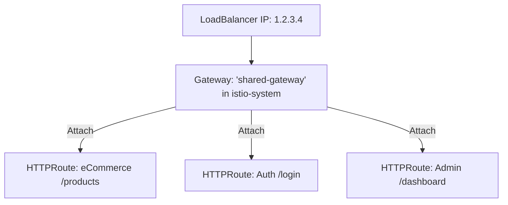

# Chapter 8 — Shared Gateway Strategy (Kubernetes Gateway API)

In this chapter, we address a common challenge: **How to share a single LoadBalancer (Public IP) across multiple services and teams** while using the modern Kubernetes Gateway API instead of the legacy Istio `VirtualService`/`Gateway` pairing.

---

## 1. The Strategy: One Gateway, Many Routes

The most efficient way to use Istio is to have **one core Gateway** (the infrastructure) managed by an admin team, and many **individual HTTPRoutes** (the logic) managed by different service teams.



---

## 2. Solution 1: Automating everything (One Shared IP)

This is the recommended approach for new projects. We create one `Gateway` in the `istio-system` namespace. Istio will provision **one** Envoy Deployment and **one** LoadBalancer Service.

### step 1: The Shared Infrastructure (Admin Task)

```yaml
# Location: istio-system namespace
apiVersion: gateway.networking.k8s.io/v1
kind: Gateway
metadata:
  name: shared-gateway
  namespace: istio-system
spec:
  gatewayClassName: istio
  listeners:
  - name: http
    port: 80
    protocol: HTTP
    allowedRoutes:
      # CRITICAL: This allows teams in ANY namespace to bind their
      # routes to this Gateway and share the IP.
      namespaces:
        from: All 
```

### step 2: The Service Route (Application Team Task)

Team "eCommerce" can now deploy their routes in their own namespace without needing a new LoadBalancer.

```yaml
# Location: ecommerce namespace
apiVersion: gateway.networking.k8s.io/v1
kind: HTTPRoute
metadata:
  name: shop-route
  namespace: ecommerce
spec:
  # Link this route to the shared infrastructure in istio-system
  parentRefs:
  - name: shared-gateway
    namespace: istio-system
  hostnames:
  - "shop.example.com"
  rules:
  - matches:
    - path: { type: PathPrefix, value: "/api/products" }
    backendRefs:
    - name: product-service
      port: 8080
```

---

## 3. Managed vs. Unmanaged Deployment

Because you are starting fresh, you should use **Managed Mode**.

### The "Managed" Approach (Standard for v1.35)
In modern Istio, you don't need to install a gateway via `istioctl` or Helm. Instead, you just apply the `Gateway` YAML, and Istio's control plane will provision the pods for you automatically.

```yaml
apiVersion: gateway.networking.k8s.io/v1
kind: Gateway
metadata:
  name: prod-gateway  # This WILL create a Deployment and LoadBalancer
  namespace: istio-ingress
spec:
  hostnames:
  - "example.com"
  - "*.example.com"
  - "*.example.org"
  - "*.example.net"
  gatewayClassName: istio
  listeners:
  - name: http
    port: 80
    protocol: HTTP
    allowedRoutes:
      namespaces:
        from: All
```

### When would you "Reuse" a name?
You only "Reuse" or use `addresses` labels if you manually installed an Envoy gateway (using Helm or the demo profile) and you want the Gateway API to take control of it without spinning up new pods. Since you are starting fresh, **let Istio manage the infrastructure**.

---

## 4. Troubleshooting: Why won't my Route attach?

If you create an `HTTPRoute` and it doesn't work, check the status:
`kubectl describe httproute <name> -n <namespace>`

Common reasons for failure:
1. **Namespace mismatch:** You forgot `allowedRoutes.namespaces.from: All` in the Gateway.
2. **Hostname conflict:** Two teams tried to claim the same `hostname` on the same Gateway without permission.
3. **GatewayClass:** You didn't install the Gateway API CRDs before installing Istio (Istio only enables Gateway API support if the CRDs are present at boot time).

```bash
# Check if Gateway API is active in Istio
kubectl get gatewayclass
# Result should show 'istio'
```

---

## Summary Comparison

| Goal | Method | Benefit |
| :--- | :--- | :--- |
| **Simple / New** | Managed Gateway (`gatewayClassName: istio`) | Istio handles the Pods and Service IP for you. |
| **Shared IP** | `parentRefs` in HTTPRoute | 100 teams share 1 LoadBalancer. |
| **Existing Infra** | Annotations + Selectors | Reuse the `istio-ingressgateway` from the demo profile. |
