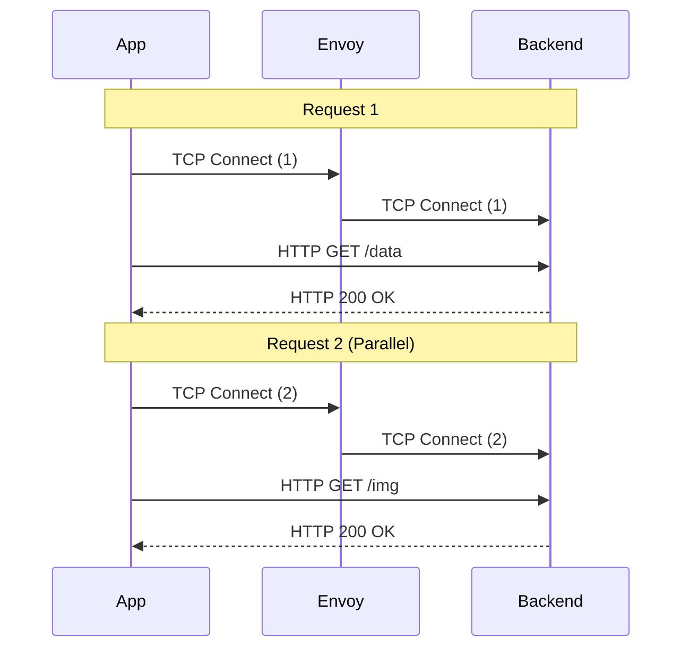
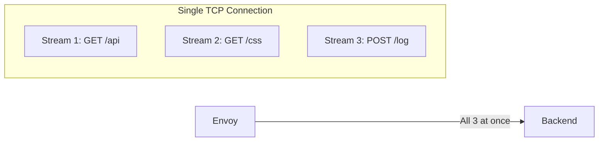
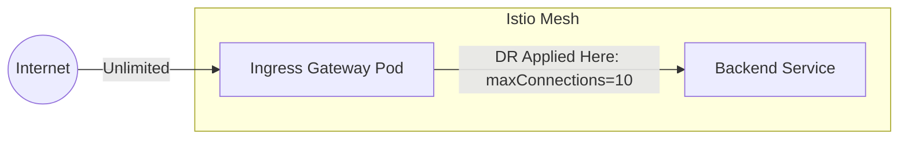

# Visual Guide: HTTP/1.1 vs HTTP/2 Connection Pooling & Circuit Breakers

This guide clarifies how Istio (Envoy) manages traffic at the protocol level and how these settings act as **Circuit Breakers**.

## 1. What is a Circuit Breaker?
In Istio, "Circuit Breaking" is the practice of **failing fast**. Instead of allowing a flood of requests to "clog" a slow backend and make the whole system crash, Envoy "trips the circuit" when a limit is reached.

*   **Behavior**: When a threshold (like `maxConnections`) is hit, Envoy immediately rejects new requests with an **HTTP 503 Service Unavailable**.
*   **Purpose**: Protect the backend from being overwhelmed and provide a predictable failure (fail-fast) instead of a hanging connection.

---

## 2. HTTP/1.1 — The Serial Road
In HTTP/1.1, you can only send **one request at a time** on a single TCP connection. If you want a second request to happen simultaneously, you MUST open a second TCP connection.

### How it works:
*   **Sequential Usage:** You can reuse a connection, but only **after** the first request finishes. This is called `Keep-Alive`.
*   **Concurrency:** To have 10 simultaneous requests, you need 10 TCP connections.

### Mermaid Visualization: HTTP/1.1

### The "Pending" Problem: `http1MaxPendingRequests`
If your `maxConnections` is set to 2, but you try to send 5 requests:
1.  Request 1 & 2 get their own TCP connections.
2.  Request 3, 4, 5 are put in the **Waiting Room** (Pending Queue).
3.  `http1MaxPendingRequests` limits the size of this waiting room. If it's full, the request is rejected immediately with a `503`.

---

## 2. HTTP/2 — The Multiplexed Highway
In HTTP/2, you can send **hundreds of requests at the same time** over a single TCP connection. We call each simultaneous request a **Stream**.

### The Difference: `http2MaxRequests` vs `maxConcurrentStreams`
*   **`maxConcurrentStreams` (L5/L6)**: This is a **Per Connection** limit. It tells Envoy: "On this one TCP wire, do not let more than 10 requests fly at once."
*   **`http2MaxRequests` (L7)**: This is a **Cluster Wide** limit. It tells Envoy: "Across all my TCP connections to this backend, do not have more than 100 requests active in total."

### Mermaid Visualization: HTTP/2

---

## 3. Comparison Table: Configuration Path & Protocol Impact

All settings below are found under: `DestinationRule.spec.trafficPolicy.connectionPool`

| Feature Path | Protocol | Impact on HTTP/1.1 | Impact on HTTP/2 |
| :--- | :---: | :--- | :--- |
| **`.tcp.maxConnections`** | L4 | **CRITICAL**. Defines how many parallel requests you can handle (1 conn = 1 request). | **LOW**. Usually 1 or 2 is enough because one connection handles many requests. |
| **`.http.http1MaxPendingRequests`** | L7 | **CRITICAL**. The "Waiting Room" for when all TCP connections are busy. | **NONE**. This field is ignored for HTTP/2 traffic. |
| **`.http.http2MaxRequests`** | L7 | **NONE**. This field is ignored for HTTP/1.1 traffic. | **CRITICAL**. Total number of active requests allowed across all open TCP pipes. |
| **`.http.maxConcurrentStreams`** | L7 | **NONE**. Not applicable. | **HIGH**. Limits the number of parallel requests **per single TCP connection**. |
| **`.http.maxRequestsPerConnection`** | L7 | **RECYCLING**. Kills the TCP connection after X *sequential* requests. | **RECYCLING**. Kills the TCP connection after X *total multiplexed* requests. |
| **`.tcp.connectTimeout`** | L4 | How long Envoy waits to open the initial TCP handshake. | Same as HTTP/1.1. |
| **`.http.idleTimeout`** | L7 | How long to keep a connection open if no requests are flowing. | Same as HTTP/1.1. |
| **`.http.maxRetries`** | L7 | The max number of parallel retries allowed across the whole pool. | Same as HTTP/1.1. |

---

## 4. `maxRequestsPerConnection` vs `maxConnectionDuration`
These two are often confused, but they are your "Health & Balance" tools:
This setting applies to **both**, but behaves differently:

*   **In HTTP/1.1**: The client sends 1 request, waits, finishes. Sends next. After 100 requests, Envoy **tears down** the TCP connection and opens a new one.
*   **In HTTP/2**: The client sends many requests at once. Envoy counts the **total** number of requests sent over the life of that connection. Once that total hits 100, it "drains" the connection (gracefully stops taking new ones) and starts a new TCP pipe.

### Why do we use it?
1.  **Imbalance**: Old connections might be stuck to a specific pod that is now overloaded. Killing it forces a re-load-balance.
2.  **Memory leaks**: Some backends leak memory if a connection stays open for days.

## 5. Where are these rules enforced? (The "Upstream" Concept)

This is the most important part to remember: **DestinationRules are "Client-Side" configurations.** 

In Istio, the "Client" is the Envoy proxy that is *sending* the request.

### The Ingress Gateway Protection Scenario
When traffic comes from the **Internet** to your **Backend**, the flow looks like this:

1.  **Internet User** (Downstream) hits the **Ingress Gateway**.
2.  **Ingress Gateway Envoy** (Client) looks at your **VirtualService** to see where to send the request.
3.  **Ingress Gateway Envoy** sees the destination is `backend.default.svc.cluster.local`.
4.  **Ingress Gateway Envoy** then looks for a **DestinationRule** for that host.
5.  **Enforcement:** The Ingress Gateway itself is the one that limits the connections based on your DR.

### Visual Flow of Enforcement

**Key Takeaway:** You are protecting the backend by telling the **Gateway** to be a "responsible client." If the gateway gets hit by 1,000 requests, but your DR says `maxConnections: 10`, the gateway will only open 10 "pipes" to your backend. The other 990 requests will wait or fail **at the Gateway**, never reaching your backend.

### Summary Table: Who holds the rule?

| Traffic Flow | Who Enforces the DR? | Who is the "Upstream"? |
| :--- | :--- | :--- |
| **App A -> App B** | Envoy Sidecar in App A | App B |
| **Internet -> App B** | Istio Ingress Gateway Pod | App B |
| **App A -> External API** | Envoy Sidecar in App A | The External API |

---

## 6. Summary Quiz for you:
*   **App sends 50 requests/sec. You use HTTP/1.1 and `maxConnections: 10`.** 
    *   *Result:* 10 requests go through. 40 requests wait in `http1MaxPendingRequests`.
*   **App sends 50 requests/sec. You use HTTP/2 and `maxConcurrentStreams: 100`.**
    *   *Result:* All 50 go through instantly on **one** TCP connection.

---

## 7. Next Steps
Connection pooling protects the **infrastructure** by limiting connections. To protect the **user experience** by removing broken pods from the pool, continue to:

**[Chapter 13 — Outlier Detection (Passive Health Checks) >>](13.outlier-detection.md)**
