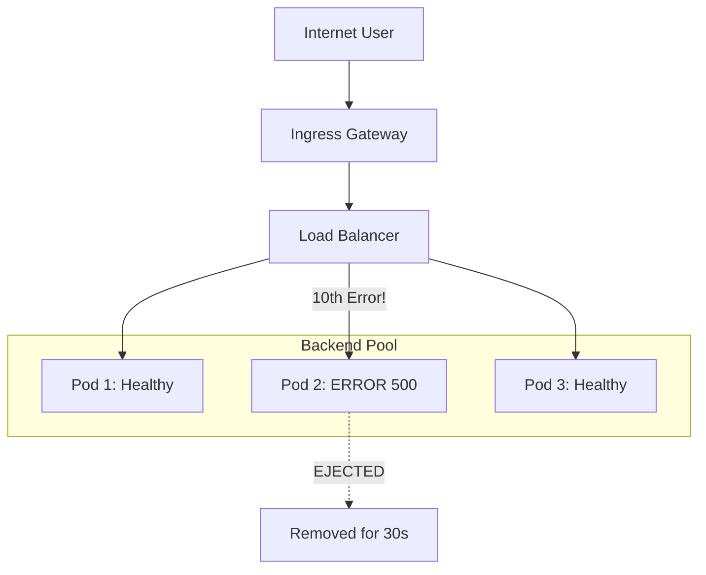

# Chapter 13 — Outlier Detection (Passive Health Checks)

While **Circuit Breaking** (Connection Pooling) limits how *much* traffic goes to a host, **Outlier Detection** decides *which* hosts are allowed to stay in the load-balancing pool at all.

## 1. The Strategy: "Ejection"
If one pod out of ten starts throwing `5XX` errors (e.g., Database connection lost), you don't want to keep sending traffic to it.
Outlier Detection "ejects" (removes) that specific pod for a period of time `baseEjectionTime: 30s`.

### How does Envoy know the pod is "Ready Again"?
It doesn't!
Unlike Kubernetes (which sends a Health Check probe), Istio Outlier Detection is Passive.
*   It does NOT ping the pod while it is ejected.
*   It simply waits for the clock to run out (baseEjectionTime).
*   Once the time is up, Envoy "forgives" the pod and puts it back into the load-balancing pool.

### The "Second Chance" Flow
1. **Ejection:** Pod IP 10.0.1.5 fails 10 times because of `consecutive5xxErrors: 10`. Envoy kicks it out.
2. **The Wait:** For 30 seconds because of `baseEjectionTime: 30s`, Envoy sends zero traffic to 10.0.1.5 for 30s.
3. **The Return:** After 30s, the next interval `interval: 5s` Envoy scans the `"Failure Registry"` and sees that the penalty is over. Envoy puts 10.0.1.5 back in the pool.
4. **The Test:** Real user traffic starts hitting 10.0.1.5 again.
   * **If it works:** Great!
   * **If it fails again immediately:** Envoy kicks it out again, but this time for longer (Istio doubles the penalty time automatically).

### How it differs from K8s Liveness Probes
*   **K8s Liveness/Readiness**: Probes are "Active". Kubelet asks the pod "Are you okay?". If the pod is failing because e.g., Database connection lost, it will answer "Yes I'm okay" even though it is failing real user requests.
*   **Istio Outlier Detection**: Probes are "Passive". Istio watches real traffic. If a pod fails during a real user request, Istio notices and kicks it out.

---

## 2. Configuration Breakdown

```yaml
apiVersion: networking.istio.io/v1beta1
kind: DestinationRule
metadata:
  name: backend-resiliency
spec:
  host: backend.default.svc.cluster.local
  trafficPolicy:
    outlierDetection:
      consecutive5xxErrors: 10    # Threshold: 10 errors in a row = OUT
      interval: 5s                # How often to check the stats. it's like a timer for the envoy to check the "Failure Registry" every 5 seconds.
      baseEjectionTime: 30s       # Start by kicking it out for 30s. Once the time is up, Envoy "forgives" the pod and puts it back into the load-balancing pool.
      maxEjectionPercent: 20      # Safety: Never kick out more than 20% of pods
```

### The Fields explained:

| Field | Purpose | Analogy |
| :--- | :--- | :--- |
| **`consecutive5xxErrors`** | The trigger for ejection. | "Three strikes and you're out." |
| **`interval`** | How often Envoy scans the "Failure Registry". | The "Referee" checking the score every 5 seconds. |
| **`baseEjectionTime`** | How long the pod stays in "Time Out". | The duration of the penalty. |
| **`maxEjectionPercent`** | The "Panic Button" limit. | If all pods are failing, don't kick everyone out (better to have slow service than 0 service). |

---

## 3. The "Consecutive" vs "Gateway" Errors

| Setting | Triggers on... |
| :--- | :--- |
| `consecutive5xxErrors` | Internal Server Errors (500, 502, 503, 504) **returning from the pod**. |
| `consecutiveGatewayErrors` | Specifically 502, 503, 504 (Network/Proxy issues). |
| `consecutiveLocalOriginFailures` | Connection timeouts even before HTTP response. | "Local failure before reaching the pod." |

### Important Distinction: Local vs Upstream 503
If you get a **503 Service Unavailable** because your **Connection Pool is full** (Circuit Breaker), it **DOES NOT** count towards ejection.

**The 503 from a full pool** is generated **internally** by the Client-side Envoy. It never reached the backend, so Envoy knows the backend didn't "fail"—it's just that the doorway (the pool) was locked.

*   **Reason**: That 503 was generated by the *sender's proxy*, not the *destination pod*.
*   **Rule**: Outlier Detection only triggers when the backend pod actually receives a request and fails to process it.

---

## 4. How Istio Routing Works (Bypassing Kube-Proxy)
When you use Istio, the standard `kube-proxy` behavior is bypassed for optimal performance and control.

1.  **Registry**: Istiod watches K8s `Services` and `Endpoints` to learn every **Pod IP**.
2.  **Sidecar Update**: Every Envoy proxy has a local map of every Pod IP in the cluster.
3.  **Direct Routing**: When a request is made, Envoy picks an IP and connects **directly to the Pod IP**, ignoring the K8s ClusterIP and `iptables` load balancing.

---

## 5. Visual Flow: Combined Protection



### Summary of Workflow
1.  **Connection Pool**: Limits the **Volume** of traffic (Prevents crashes).
2.  **Outlier Detection**: Limits the **Frequency** of errors (Improves Success Rate).

---

## 6. Next Steps
Now that you have seen how to handle *real* failures, learn how to *simulate* them to test your system's strength:

**[Chapter 14 — Fault Injection (Chaos Engineering) >>](14.fault-injection.md)**

**[<< Back to Chapter 12: Connection Pooling](12.http-connection-pooling.md)**
