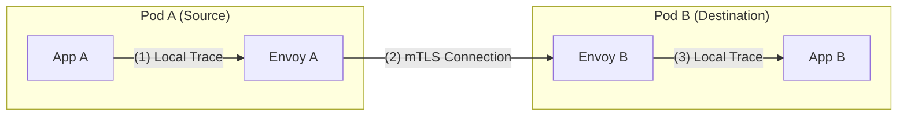
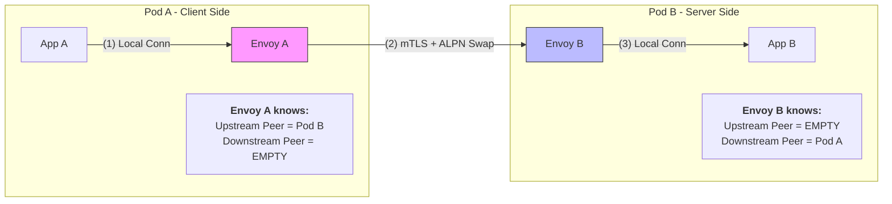

# Chapter 15.2 — Upstream, Downstream, and the "Reporter"

To understand Istio metrics, you must stop thinking of "Client and Server" and start thinking of **Proxies**. Every request in a mesh is handled by two proxies. 

This guide explains the "Peer Metadata" logic that often confuses people in the official Istio documentation.

---

## 1. The Perspective: Who am I?
In the world of Envoy, **Upstream** and **Downstream** are relative terms. They change depending on which pod you are currently looking at.

### Scenario: Pod A calling Pod B


### From the perspective of Envoy A (The Client Sidecar):
*   **Downstream:** The source of the request. (App A).
*   **Upstream:** Where the request is going next. (Pod B).
*   **Peer Metadata:** Info about Pod B.

### From the perspective of Envoy B (The Server Sidecar):
*   **Downstream:** The source of the connection. (Envoy A / Pod A).
*   **Upstream:** Where the request is going next. (App B).
*   **Peer Metadata:** Info about Pod A.

---

## 2. The "Reporter" Attribute
Because both proxies record the same request, Prometheus could accidentally "Double Count" your traffic. To prevent this, Istio adds a label called `reporter`.

| Reporter Value | Which Proxy said this? | Use Case |
| :--- | :--- | :--- |
| `source` | **Envoy A** (The Sender) | "What is the latency the user feels?" |
| `destination` | **Envoy B** (The Receiver) | "How much load is hitting my service?" |

> **Crucial Rule:** When querying `istio_requests_total` in Grafana, you should **always** filter by `reporter="destination"` to get a true count of requests processed by your services.

---

## 3. Peer Metadata: How do they know each other?
How does Pod B know that "Pod A" is the one calling it? It’s not in the HTTP headers!

Istio uses a mechanism called **Metadata Exchange `Application-Layer Protocol Negotiation` (ALPN)**:
1.  **Preparation**: The **Istio Agent** (`pilot-agent`) reads environment variables (like `ISTIO_META_ISTIO_VERSION`) and "seeds" them into Envoy's local metadata.
2.  **The Handshake**: During the mTLS connection, the two sidecars exchange a "Digital Business Card" (this is a custom ALPN protocol).
3.  **The Extraction**: Istio takes this info and puts it into the `istio_` metrics using its specialized filters.

### Example: Adding the Caller's Istio Version
If you want Pod B to record the Istio version of whoever is calling it:
```yaml
spec:
  metrics:
    - overrides:
        - match:
            metric: REQUEST_COUNT
          mode: SERVER # I am the receiver
          tagOverrides:
            caller_version:
              value: "downstream_peer.labels['istio-version']"
```

### How istio-agent reads `downstream_peer.labels['istio-version']` (istio version from the caller in the downstream) from Envoy's "Business Card"? <br/>Is Envoy "Istio-Aware"?

Actually, **no**. Envoy is a generic proxy. It doesn't inherently know about "Istio Versions" or "K8s Namespaces." 
*   **Istio Agent (The Secretary)**: Knows all the K8s/Istio details. It writes these details into Envoy's "pocket" (Metadata).
*   **Envoy (The Courier)**: Just carries the metadata and swaps it with the other proxy. It doesn't care what the values mean.
    * Imagine Envoy A and Envoy B swapping "Digital Business Cards."
    * This swap happens over a custom protocol (ALPN) that Istio added to Envoy.
    * Result: Envoy B now has a copy of Envoy A's card in its memory.
*   **CEL (The Translator)**: When you write "downstream_peer.labels['istio-version']", you are using the CEL logic engine to:
    * Reach into Envoy's "pocket" (the metadata it just swapped).
    * Find the card labeled downstream_peer.
    * Read the `istio-version` field.
    * Write that value into your Prometheus metric labels like `caller_version`

### Why is "Source App" sometimes `unknown`?
If Pod B (in the mesh) receives a request from a legacy VM or a pod **without a sidecar**, there is no mTLS handshake and no "Business Card" exchange.
*   The proxy sees the IP address, but it doesn't know the "App Name."
*   Result: `source_workload="unknown"`.
*   `downstream_peer` envoy metadata will be empty, and any CEL expressions that try to read them will return `""`.

---

## 4. Usage in Telemetry API (CEL)
In the Telemetry API `tagOverrides`, you can use these "Business Cards" (Peer Metadata) to create custom labels.

*   **`upstream_peer`**: Access metadata of the pod you are **calling**. (Used mostly in `mode: CLIENT`).
*   **`downstream_peer`**: Access metadata of the pod **calling you**. (Used mostly in `mode: SERVER`).

---

## 4. Visualization: The "Metadata Mirror"
To make the logic persist in your mind, remember that "Peer" **ALWAYS** means the "Remote guy on the other end of the wire."

### The Rule of "Empty" Peers:
*   A sidecar **never** sees its own local application as a "Peer."
*   Peer metadata is only created when two Envoys shake hands.



### 5. Config Example: The "Mind-Clearer"

If you try to use the "wrong" peer for the "wrong" mode, your metrics will fail to populate.

#### **Case 1: The Working Setup (Success)**
You want Pod B to record which version of Istio the caller is using.
*   **Logic:** I am the **Server**. The caller is my **Downstream Peer**.
```yaml
# Applied in Pod B's namespace
spec:
  metrics:
    - overrides:
        - match: { metric: REQUEST_COUNT }
          mode: SERVER  # Correct Mode for Receiver
          tagOverrides:
            caller_version:
              value: "downstream_peer.labels['istio-version']" # Correct Peer
# RESULT: Label exists with value (e.g. "1.15")
```

#### **Case 2: The "Broken" Setup (Empty Labels)**
You try to ask Pod B for its "Upstream Peer" version.
*   **Logic:** I am the Server. My "Upstream" is just my local container (App B). There is no "Peer card" for local containers.
```yaml
# Applied in Pod B's namespace
spec:
  metrics:
    - overrides:
        - match: { metric: REQUEST_COUNT }
          mode: SERVER 
          tagOverrides:
            wrong_label:
              value: "upstream_peer.labels['istio-version']" 
# RESULT: Label exists but is EMPTY ("") because upstream_peer is unpopulated here.
```

### 6. Label Presence: "Where did my label go?"
A common source of confusion is why a custom label appears on some metrics but not others.

*   **Mode Mismatch (`SERVER` vs `CLIENT`)**: 
    If you set `mode: SERVER`, Istio only tells the **inbound** side of the proxy about your label. 
    *   The `destination` reporter (Server side) will have the label `caller_version`.
    *   The `source` reporter (Client side) will **NOT** have the label at all.
*   **CEL Expression Failure**: 
    If you use `mode: CLIENT_AND_SERVER` but the metadata doesn't exist (e.g., trying to read `downstream_peer` labels on the client side), the label will be **present** in Prometheus, but the value will be **empty** (`""`).

| Scenario | Prometheus Result | Cause |
| :--- | :--- | :--- |
| **Label is missing entirely** | No `caller_version` label | Your `mode` (CLIENT/SERVER) didn't hit that reporter. |
| **Label exists but is empty** | `caller_version=""` | Your CEL expression couldn't find the data at runtime. |

---

## Summary
*   **Envoy Metrics (`envoy_`)**: Low-level. They don't know "Apps," they only know "Upstream/Downstream IPs."
*   **Istio Metrics (`istio_`)**: Enriched. They use **Metadata Exchange** to turn IPs into App Names.
*   **Reporter**: Tells you if the data came from the "Starting line" (source) or the "Finish line" (destination).

---
**[<< Chapter 15.1: Custom Metrics](15.1-custom-metrics.md)** | **[Appendix: CEL vs. Starlark >>](Appendix-CEL-Starlark.md)**
