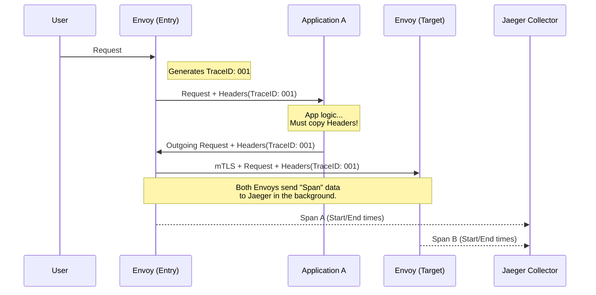
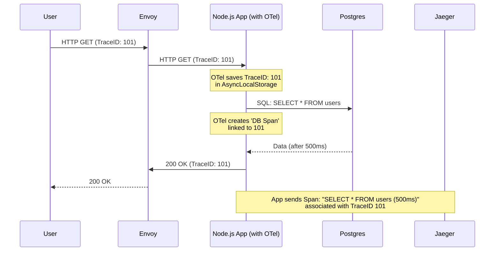

# 15.3 Distributed Tracing in Istio (with Jaeger)

Distributed tracing allows you to visualize a request's journey as it hops through a complex web of microservices. While Prometheus (Metrics) tells you *how many* requests failed, Tracing tells you *where* and *why* a specific request got stuck.

---

## 1. How Tracing Works: The "Breadcrumb" Strategy
Tracing relies on **Span Propagation**. Think of a "Trace" as a tree of "Spans."
*   **Trace:** The entire journey of a request from user to database.
*   **Span:** A single unit of work (e.g., a call from Service A to Service B).

### The "Developer's Duty": Header Propagation
Istio sidecars (Envoy) do 90% of the work by generating IDs, but **your application must do the remaining 10%**. 

When a request arrives at Service A, Envoy injects tracing headers. If Service A then calls Service B, **Service A must manually copy those headers** from the incoming request to the outgoing one. If you don't, the "chain" breaks, and you see two separate, disconnected traces instead of one long path.

#### What is B3?
**B3** stands for "BigBrotherBird," the original name of the Zipkin project inside Twitter. It is a standard set of headers that tell the next service: "I am part of Trace X, and my ID is Y."

**Headers to forward (B3 Format):**
*   `x-request-id`: The unique ID of the request (used by Envoy for logging too).
*   `x-b3-traceid`: The ID for the whole journey.
*   `x-b3-spanid`: The ID for this specific hop.
*   `x-b3-parentspanid`: The ID of the previous hop.
*   `x-b3-sampled`: A `0` or `1` telling the next service if this request should be recorded.
*   `x-b3-flags`: Debug flags.

#### The "x-" Header Mystery
In HTTP, headers starting with `x-` were historically used for "eXtention" (non-standard) headers.
*   **Are they standard?** No, but they are industry standard "de facto." Modern RFCs suggest using descriptive names without `x-`, but tools like Envoy and Zipkin stick to `x-` for backward compatibility.
*   **Do frameworks echo them automatically?** **NO.** Frameworks like Fastify, Express, or Django do **not** automatically forward headers to outgoing calls. You must write a small middle-ware or function to manually copy them. If you use a library like `axios` or `requests` to call another service, they don't know about the headers sitting in your incoming request unless you tell them.

---

## 2. Archiectural Architecture (Sidecar + Collector)



---

## 3. Configuration Step 1: Defining the Provider
By default, Zipkin is often pre-configured in Istio, but to use a specific backend like Jaeger or OpenTelemetry, you must define an **Extension Provider** in the Mesh Configuration.

### Method A: Using IstioOperator (Fresh Install)
If you are using the Operator, add this to your `spec`:

```yaml
apiVersion: install.istio.io/v1alpha1
kind: IstioOperator
spec:
  meshConfig:
    enableTracing: true # Global switch to allow tracing features
    extensionProviders:
    - name: "my-jaeger" # A friendly name we will use in the Telemetry CRD
      zipkin: # Jaeger uses the Zipkin protocol for ingestion
        service: "jaeger-collector.istio-system.svc.cluster.local" # Where to send spans
        port: 9411 # Standard port for Zipkin-compatible tracers
```

### Method B: Editing the ConfigMap (Existing Install)
If Istio is already running, you can edit the `istio` ConfigMap in the `istio-system` namespace.

**Command:** `kubectl edit cm istio -n istio-system`

```yaml
data:
  mesh: |-
    # ... existing config ...
    extensionProviders:
    - name: "my-jaeger"
      zipkin:
        service: "jaeger-collector.istio-system.svc.cluster.local"
        port: 9411
```

---

## 4. Configuration Step 2: Activating via Telemetry Resource
Defining the provider doesn't start the tracing. You must tell Istio to **use** that provider for a specific namespace or the whole mesh.

### Why 1% Sampling in Production?
*   **Performance:** Generating and sending spans for 10,000 requests per second is a heavy load for Envoy and the Jaeger collector.
*   **Storage:** 100% sampling will fill up your Jaeger database (Elasticsearch/Cassandra) in hours.
*   **Statistical Accuracy:** For performance monitoring, 1% or 0.1% of requests is usually enough to see the "average" latency and find bottlenecks.

### Example: Deep Trace Configuration
```yaml
apiVersion: telemetry.istio.io/v1alpha1
kind: Telemetry
metadata:
  name: mesh-wide-tracing
  namespace: istio-system # Applied to the whole mesh
spec:
  tracing:
  - providers:
    - name: "my-jaeger" # Match the name from the ExtensionProvider
    randomSamplingPercentage: 1 # Only 1% of requests are traced
    customTags:
      # 1. LITERAL: Static value added to every span
      # Use for: cluster name, region, environment (dev/prod)
      x-envoy-app_env:
        literal:
          value: "production"

      # 2. HEADER: Copy a value from an incoming HTTP header
      # Use for: tracing specific users or sessions
      x-envoy-user_id:
        header:
          name: "x-user-id"
          defaultValue: "anonymous"

      # 3. ENVIRONMENT: Get a value from the PROXY'S Environment Variables
      # NOTE: This pulls from the Envoy Sidecar's environment, not your app's code.
      # If your Pod has ENV="v1.2", Envoy can read it and tag the trace.
      x-envoy-proxy_version:
        environment:
          name: "ISTIO_META_ISTIO_VERSION"

      # 4. Custom App Header: Track your specific version
      # In the Jaeger UI/Dashboard, this will appear as a searchable tag.
      tag-app-version:
        header: # Corrected to singular 'header'
          name: "x-app-version"
          defaultValue: "unknown"
```

---

## 5. FAQ: Headers & Propagation

### Does Envoy generate B3 headers automatically?
**Yes.** Once tracing is enabled in your mesh, Envoy handles the heavy lifting:
1.  **Incoming:** Envoy checks for `x-b3-` headers.
2.  **Logic:** If they exist, it joins the existing trace. If not, it creates a new one at the entry point.
3.  **Outgoing:** Envoy will update the SpanID and send the updated `x-b3-` headers to the next hop.
**CRITICAL:** You do NOT need to configure B3 headers in the Telemetry CRD. They are built-in.

### "The Prefix Strategy" (Simplicity for Developers)
To make your developers' lives easier, give them a simple, catch-all instruction:
> "Forward all headers starting with `x-b3-`, `x-request-id`, and `x-app-`"

This way, if you add a new tag (like `x-app-region` or `x-app-user-tier`), the developers don't have to change their code! They already forward everything in that "bucket."

---

## 6. Tracing the "Black Hole": Databases (Postgres, Mongo, etc.)
You asked a brilliant question: *Does the trace break at the database?*

The short answer is: **Technically, the "chain" of headers ends at the database, but the "Trace" does not break.**

### The Problem: Databases aren't HTTP
Database protocols (MySQL, Postgres, MongoDB) are **binary protocols**, not HTTP.
*   They do **not** have "Headers."
*   They cannot "echo back" `x-b3-` IDs or `x-request-id`.
*   You cannot "forward" headers into a SQL query.

### The Solution: How Istio/Envoy handles it
Even though the database doesn't speak B3, Envoy acts as a **vantage point** at the networking level.

1.  **Context Knowledge:** Envoy is currently "holding" a request for your Node.js app that has `TraceID: 001`.
2.  **Egress Capture:** When your Node.js app opens a socket to Postgres (TCP Port 5432), Envoy sees this "Egress" traffic.
3.  **Automatic Measurement:** Since Envoy is a proxy, it knows that *this specific* TCP connection belongs to the *same process* that is currently handling `TraceID: 001`.
4.  **The Span:** Envoy creates an **Exit Span**. It records:
    *   **Start:** Time Node.js sent the first SQL packet.
    *   **End:** Time Postgres sent the last response packet.
    *   **Duration:** 450ms.
5.  **The Result:** In Jaeger, you see a bar labeled `postgres.default.svc.cluster.local:5432`.

### The "Deep Solution": Application-Level Instrumentation
If you rely **only** on Envoy, you will see *that* the DB was slow, but you won't see *which* query was slow. To fix the "Black Hole" completely, we use **OpenTelemetry (OTel)** or **Jaeger Libraries** inside the Node.js code.

#### How it works inside the code (The "Context" Bridge):
1.  **The Middleware:** When the request enters Node.js, an OTel library saves the `TraceID` in a "Global Context" (usually using `AsyncLocalStorage` in Node).
2.  **The Driver Hook:** When you call `client.query('SELECT...')`, the OTel library "wraps" the Postgres driver.
3.  **The DB Span:** It creates a new span **inside the app** called `SQL SELECT`. It attaches the actual SQL command as a tag.
4.  **The Connection:** Because it uses the same `TraceID` from the "Global Context", Jaeger can perfectly stitch the HTTP request and the SQL query together.



### 6.1 The Pooling Challenge: Envoy's "Blind Spot"
You raised a very high-level technical point: **What about Connection Pools?**

You are 100% correct. If your Node.js app keeps 10 TCP connections open (a pool) and sends 100 queries through them over 10 minutes, Envoy's Layer 4 (TCP) logic gets confused.

*   **The Issue:** At a pure TCP level (Layer 4), Envoy just sees one long-lived connection. It can't tell where Query A ends and Query B begins.
*   **The Risk:** If Query A (Trace 001) and Query B (Trace 002) both use the same physical TCP connection at slightly overlapping times, Envoy might misattribute the time or simply show one giant, meaningless span.

### The Two Solutions to the Pooling Problem

#### 1. Protocol-Aware Filters (The Envoy Way)
Envoy has specific filters for certain databases (e.g., `envoy.filters.network.postgres_proxy` or `envoy.filters.network.mongo_proxy`).
*   **How it helps:** These filters "sniff" the binary protocol. They understand the "Start Query" and "End Result" packets inside the TCP stream.
*   **Limitation:** This is computationally expensive. Istio does not enable "Deep SQL Inspection" by default because it would slow down the mesh significantly.

#### 2. OpenTelemetry (The Clean Way)
This is why **Application Instrumentation** is the industry standard for databases.
*   **Memory Context:** Because the OTel library lives **inside** your Node.js app, it doesn't care about TCP sockets or pools. 
*   **Logic:** It knows that `Thread/Async Context A` is currently executing `db.query()`. It starts the timer exactly when your code calls the function and stops it when the callback returns.
*   **Accuracy:** It is 100% accurate because it is tied to your **Application Logic**, not the **Network Packets**.

---

## 7. Why Jaeger?
Jaeger is the most popular backend for Istio tracing because:
1.  **Gantt Chart View:** It shows exactly which service took the longest (e.g., Service B took 800ms out of a 1s total).
2.  **Service Graph:** It can automatically draw a map of how your services are connected based on the traces.
3.  **Search:** You can find traces with specific tags (like our `user_id` tag above) to debug a specific user's problem.

---

## 6. Common Pitfalls
1.  **Missing Headers:** If a trace looks broken (only one service shows up), check if your code is "eating" the `x-request-id` header instead of passing it forward.
2.  **Sampling Rate:** If you set `randomSamplingPercentage: 1` (default), 99% of your requests won't appear in Jaeger. This is good for performance but confusing during testing.
3.  **Zipkin vs Jaeger:** In Istio config, we often use the `zipkin` key to point to Jaeger. This is normal because Jaeger speaks the Zipkin protocol.
