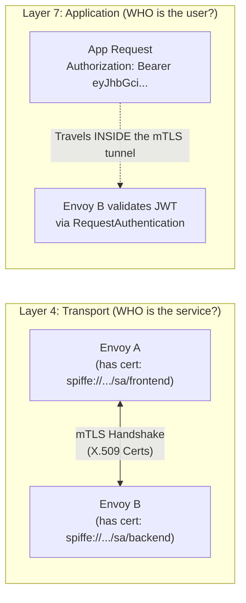
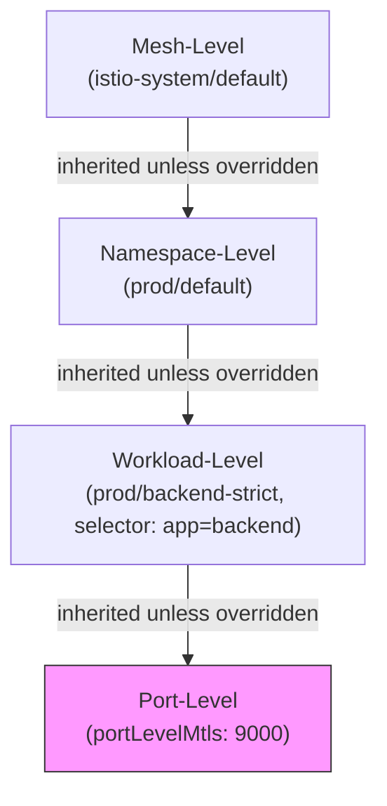
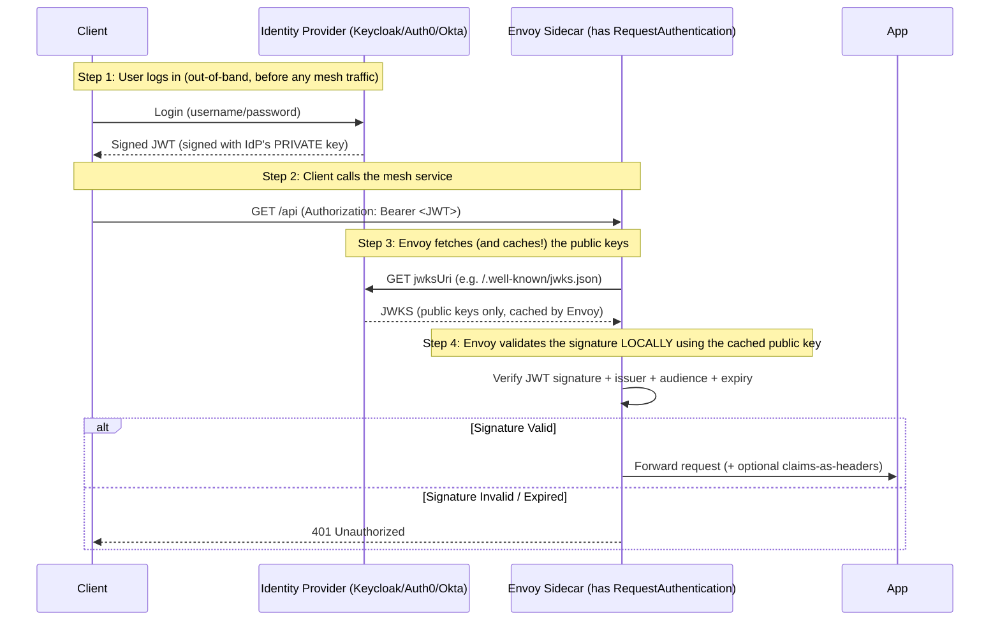

# 16.1 Istio Security — Authentication Deep Dive (mTLS & JWT)

Chapter 16 covers the **Security Pillar** of Istio: `Authentication` (Who are you?) and `Authorization` (What are you allowed to do?). This first part focuses entirely on **Authentication**.

---

## 1. The Core Confusion: "Authentication" is Split in Two

This is the part that trips up most engineers. In Istio, "Authentication" is **not one thing** — it is deliberately split into two completely separate resources because they authenticate two completely different types of "identity."

| Concept | Istio Resource | Answers the question... | Identity Format | Who holds the "key"? |
| :--- | :--- | :--- | :--- | :--- |
| **Peer (Service) Authentication** | `PeerAuthentication` | *"Which **service** is calling me?"* | X.509 Certificate (SPIFFE ID) | The **Envoy Sidecar** (mTLS handshake) |
| **Request (User) Authentication** | `RequestAuthentication` | *"Which **end-user/human/client-app** is calling me?"* | JWT (JSON Web Token) | The **Application client** (attaches header) |

### The Simple Analogy
Think of a secure office building:
*   **PeerAuthentication (mTLS)** = The **Badge Reader on the door**. It checks that the person walking through the door is a legitimate "employee" (i.e., a workload that belongs to the mesh) — it doesn't care WHO the employee is, just that they have a valid company badge (certificate).
*   **RequestAuthentication (JWT)** = The **ID card the employee shows the receptionist** once they are already inside the building. It proves *which specific person* (or which specific end-user's session) is making the request.

**Key takeaway:** `PeerAuthentication` authenticates the **workload/service** (machine-to-machine). `RequestAuthentication` authenticates the **end-user or client application** (human-to-machine, or app-to-app impersonation of a user). You typically use **both together** — mTLS secures the "pipe" between services, JWT identifies "who" is inside that pipe.

---

## 2. X.509 Certificates vs. JWT — Full Comparison

### 2.1 What is an X.509 Certificate (used in mTLS)?
It's a cryptographic file, issued by `istiod`'s built-in Certificate Authority (CA), that proves a **workload's identity**. Istio embeds a special identity format called **SPIFFE ID** inside the certificate, e.g.:
```
spiffe://cluster.local/ns/prod/sa/frontend
```
This means: *"This certificate belongs to the `frontend` ServiceAccount, in the `prod` namespace, in the `cluster.local` trust domain."*

### 2.2 What is a JWT (used in RequestAuthentication)?
A JWT is a **self-contained, signed text token** (usually issued by an external Identity Provider like Keycloak, Auth0, Okta, or Google) that a *client* attaches to its request, usually in the `Authorization: Bearer <token>` header. It contains **claims** (key-value pairs) like:
```json
{
  "iss": "https://accounts.google.com",
  "sub": "user-12345",
  "aud": "my-api",
  "exp": 1735689600
}
```

### 2.3 Side-by-Side Comparison

| Feature | X.509 Certificate (mTLS) | JWT (RequestAuthentication) |
| :--- | :--- | :--- |
| **Proves identity of...** | The workload/Pod (Service) | The end-user or calling application |
| **Issued by** | Istio's internal CA (`istiod`) or a custom CA | An external Identity Provider (IdP): Keycloak, Auth0, Okta, Azure AD |
| **Where is it attached?** | Embedded in the TLS handshake itself (Layer 4) | An HTTP Header, Cookie, or Query Parameter (Layer 7) |
| **Who verifies it?** | Envoy Sidecar (during the TCP handshake) | Envoy Sidecar (during HTTP request parsing, via `RequestAuthentication`) |
| **Lifespan** | Short-lived (~24h), auto-rotated by Istio | Depends on IdP config (usually minutes to hours) |
| **Granularity** | 1 identity per **workload** (all pods of a Deployment share it) | 1 identity per **individual user/session/token** |
| **Managed via CRD** | `PeerAuthentication` | `RequestAuthentication` |
| **Enforced via CRD** | `PeerAuthentication` (mode) + `DestinationRule` (outbound) | `AuthorizationPolicy` (using `requestPrincipals`) |

### 2.4 "Can mTLS be done with JWT?" — Clearing the Confusion
**No — not in the way you might think, and this is an important distinction:**
*   **mTLS** is a **transport-layer (L4)** concept: it's about the TLS handshake itself, requiring **both sides** to present certificates.
*   **JWT** is an **application-layer (L7)** concept: it's just a string of text traveling as an HTTP header, completely independent of whether the underlying connection is using TLS, mTLS, or plaintext.

**You CAN and typically SHOULD use both simultaneously** — they solve different problems and stack on top of each other:

So the correct mental model is: **mTLS wraps the "pipe" in an encrypted, mutually-verified tunnel. The JWT is just cargo riding inside that pipe, which gets separately inspected.** JWT validation does NOT create or replace the mTLS handshake — they are two independent, stackable layers of trust.

---

## 3. `PeerAuthentication` — Full Field-Path Reference

Based on `kubectl explain`, here is the full structure:

```
PeerAuthentication.spec<Object>
├── selector<Object>              # WHICH workloads this policy applies to
├── mtls<Object>
│   └── mode<string>              # enum: UNSET, DISABLE, PERMISSIVE, STRICT
└── portLevelMtls<map[string]Object>
    └── <port-number>.mode<string> # Per-port override of the mode above
```

### 3.1 The Four Modes Explained

| Mode | Field Path | Meaning |
| :--- | :--- | :--- |
| **`STRICT`** | `PeerAuthentication.spec.mtls.mode` | Only mTLS-encrypted traffic is accepted. Plaintext is **rejected**. |
| **`PERMISSIVE`** | `PeerAuthentication.spec.mtls.mode` | Accepts **both** mTLS and plaintext traffic on the same port. (Default mesh-wide setting — used for migrating legacy apps.) |
| **`DISABLE`** | `PeerAuthentication.spec.mtls.mode` | mTLS is turned OFF. Traffic is sent/received in plaintext. |
| **`UNSET`** | `PeerAuthentication.spec.mtls.mode` | No opinion here — **inherit** from the parent level (Workload → Namespace → Mesh). If nothing is set anywhere, defaults to `PERMISSIVE`. |

### 3.2 Example A — Mesh-Wide STRICT mTLS
```yaml
apiVersion: security.istio.io/v1beta1
kind: PeerAuthentication
metadata:
  name: default          # Convention: "default" name + istio-system namespace = mesh-wide policy
  namespace: istio-system
spec:
  # No 'selector' field defined here -> applies to EVERY workload in the ENTIRE mesh
  mtls:
    mode: STRICT         # PeerAuthentication.spec.mtls.mode: reject all plaintext traffic mesh-wide
```

### 3.3 Example B — Namespace-Wide PERMISSIVE (Migration Mode)
```yaml
apiVersion: security.istio.io/v1beta1
kind: PeerAuthentication
metadata:
  name: default
  namespace: legacy-apps # Applying at the NAMESPACE level (no selector) = affects all pods in 'legacy-apps' ns
spec:
  mtls:
    mode: PERMISSIVE     # PeerAuthentication.spec.mtls.mode: allow BOTH plaintext and mTLS
                          # Useful while onboarding VMs / non-injected pods into the mesh
```

### 3.4 Example C — Workload-Specific STRICT (Most Specific Wins)
```yaml
apiVersion: security.istio.io/v1beta1
kind: PeerAuthentication
metadata:
  name: backend-strict
  namespace: prod
spec:
  selector:               # PeerAuthentication.spec.selector: targets ONLY pods matching these labels
    matchLabels:
      app: backend
  mtls:
    mode: STRICT          # This OVERRIDES whatever is set at the namespace or mesh level for 'backend' pods only
```

### 3.5 Example D — Port-Level Override (Metrics Port Exception)
This is the exact scenario from your course material — useful when a specific port (e.g., a legacy metrics scraper, a health check, or a non-mesh-aware DB driver) cannot speak mTLS, but you still want STRICT mTLS for everything else.
```yaml
apiVersion: security.istio.io/v1beta1
kind: PeerAuthentication
metadata:
  name: default
  namespace: prod
spec:
  selector:
    matchLabels:
      app: backend
  mtls:
    mode: STRICT           # PeerAuthentication.spec.mtls.mode: STRICT for ALL ports by default
  portLevelMtls:           # PeerAuthentication.spec.portLevelMtls<map[string]Object>: per-port EXCEPTIONS
    9000:                  # This is the CONTAINER port (not the K8s Service port!)
      mode: DISABLE         # PeerAuthentication.spec.portLevelMtls.<port>.mode: this one port allows plaintext
```
> **Gotcha (explicitly called out in the course):** The port number under `portLevelMtls` refers to the **container/workload port**, NOT the Kubernetes `Service` port. If your `Service` maps `9000 -> 8080` (targetPort), you must use `8080` here, not `9000`.

### 3.6 The Inheritance / Precedence Rule (ABCD Rule Recap)

**Most specific always wins.** Port-level beats Workload-level, Workload-level beats Namespace-level, Namespace-level beats Mesh-level. `UNSET` at any level simply means "look one level up."

---

## 4. `RequestAuthentication` — Full Field-Path Reference

```
RequestAuthentication.spec<Object>
├── selector<Object>                          # WHICH workloads this policy applies to
├── targetRef<Object>                         # Alternative to selector (Gateway API style, single target)
│   ├── group<string>
│   ├── kind<string>          -required-
│   ├── name<string>          -required-
│   └── namespace<string>
├── targetRefs<[]Object>                      # Alternative to selector (Gateway API style, multiple targets)
│   └── (same sub-fields as targetRef)
└── jwtRules<[]Object>                        # THE core list: rules to validate incoming JWTs
    ├── issuer<string>                        # WHO issued the token (must match the 'iss' claim exactly).
    ├── audiences<[]string>                   # WHO the token is intended for (must match 'aud' claim)
    ├── jwksUri<string>                       # URL to fetch the issuer's PUBLIC KEYS (for signature verification)
    ├── jwks<string>                          # Inline JSON Web Key Set (alternative to jwksUri, no network call needed)
    ├── fromHeaders<[]Object>                 # Custom header(s) to look for the token in
    │   ├── name<string>
    │   └── prefix<string>
    ├── fromParams<[]string>                  # Custom query parameter(s) to look for the token in
    ├── fromCookies<[]string>                 # Custom cookie name(s) to look for the token in
    ├── forwardOriginalToken<boolean>         # Should the raw JWT be forwarded upstream to the app?
    ├── outputPayloadToHeader<string>         # Dump the FULL decoded JWT payload into this header
    ├── outputClaimToHeaders<[]Object>        # Copy INDIVIDUAL claims into specific headers
    │   ├── header<string>
    │   └── claim<string>
    ├── spaceDelimitedClaims<[]string>        # Treat these claims as space-separated lists (e.g., scope)
    └── timeout<string>                       # Max wait time when fetching remote JWKS
```

### 4.1 What is a JWK / JWKS? (Since it's new to you)
*   **JWK (JSON Web Key):** A single public cryptographic key represented as a JSON object. It contains the key type (`kty`), algorithm (`alg`), and the actual key material (`n`, `e` for RSA keys).
*   **JWKS (JSON Web Key Set):** A JSON document containing an **array** of JWKs — usually published by the Identity Provider at a well-known, public URL (e.g., `https://accounts.google.com/.well-known/jwks.json` or your Keycloak realm's `.../protocol/openid-connect/certs`).
*   **Why it matters:** JWTs are signed using the IdP's **private key**. Anyone verifying the JWT needs the corresponding **public key** to check the signature — that's exactly what the JWKS provides. Public keys are safe to expose; only the IdP holds the private key used for signing.

### 4.2 Signature Validation — Answering Your Direct Question
> *"How will the signature be validated? Against an endpoint API with a public key like Keycloak? Or against a trusted CA / Istio CA saved internally in the proxy?"*

**Answer: It is validated against the external IdP's public keys — NOT against the Istio CA.** The Istio CA (used for mTLS/X.509) and the JWT signature validation are **completely separate trust chains**. Here's exactly how it works:
AuthorizationPolicy.spec< Object>.jwtRules<[]Object> is a list of issuers (.jwtRules<[]Object>.issuer) and their corresponding JWKS (.jwtRules<[]Object>.jwksUri or .jwtRules<[]Object>.jwks).<br/>
When a request comes in with a JWT, the Envoy sidecar does the following:
*   It checks the `iss` claim in the JWT against the list of issuers in the `RequestAuthentication` policy.
*   It fetches the JWKS from the corresponding `jwksUri` (or uses the static `jwks`) to obtain the public key.
*   It uses the public key to verify the JWT's signature.
*   If none of the issuers match the `iss` claim, or if the signature is invalid, the request is rejected with a `401 Unauthorized`.



**Key clarifications:**
1.  **Not the Istio CA:** `jwksUri` points to YOUR Identity Provider (Keycloak, Auth0, Google, Azure AD, etc.), never to Istio's internal Certificate Authority. They are unrelated PKI systems.
2.  **Yes, exactly like Keycloak:** If you run Keycloak, your `jwksUri` would look like:
    `https://keycloak.mycompany.com/realms/myrealm/protocol/openid-connect/certs`
3.  **Caching:** Envoy fetches the JWKS periodically (respecting cache headers) and caches it locally — it does NOT make a network call to the IdP on every single request. This keeps validation fast.
4.  **Offline alternative (`jwks` field):** If you don't want Envoy making any outbound calls to fetch keys (e.g., air-gapped environments), you can inline the JWKS directly as a string using the `jwks` field instead of `jwksUri`.
5.  **`istiod`'s role:** `istiod` only takes your `RequestAuthentication` YAML and pushes the equivalent Envoy JWT filter configuration down via xDS. It does not participate in the actual runtime validation — that's 100% done locally inside the Envoy sidecar's data plane.

### 4.3 Example A — Basic JWT Validation (from the course)
```yaml
apiVersion: security.istio.io/v1
kind: RequestAuthentication
metadata:
  name: jwt
  namespace: prod
spec:
  selector:                                 # RequestAuthentication.spec.selector
    matchLabels:
      app: backend
  jwtRules:                                 # RequestAuthentication.spec.jwtRules
  - issuer: "https://sso.bssconnects.io/realms/bssconnects"  # RequestAuthentication.spec.jwtRules.issuer # Must match exactly the claim iss: in the JWT to apply this rule.
    jwksUri: "https://raw.githubusercontent.com/istio/istio/release-1.20/security/tools/jwt/samples/jwks.json"
                                             # RequestAuthentication.spec.jwtRules.jwksUri
    forwardOriginalToken: true              # RequestAuthentication.spec.jwtRules.forwardOriginalToken
                                             # Keeps the raw "Authorization: Bearer ..." header for the app
    outputClaimToHeaders:                   # RequestAuthentication.spec.jwtRules.outputClaimToHeaders
    - header: x-foo                         # RequestAuthentication.spec.jwtRules.outputClaimToHeaders.header
      claim: foo                            # RequestAuthentication.spec.jwtRules.outputClaimToHeaders.claim
    - header: x-sub
      claim: sub                            # e.g. copies the JWT's "sub" claim into the "x-sub" header
```
Example Payload of a JWT that would be validated by the above rule:
```json
{
  "iss": "https://sso.bssconnects.io/realms/bssconnects", # Must match exactly the issuer in the RequestAuthentication rule
  "sub": "user-12345",
  "aud": "my-api",
  "foo": "bar",
  "exp": 1735689600
}
```

### 4.4 Example B — Custom Header/Query Param Location (from the course)
```yaml
apiVersion: security.istio.io/v1
kind: RequestAuthentication
metadata:
  name: jwt-custom-location
spec:
  selector:
    matchLabels:
      app: httpbin
  jwtRules:
  - issuer: "testing@secure.istio.io"
    jwksUri: "https://raw.githubusercontent.com/istio/istio/release-1.20/security/tools/jwt/samples/jwks.json"
    forwardOriginalToken: true
    fromParams:                             # RequestAuthentication.spec.jwtRules.fromParams
    - "jwt_token"                           # Looks for: GET /api?jwt_token=<JWT>
    fromHeaders:                            # RequestAuthentication.spec.jwtRules.fromHeaders
    - name: x-jwt                           # RequestAuthentication.spec.jwtRules.fromHeaders.name # Looks for header: x-jwt: <JWT>
      prefix: "Bearer "                     # RequestAuthentication.spec.jwtRules.fromHeaders.prefix
                                             # NOTE the trailing space! Header must look like: "x-jwt: Bearer <JWT>"
```

### 4.5 Example C — Multiple Issuers on the Same Workload
```yaml
apiVersion: security.istio.io/v1
kind: RequestAuthentication
metadata:
  name: multi-issuer
  namespace: prod
spec:
  selector:
    matchLabels:
      app: api-gateway
  jwtRules:                                 # A LIST -> supports MULTIPLE issuers (OR semantics)
  - issuer: "https://accounts.google.com"
    audiences: ["my-web-app"]               # RequestAuthentication.spec.jwtRules.audiences
    jwksUri: "https://www.googleapis.com/oauth2/v3/certs"
  - issuer: "https://keycloak.mycompany.com/realms/myrealm"
    audiences: ["internal-service"]
    jwksUri: "https://keycloak.mycompany.com/realms/myrealm/protocol/openid-connect/certs"
    # A request will be validated if it matches EITHER of the two jwtRules above
```

### 4.6 Example D — Inline JWKS (No Outbound Network Call)
```yaml
apiVersion: security.istio.io/v1
kind: RequestAuthentication
metadata:
  name: offline-jwks
  namespace: prod
spec:
  selector:
    matchLabels:
      app: backend
  jwtRules:
  - issuer: "internal-issuer"
    jwks: |                                 # RequestAuthentication.spec.jwtRules.jwks (inline string, not a URL)
      {"keys":[{"kty":"RSA","kid":"abc123","n":"...","e":"AQAB"}]}
```

### 4.7 CRITICAL: `RequestAuthentication` Alone Does NOT Enforce Anything!
This is a common misconception. **`RequestAuthentication` only VALIDATES tokens that are present** — it does not, by itself, reject requests that have **no token at all**.

| Scenario | Result with ONLY `RequestAuthentication` (no `AuthorizationPolicy`) |
| :--- | :--- |
| Request WITH a valid JWT | ✅ Allowed, claims extracted, available for use |
| Request WITH an invalid/expired JWT | ❌ **Rejected** (401) — invalid tokens are always rejected |
| Request WITH an unknown issuer JWT | ❌ **Rejected** (401) — Token present, but no jwtRule matches this issuer. |
| Request WITH **NO** JWT at all | ✅ **Still Allowed!** (Because there was nothing to validate) |

**To force "JWT is mandatory," you MUST pair it with an `AuthorizationPolicy`** using the `requestPrincipals` field (covered in [16.2-authorization-policies-opa.md](16.2-authorization-policies-opa.md)):
```yaml
apiVersion: security.istio.io/v1beta1
kind: AuthorizationPolicy
metadata:
  name: require-jwt
  namespace: prod
spec:
  selector:
    matchLabels:
      app: backend
  action: ALLOW
  rules:
  - from:
    - source:
        requestPrincipals: ["*"]  # "*" means: a JWT MUST be present, from ANY of the validated issuers
```

---

## 5. Summary Cheat-Sheet

| I want to... | Use this resource | Key field |
| :--- | :--- | :--- |
| Force all service-to-service L4 traffic to be encrypted | `PeerAuthentication` | `spec.mtls.mode: STRICT` |
| Allow legacy non-mesh services to talk to mesh services temporarily | `PeerAuthentication` | `spec.mtls.mode: PERMISSIVE` |
| Exempt one specific port from mTLS (e.g., a health check) | `PeerAuthentication` | `spec.portLevelMtls.<port>.mode` |
| Validate that an incoming request has a legit JWT from Keycloak/Auth0/etc. | `RequestAuthentication` | `spec.jwtRules.issuer` + `spec.jwtRules.jwksUri` |
| Extract a user's claims (e.g., `sub`, `email`) into headers for my app | `RequestAuthentication` | `spec.jwtRules.outputClaimToHeaders` |
| **Force** that a JWT must be present (reject anonymous requests) | `AuthorizationPolicy` (paired with above) | `spec.rules.from.source.requestPrincipals` |

Continue to [16.2 — Authorization Policies & OPA](16.2-authorization-policies-opa.md) for the enforcement layer (`AuthorizationPolicy`) and Open Policy Agent (OPA) integration.
