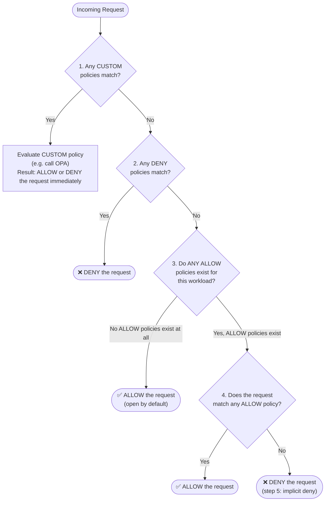
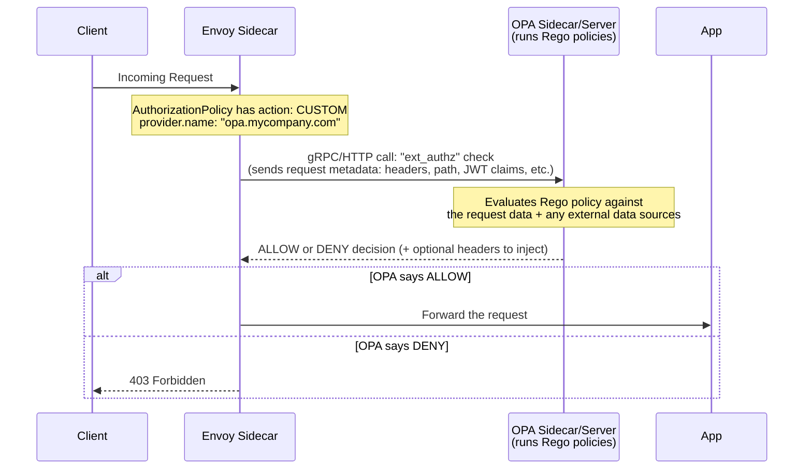

# 16.2 Istio Security — Authorization Policies & OPA Deep Dive

This chapter covers **Authorization** — once `PeerAuthentication` (mTLS) and `RequestAuthentication` (JWT) have established WHO is calling, `AuthorizationPolicy` decides WHAT that caller is allowed to do.

---

## 1. `AuthorizationPolicy` — Full Field-Path Reference

```
AuthorizationPolicy.spec<Object>
├── action<string>                  # enum: ALLOW, DENY, AUDIT, CUSTOM (default: ALLOW)
├── provider<Object>                # ONLY used when action = CUSTOM
│   └── name<string>                # Name of the external authz extension provider (e.g., OPA)
├── selector<Object>                # WHICH workloads this policy applies to (label-based)
├── targetRef<Object>                # Alternative to selector (Gateway API style)
├── targetRefs<[]Object>             # Alternative to selector (multiple targets)
└── rules<[]Object>                  # THE list of access rules (OR'd together)
    ├── from<[]Object>               # WHO is sending the request
    │   └── source<Object>
    │       ├── principals<[]string>          # SPIFFE IDs from mTLS certs (source workload identity)
    │       ├── notPrincipals<[]string>       # Negative match
    │       ├── requestPrincipals<[]string>   # JWT identities: "<issuer>/<subject>"
    │       ├── notRequestPrincipals<[]string>
    │       ├── namespaces<[]string>          # Source namespace
    │       ├── notNamespaces<[]string>
    │       ├── ipBlocks<[]string>            # Source IP / CIDR
    │       ├── notIpBlocks<[]string>
    │       ├── remoteIpBlocks<[]string>      # Original client IP (via X-Forwarded-For)
    │       └── notRemoteIpBlocks<[]string>
    ├── to<[]Object>                 # WHAT operation is being performed
    │   └── operation<Object>
    │       ├── hosts<[]string>
    │       ├── notHosts<[]string>
    │       ├── ports<[]string>
    │       ├── notPorts<[]string>
    │       ├── methods<[]string>              # GET, POST, PUT, DELETE...
    │       ├── notMethods<[]string>
    │       ├── paths<[]string>                # /api/*, /admin, etc.
    │       └── notPaths<[]string>
    └── when<[]Object>                # ADDITIONAL conditions (CEL-like key/value matching)
        ├── key<string>               # e.g. request.auth.claims[iss], source.ip, connection.sni
        ├── values<[]string>          # Positive match (OR semantics)
        └── notValues<[]string>       # Negative match
```

> **OR / AND Logic Cheat-Sheet:**
> *   Multiple items inside the SAME list (e.g., two entries in `principals`) → **OR**.
> *   Multiple sections in the SAME rule (`from` + `to` + `when` together) → **AND**.
> *   Multiple `rules` entries in the SAME policy → **OR** (any single rule matching is enough).
> *   Multiple `AuthorizationPolicy` **resources** → combined per the evaluation order in Section 2.

---

## 2. The Evaluation Order — Step by Step with Examples

This is the single most important concept to internalize. Istio evaluates **all matching policies across the entire mesh** (mesh-level + namespace-level + workload-level) using this exact algorithm:



### The 5 Steps in Plain English
1.  **CUSTOM policies first.** If any `CUSTOM` action policy matches (e.g., an OPA check), its result (allow/deny) is authoritative and evaluation effectively stops there for that decision.
2.  **DENY policies next.** If ANY `DENY` policy matches the request, it is **immediately rejected** — no `ALLOW` policy can ever override this.
3.  **No ALLOW policies exist?** If there isn't a single `ALLOW` policy targeting this workload anywhere in the mesh/namespace/workload scope, the request is **allowed by default** (this is Istio's "open" default posture).
4.  **ALLOW policies exist — does the request match one?** If `ALLOW` policies exist for this workload, the request must match **at least one** of them to be let through.
5.  **Otherwise, implicit deny.** If `ALLOW` policies exist but none of them match this specific request, it is denied.

### 2.1 Example Set — Demonstrating the FULL Evaluation Order
Let's build a realistic 3-policy scenario in the `prod` namespace to see this play out.

```yaml
# ============================================================
# POLICY 1: Namespace-wide DENY — blocks the 'payments' service
#           from ever reaching ANY workload in 'prod', no matter
#           what other ALLOW policies say (Step 2 wins over Step 4).
# ============================================================
apiVersion: security.istio.io/v1beta1
kind: AuthorizationPolicy
metadata:
  name: deny-payments-everywhere
  namespace: prod
spec:
  action: DENY                                   # AuthorizationPolicy.spec.action
  # No 'selector' -> applies to ALL workloads in the 'prod' namespace
  rules:                                          # AuthorizationPolicy.spec.rules
  - from:                                         # AuthorizationPolicy.spec.rules.from
    - source:
        principals: ["cluster.local/ns/prod/sa/payments"]
                                                   # AuthorizationPolicy.spec.rules.from.source.principals
---
# ============================================================
# POLICY 2: Workload-level ALLOW — only 'frontend' can call 'backend',
#           and only for specific GET/POST routes.
#           Once THIS policy exists, 'backend' now REQUIRES a match
#           (Step 3 "no ALLOW exists" no longer applies to 'backend').
# ============================================================
apiVersion: security.istio.io/v1beta1
kind: AuthorizationPolicy
metadata:
  name: allow-frontend-to-backend
  namespace: prod
spec:
  selector:                                       # AuthorizationPolicy.spec.selector
    matchLabels:
      app: backend
  action: ALLOW                                   # (ALLOW is also the default if omitted)
  rules:
  - from:
    - source:
        principals: ["cluster.local/ns/prod/sa/frontend"]
    to:                                            # AuthorizationPolicy.spec.rules.to
    - operation:
        methods: ["GET", "POST"]                   # AuthorizationPolicy.spec.rules.to.operation.methods
        paths: ["/api/*"]                          # AuthorizationPolicy.spec.rules.to.operation.paths
    when:                                          # AuthorizationPolicy.spec.rules.when
    - key: request.auth.claims[iss]                # AuthorizationPolicy.spec.rules.when.key
      values: ["https://prodissuer.mycompany.com"] # AuthorizationPolicy.spec.rules.when.values
---
# ============================================================
# POLICY 3: A DIFFERENT workload ('reporting') has NO ALLOW policy
#           anywhere -> Step 3 applies -> it is OPEN to anyone
#           (except globally denied 'payments' from Policy 1).
#           (No YAML needed here — this demonstrates the "implicit allow"
#            behavior purely by ABSENCE of a policy for 'app: reporting')
# ============================================================
```

### 2.2 Tracing Through Real Requests

| Request | Walkthrough | Result |
| :--- | :--- | :--- |
| `payments` → `backend` GET `/api/x` | Step 1: No CUSTOM. Step 2: **Policy 1 (DENY) matches** `payments` principal → immediately rejected. | ❌ **DENIED** (Policy 1 wins, Policy 2 never even considered) |
| `frontend` → `backend` GET `/api/x` (valid JWT issuer) | Step 1: No CUSTOM. Step 2: No DENY matches (`frontend` ≠ `payments`). Step 3: ALLOW policies EXIST for `backend` (Policy 2). Step 4: Request matches Policy 2's `from`+`to`+`when`. | ✅ **ALLOWED** |
| `frontend` → `backend` **DELETE** `/api/x` | Step 1/2: pass. Step 3: ALLOW exists. Step 4: Method `DELETE` is NOT in `["GET","POST"]` → no match. Step 5: implicit deny. | ❌ **DENIED** (fails to match the only ALLOW rule) |
| `random-service` → `reporting` GET `/anything` | Step 1/2: pass (not `payments`, no DENY targets `reporting`). Step 3: **NO ALLOW policy exists for `app: reporting` anywhere** → default-allow applies. | ✅ **ALLOWED** (open by default — no policies were ever written for it!) |

**The critical lesson from row 4:** The moment you add **even one** `ALLOW` policy for a workload, that workload's default posture flips from "open" to "closed except for what's explicitly allowed." This is why the two competing strategies below exist.

---

## 3. The Two Defense Strategies — "Allow-Nothing" vs "Allow-All + Deny"

### 3.1 Strategy A: "Allow-Nothing" (Default-Deny, Recommended for Zero-Trust)
```yaml
# ============================================================
# STEP 1: The "Allow-Nothing" baseline.
# Trick: action is ALLOW (not DENY!) with EMPTY rules.
# An ALLOW policy with NO rules matches NOTHING -> Step 4 always fails
# -> Step 5 implicit deny kicks in for EVERY request in this namespace.
# WHY NOT use action:DENY here? Because DENY policies are evaluated
# FIRST (Step 2) and unconditionally block EVERYTHING, permanently,
# with no way for any future ALLOW policy to ever carve out an exception!
# ============================================================
apiVersion: security.istio.io/v1beta1
kind: AuthorizationPolicy
metadata:
  name: allow-nothing
  namespace: prod
spec: {}                                # AuthorizationPolicy.spec: empty spec = ALLOW action, zero rules
---
# ============================================================
# STEP 2: Explicit exception — only 'frontend' may call 'backend'.
# This is now the ONLY way anything reaches 'backend'.
# ============================================================
apiVersion: security.istio.io/v1beta1
kind: AuthorizationPolicy
metadata:
  name: allow-frontend-backend
  namespace: prod
spec:
  selector:
    matchLabels:
      app: backend
  rules:
  - from:
    - source:
        principals: ["cluster.local/ns/prod/sa/frontend"]
```
**When to use:** High-security environments (finance, healthcare, "zero trust" mandates). You explicitly whitelist every single allowed communication path. Anything you forget to whitelist is automatically blocked — the safe failure mode.

### 3.2 Strategy B: "Allow-All" + Explicit DENY Exceptions
```yaml
# ============================================================
# STEP 1: The "Allow-All" baseline.
# `rules: [{}]` -> ONE rule, that rule is EMPTY -> an empty rule
# matches EVERYTHING (any 'from', any 'to', any 'when') -> Step 4
# always succeeds -> everything is allowed.
# NOTE the difference from "allow-nothing": there {} was the SPEC,
# here [{}] is a list containing ONE EMPTY RULE inside 'rules'.
# ============================================================
apiVersion: security.istio.io/v1beta1
kind: AuthorizationPolicy
metadata:
  name: allow-all
  namespace: prod
spec:
  rules:
  - {}                                   # AuthorizationPolicy.spec.rules[0]: empty object = matches ANY request
---
# ============================================================
# STEP 2: Explicit carve-out — block ONLY 'payments' from 'backend'.
# Because DENY is evaluated BEFORE any ALLOW policy (Step 2 in the
# flowchart), this exception is enforced regardless of the Allow-All above.
# ============================================================
apiVersion: security.istio.io/v1beta1
kind: AuthorizationPolicy
metadata:
  name: deny-payments-backend
  namespace: prod
spec:
  action: DENY
  selector:
    matchLabels:
      app: backend
  rules:
  - from:
    - source:
        principals: ["cluster.local/ns/prod/sa/payments"]
```
**When to use:** Rapidly evolving internal environments, or as a stop-gap while migrating toward stricter policies. Lower operational overhead (you only write rules for the exceptions), but higher risk (new services are open to everything by default until you notice and lock them down).

### 3.3 Side-by-Side Decision Table

| Criteria | Allow-Nothing (Default-Deny) | Allow-All + Deny (Default-Allow) |
| :--- | :--- | :--- |
| **Security posture** | Zero-trust — safest | Trust-by-default — riskier |
| **Effort to maintain** | High (must whitelist every path) | Low (only write exceptions) |
| **Risk of "forgotten" exposure** | Low (new services are blocked until explicitly allowed) | High (new services are open until explicitly denied) |
| **Best for** | Regulated industries, prod-critical namespaces | Dev/staging, fast-moving teams, legacy migration |

---

## 4. `CUSTOM` Action & Open Policy Agent (OPA) — In Depth

### 4.1 What is OPA?
**Open Policy Agent (OPA)** is a general-purpose, CNCF-graduated **policy engine**. Unlike Istio's built-in `AuthorizationPolicy` (which can only match on simple fields like `principals`, `paths`, `methods`), OPA lets you write **arbitrarily complex authorization logic** in a purpose-built declarative language called **Rego**.

**Why would you need OPA when `AuthorizationPolicy` already exists?**
Istio's native `AuthorizationPolicy` is great for straightforward rules ("service A can call service B on this path"), but it **cannot** express:
*   Time-based rules ("only allow this between 9 AM and 5 PM")
*   Complex business logic ("deny if the user's account balance < the transaction amount")
*   Cross-referencing external data ("check this SPIFFE ID against a dynamic list stored in a database")
*   Combining/aggregating multiple JWT claims with custom boolean logic
*   Centralized policy-as-code shared across Istio AND other systems (Kubernetes admission control, APIs, CI/CD, etc.)

### 4.2 How OPA Plugs Into Istio — The Architecture

OPA is deployed as an **`ext_authz` (External Authorization) filter target** — either as its own sidecar container in the same pod as your app, or as a centralized standalone service. Envoy makes a synchronous call to OPA for every request that matches a `CUSTOM` policy, and OPA's response determines whether the request proceeds.

### 4.3 Step 1 — Register OPA as an Extension Provider (Mesh Config)
```yaml
apiVersion: install.istio.io/v1alpha1
kind: IstioOperator
spec:
  meshConfig:
    extensionProviders:
    - name: "opa.mycompany.com"           # Friendly name referenced later in AuthorizationPolicy.spec.provider.name
      envoyExtAuthzGrpc:                  # Using the gRPC ext_authz API (OPA supports this natively)
        service: "opa.istio-system.svc.cluster.local"  # The OPA service's DNS name
        port: 9191                        # Port OPA's gRPC ext_authz server listens on
        # Optional tuning fields:
        # includeRequestHeadersInCheck: ["x-user-id"]
        # timeout: 1s
```

### 4.4 Step 2 — Write the `CUSTOM` AuthorizationPolicy
```yaml
apiVersion: security.istio.io/v1beta1
kind: AuthorizationPolicy
metadata:
  name: opa-check
  namespace: prod
spec:
  selector:
    matchLabels:
      app: backend
  action: CUSTOM                          # AuthorizationPolicy.spec.action: CUSTOM triggers ext_authz
  provider:                               # AuthorizationPolicy.spec.provider
    name: "opa.mycompany.com"             # AuthorizationPolicy.spec.provider.name: MUST match the extensionProviders name above
  rules:
  - to:
    - operation:
        paths: ["/api/*"]                 # Only send requests matching THIS path to OPA for evaluation
                                           # (Requests to other paths skip the OPA check entirely)
```

### 4.5 Step 3 — A Sample Rego Policy (What OPA Actually Evaluates)
```rego
package istio.authz

import future.keywords.if

# Default: deny everything unless explicitly allowed
default allow := false

# Example business rule: allow GET requests to /api/* ONLY if the
# JWT claim 'role' equals "admin", OR if it's during business hours.
allow if {
    input.attributes.request.http.method == "GET"
    startswith(input.attributes.request.http.path, "/api/")
    claims := input.parsed_path_claims  # (illustrative — real field names vary by integration)
    claims.role == "admin"
}

allow if {
    input.attributes.request.http.method == "GET"
    business_hours
}

business_hours if {
    now := time.now_ns()
    clock := time.clock(now)
    hour := clock[0]
    hour >= 9
    hour < 17
}
```
This is the power of OPA: the logic above (role checks + time-of-day checks combined with boolean OR) is **impossible** to express in a native `AuthorizationPolicy`, but trivial in Rego.

### 4.6 CUSTOM vs. Native ALLOW/DENY — When to Use Which

| Use Case | Native `ALLOW`/`DENY` | `CUSTOM` (OPA) |
| :--- | :--- | :--- |
| "Service A can call Service B on `/api`" | ✅ Perfect fit | Overkill |
| "Deny all traffic from namespace X" | ✅ Perfect fit | Overkill |
| "Only allow if JWT claim `dept` is in a dynamic list fetched from a DB" | ❌ Not possible | ✅ Required |
| "Rate-limit-aware or time-of-day-aware access rules" | ❌ Not possible | ✅ Required |
| "Reuse the same policy logic across Kubernetes, Istio, and your CI/CD pipeline" | ❌ Not possible (Istio-only) | ✅ Required (Rego is portable) |
| **Performance** | Very fast (in-proxy, no extra network hop) | Slower (extra gRPC/HTTP round-trip to OPA per request) |

**Rule of thumb:** Start with native `AuthorizationPolicy` (`ALLOW`/`DENY`) for anything simple — it's faster and has zero extra infrastructure. Reach for `CUSTOM` + OPA only when your authorization logic genuinely needs external data, complex boolean combinations, or centralized policy-as-code across multiple systems.

---

## 5. Full Reference Recap — `ALLOW` Example (from your course, annotated)

```yaml
apiVersion: security.istio.io/v1beta1
kind: AuthorizationPolicy
metadata:
  name: prod-policy
  namespace: prod                          # No selector defined -> applies to ALL workloads in 'prod' namespace
spec:
  action: ALLOW                            # AuthorizationPolicy.spec.action
  rules:                                   # AuthorizationPolicy.spec.rules (list = OR'd together)
  - from:                                  # AuthorizationPolicy.spec.rules[0].from (list = OR'd together)
    - source:
        principals: ["cluster.local/ns/prod/sa/frontend"]
                                            # AuthorizationPolicy.spec.rules[0].from[0].source.principals
    - source:
        namespaces: ["test"]               # AuthorizationPolicy.spec.rules[0].from[1].source.namespaces
                                            # (OR: from 'frontend' SA  OR  from ANY workload in 'test' ns)
    to:                                    # AuthorizationPolicy.spec.rules[0].to (list = OR'd together)
    - operation:
        methods: ["GET"]
        paths: ["/api*"]
    - operation:
        methods: ["POST"]
        paths: ["/data"]
                                            # (OR: GET /api*  OR  POST /data)
    when:                                  # AuthorizationPolicy.spec.rules[0].when (AND'd with from/to above)
    - key: request.auth.claims[iss]
      values: ["https://prodissuer.mycompany.com"]
                                            # AND: the JWT issuer claim must match this value
```
**Full logical translation:** *"ALLOW requests where [(source is `frontend` SA) OR (source is in `test` namespace)] AND [(GET to `/api*`) OR (POST to `/data`)] AND [JWT issuer == `prodissuer.mycompany.com`]."*

---

## 6. Quick Reference — All Field Paths at a Glance

| Field Path | Purpose |
| :--- | :--- |
| `AuthorizationPolicy.spec.action` | `ALLOW` \| `DENY` \| `AUDIT` \| `CUSTOM` |
| `AuthorizationPolicy.spec.provider.name` | Extension provider name (only for `CUSTOM`) |
| `AuthorizationPolicy.spec.selector.matchLabels` | Target workloads by label |
| `AuthorizationPolicy.spec.rules[].from[].source.principals` | Match by mTLS SPIFFE ID (service identity) |
| `AuthorizationPolicy.spec.rules[].from[].source.requestPrincipals` | Match by JWT `<issuer>/<subject>` (user identity) |
| `AuthorizationPolicy.spec.rules[].from[].source.namespaces` | Match by source namespace |
| `AuthorizationPolicy.spec.rules[].from[].source.ipBlocks` | Match by source IP/CIDR |
| `AuthorizationPolicy.spec.rules[].to[].operation.methods` | Match by HTTP method |
| `AuthorizationPolicy.spec.rules[].to[].operation.paths` | Match by URL path |
| `AuthorizationPolicy.spec.rules[].when[].key` / `.values` | Additional attribute-based conditions (CEL-like) |
