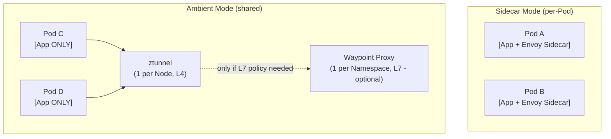
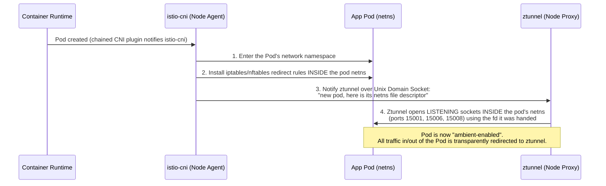
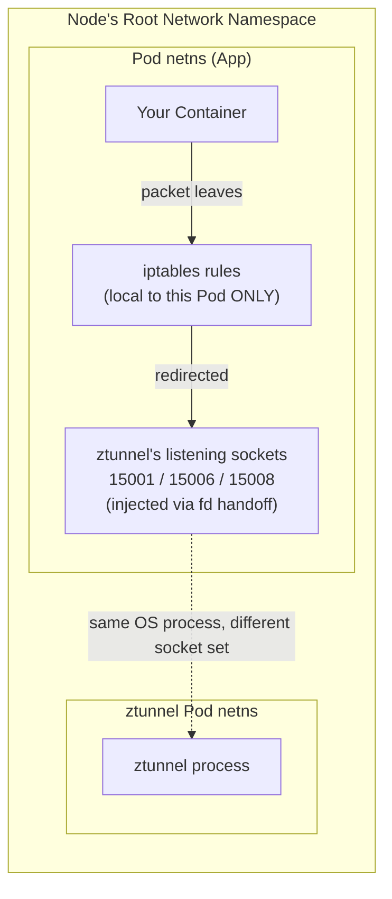

# 17.1 Istio Ambient Mode — Architecture Deep Dive

Ambient Mode is Istio's **sidecar-less** data plane, reaching **General Availability in Istio 1.24** (Nov 6, 2024). This chapter explains how it achieves the same mTLS/L4/L7 guarantees as Sidecar Mode, but without injecting a proxy into every Pod.

---

## 1. The Core Problem Ambient Mode Solves

In **Sidecar Mode**, every Pod carries its own Envoy proxy:
* Every upgrade of Istio requires a **rolling restart of every application Pod** (to get the new sidecar image).
* Every Pod pays a **fixed CPU/Memory tax** for its own dedicated Envoy instance, even if traffic volume is tiny.
* The mesh's networking logic and the application's business logic are coupled inside the same Pod lifecycle.

**Ambient Mode's answer:** Split the proxy responsibilities into two **separate, shared, node/namespace-level components** instead of one-per-pod:

| Component | Scope | Responsibility | Layer |
| :--- | :--- | :--- | :--- |
| **ztunnel** | One per **Node** (DaemonSet) | mTLS, identity, L4 authorization, telemetry | L4 (TCP) |
| **Waypoint Proxy** | One per **Namespace** (or workload) — **optional** | HTTP routing, retries, L7 AuthorizationPolicy | L7 (HTTP) |

---

## 2. No Sidecar — So How Is Traffic Captured?

This is the key architectural trick. Since there's no proxy *inside* the Pod's container, Istio needs another way to intercept traffic. The answer is the **`istio-cni`** node agent plus a per-Pod redirect setup performed **once, at Pod startup**.

### 2.1 The Actors
* **`istio-cni`**: A **DaemonSet** running on every Node. It hooks into the CNI (Container Network Interface) chain — it runs *after* your primary CNI plugin (Calico, Cilium, etc.) whenever a Pod is created.
* **ztunnel**: Also a DaemonSet (one per Node). It is the actual proxy process that ends up carrying the traffic.

### 2.2 The Sequence When a Pod Joins the Ambient Mesh

**In plain English:**
1.  `istio-cni` is the "locksmith" — it goes into the Pod's private network space and changes the traffic rules (iptables) so all packets get redirected.
2.  It then hands ztunnel a special low-level Linux "key" (a file descriptor) that lets ztunnel open its own listening ports **inside** that same Pod's network namespace — even though the ztunnel *process* physically runs elsewhere (in its own DaemonSet Pod on the same Node).
3.  This is only possible because of a low-level Linux socket API feature: a process in namespace A can be given a handle to create a listening socket inside namespace B, as long as it's told which namespace to target.

---

## 3. What Is a "Pod Network Namespace"? (Answering your direct question)

**Yes — you are exactly right.** A Linux **network namespace (netns)** is an isolated, virtualized copy of the network stack: its own loopback interface, its own routing table, its own `iptables`/`nftables` rules, its own set of sockets and ports.

### 3.1 Key Facts
* **Isolation is the whole point.** Every Pod in Kubernetes gets its **own** network namespace by default (this is what lets two Pods both bind to port `8080` without conflicting — they live in separate "network universes").
* **Changing iptables *inside* a Pod's netns affects ONLY that Pod.** It does **not** affect:
    * The Node's own `iptables` (the "root"/"host" network namespace).
    * Any other Pod's network namespace on the same Node.
* This is precisely why `istio-cni`'s approach is safe and scalable: it enters **one Pod's netns at a time** and adds redirect rules **local to that Pod only**. A misconfiguration or crash affecting one Pod's iptables cannot "leak" into a neighboring Pod.

### 3.2 Why This Matters for Ambient Mode
In **Sidecar Mode**, the same "enter the Pod's netns and set iptables rules" trick is used — it's done by an **init container** (`istio-init`) that runs once at Pod startup, before the sidecar starts.

**Ambient Mode reuses the exact same low-level mechanism**, but instead of a per-Pod init container, a **single shared node-level agent** (`istio-cni`) does this job for every Pod on the Node, and instead of redirecting to a **local sidecar in the same Pod**, it redirects to the **shared ztunnel process** running in a different Pod (but still "borrowing" a presence inside your Pod's netns via those listening sockets on 15001/15006/15008).

---

## 4. The Redirect Ports (Cheat-Sheet)

| Port | Purpose |
| :--- | :--- |
| **15001** | Egress capture — outbound traffic **leaving** the Pod is redirected here for ztunnel to process (mTLS wrap + HBONE encapsulation) before it leaves the Node. |
| **15006** | Ingress capture (**plaintext**) — inbound **plaintext** traffic destined for the Pod. |
| **15008** | Ingress capture (**HBONE**) — inbound traffic that is already HBONE-encapsulated (i.e., came from another ztunnel over the secure tunnel). |

---

## 5. Continue to:
* [17.2 — Ztunnel, HBONE & L4 Authorization Deep Dive](17.2-ztunnel-hbone-deep-dive.md)
* [17.3 — Waypoint Proxies & L7 Policy Enforcement](17.3-waypoint-proxies-l7.md)
