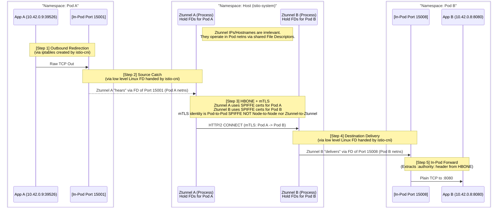
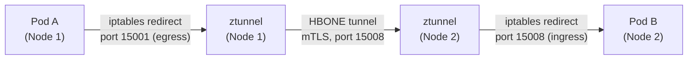

# 17.2 Istio Ambient Mode — Ztunnel & HBONE Deep Dive

This chapter zooms into **ztunnel**, the Rust-based Layer 4 proxy that is the beating heart of Ambient Mode, and **HBONE**, the secure tunneling protocol it uses to talk to other ztunnels.

---

## 1. What Is Ztunnel?

* **Language:** Written in **Rust** (for performance and memory safety — unlike Envoy, which is C++).
* **Deployment:** A **DaemonSet** — exactly **one instance per Kubernetes Node**.
* **Responsibilities (L4 ONLY):**
    1.  **mTLS** — encrypt/decrypt traffic using SPIFFE-identity certificates (same PKI model as sidecar mode).
    2.  **Authentication** — verify the peer's identity during the mTLS handshake.
    3.  **L4 Authorization** — enforce `AuthorizationPolicy` rules that only need L4 info (source IP, source principal, destination port — NOT paths/methods/headers).
    4.  **Telemetry** — collect L4-level metrics and logs (connections, bytes transferred, TCP-level success/failure).

> **Critical exam point:** Ztunnel does **NOT** understand HTTP. It cannot look at a `path`, `method`, or header. Any `AuthorizationPolicy` rule using `to.operation.paths` or `to.operation.methods` **requires a Waypoint Proxy** (see [17.3](17.3-waypoint-proxies-l7.md)) — ztunnel alone cannot enforce it.

---

## 2. Ztunnel's Configuration Sync

When ztunnel starts, it connects to the **Istio control plane (istiod)** and pulls down a full snapshot of state relevant to its Node:
* Every Pod scheduled on **that Node** (and pods elsewhere it needs to reach) — their IP, namespace, workload name, ServiceAccount.
* All **L4 `AuthorizationPolicy`** rules that could apply.

This is delivered via the same **xDS protocol** sidecars use — ztunnel is just a different kind of xDS client.

---

## 3. HBONE — HTTP-Based Overlay Network Environment

**HBONE** is the tunneling protocol used **between ztunnel instances on different Nodes** (and between ztunnel and a Waypoint proxy).

### 3.1 What problem does HBONE solve?
Ztunnel needs to send **raw, arbitrary TCP** traffic (could be HTTP, gRPC, a raw TCP DB connection, anything) from Node A to Node B, while:
* Encrypting it with **mTLS** using SPIFFE identities (same trust model as sidecar mode).
* Doing so in a way that's **firewall-friendly** and works over standard network paths.

### 3.2 How it works
* HBONE **tunnels raw TCP inside an HTTP CONNECT request.**
* The whole thing rides over a standard **mTLS connection** (client + server certs, SPIFFE-based identities) on a **well-known port: `15008`**.
* Think of it like: *"I want to open a private, encrypted pipe from Node A's ztunnel straight through to Node B's ztunnel, and inside that pipe I'll just push raw bytes exactly as if the two Pods had a direct socket to each other."*



### 3.3 Why this matters
* **Encryption is automatic and mandatory** for all ambient-enabled workloads — the application never needs to know or care.
* **The application sees ZERO difference.** It just sends a normal TCP packet; iptables silently redirects it into ztunnel, ztunnel silently wraps it in HBONE+mTLS, sends it across the wire, and the receiving ztunnel silently unwraps it and delivers plain bytes to the destination app.
* **Same-Node traffic still goes through the local ztunnel** (even though it doesn't need to cross the network) — this ensures L4 policy enforcement and telemetry collection stay **consistent regardless of Pod placement**.

---

## 4. Traffic Flow Diagrams

### 4.1 Cross-Node Traffic (No Waypoint)


### 4.2 Same-Node Traffic
Even if Pod A and Pod B are on the **same Node**, traffic still flows through the (single, shared) local ztunnel instance — it just doesn't need to cross a physical network link to reach a "remote" ztunnel.

---

## 5. Ztunnel vs. Sidecar — Feature Comparison

| Capability | Sidecar (Envoy per Pod) | Ztunnel (per Node) |
| :--- | :--- | :--- |
| mTLS encryption | ✅ | ✅ |
| SPIFFE identity | ✅ | ✅ |
| L4 `AuthorizationPolicy` (principals, ports, IPs) | ✅ | ✅ |
| L7 `AuthorizationPolicy` (paths, methods, headers) | ✅ | ❌ (needs Waypoint) |
| HTTP routing (retries, timeouts, `VirtualService`) | ✅ | ❌ (needs Waypoint) |
| Resource cost | Per-Pod (high at scale) | Per-Node (much lower) |
| Restart needed on Istio upgrade | ✅ (every Pod) | ❌ (only the DaemonSet) |

---

## 6. Debugging Ztunnel (Practical Commands)

Check that ztunnel has picked up a Pod:
```bash
kubectl logs ds/ztunnel -n istio-system | grep inpod
# Look for: "pod ... received netns, starting proxy"
```

Confirm listening sockets exist inside the Pod's own netns:
```bash
kubectl debug <pod> -it -n <namespace> --image nicolaka/netshoot -- ss -ntlp
# Expect to see LISTEN entries on 15001, 15006, 15008
```

Inspect the iptables rules installed inside the Pod's netns:
```bash
kubectl debug <pod> -it --image gcr.io/istio-release/base --profile=netadmin -n <namespace> -- iptables-save
```

---

## 7. Continue to:
* [17.1 — Ambient Mode Architecture Overview](17.1-ambient-mode-architecture.md)
* [17.3 — Waypoint Proxies & L7 Policy Enforcement](17.3-waypoint-proxies-l7.md)
