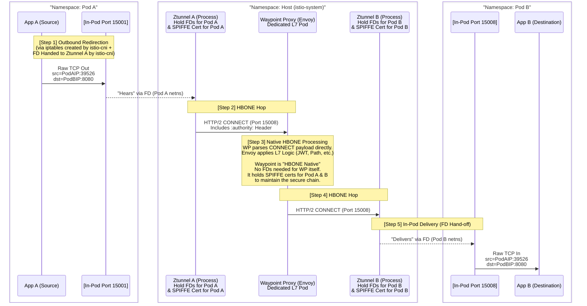

# 17.3 Istio Ambient Mode — Waypoint Proxies & L7 Policy Enforcement

Ztunnel handles Layer 4 only. This chapter covers the **Waypoint Proxy** — the optional Envoy-based component that adds back all the Layer 7 (HTTP-aware) features you're used to from Sidecar Mode.

---

## 1. Why Do We Need Waypoints?

Ztunnel is intentionally "dumb" about HTTP — it only sees encrypted TCP bytes flowing by. It **cannot**:
* Match on HTTP `paths` or `methods`.
* Perform retries, timeouts, or fault injection (`VirtualService` L7 features).
* Validate a JWT (`RequestAuthentication`) — that requires parsing HTTP headers.
* Enforce `AuthorizationPolicy` rules with `to.operation.paths/methods` or `when` conditions on HTTP claims.

**Whenever you need ANY of the above, you need a Waypoint Proxy.** If you never need L7 features, you never need to deploy one — this is the big cost-saving win of Ambient Mode: **pay only for what you use.**

---

## 2. What Is a Waypoint Proxy?

* It **is** an Envoy proxy (the exact same Envoy binary used in Sidecar Mode) — so **all existing L7 features work identically**.
* It is deployed as a regular **Kubernetes `Gateway` resource**, using a special `GatewayClass`: **`istio-waypoint`**.
* Scope: **one Waypoint typically serves an entire Namespace** (all workloads in it), though it can be scoped down to a single workload.

### 2.1 Deploying a Waypoint
```bash
# Using istioctl's built-in subcommand
istioctl waypoint apply -n prod --enroll-namespace
```

This creates a `Gateway` resource similar to:
```yaml
apiVersion: gateway.networking.k8s.io/v1
kind: Gateway
metadata:
  name: waypoint
  namespace: prod
  labels:
    istio.io/waypoint-for: service   # or 'workload' for workload-level granularity
spec:
  gatewayClassName: istio-waypoint    # This is what makes it a Waypoint, not a regular Ingress Gateway
  listeners:
  - name: mesh
    port: 15008
    protocol: HBONE
```

---

## 3. How Traffic Gets Routed to a Waypoint (Opt-In Model)

**Critical fact:** Deploying a Waypoint does **NOT automatically** route any traffic through it. You must **explicitly enroll** a namespace or a specific service.

### 3.1 Enrolling a Namespace (label-based)
```bash
kubectl label namespace prod istio.io/use-waypoint=waypoint
```
Now: **every** request destined for **any Service** in the `prod` namespace is routed through the `waypoint` Gateway for L7 processing before reaching the actual workload.

### 3.2 Enrolling a Single Service (finer granularity)
```yaml
apiVersion: v1
kind: Service
metadata:
  name: backend
  namespace: prod
  labels:
    istio.io/use-waypoint: waypoint
```

### 3.3 Targeting Workloads Instead of Services
By default, a Waypoint only handles Service-destined traffic. To make it handle traffic aimed directly at Pod IPs (workload-level), label the Gateway itself:
```yaml
metadata:
  labels:
    istio.io/waypoint-for: workload
```

---

## 4. The Full Traffic Flow With a Waypoint



**Key takeaway:** Traffic now takes **two HBONE hops** instead of one: `Source ztunnel → Waypoint → Destination ztunnel`. The Waypoint acts as an "L7 checkpoint." Note that throughout these hops, the **mTLS identity remains Pod A → Pod B**; the Waypoint acts as a "Man-in-the-Middle" authorized by Istiod, holding the necessary certificates to decrypt the first hop and re-encrypt the second hop while preserving the original source/destination identities.

---

## 5. What Runs Where — Full Responsibility Matrix

| Feature | Enforced By | Requires Waypoint? |
| :--- | :--- | :--- |
| mTLS encryption (`PeerAuthentication`) | ztunnel | ❌ No |
| SPIFFE identity / `principals` | ztunnel | ❌ No |
| Source IP / `ipBlocks` | ztunnel | ❌ No |
| L4 ports (`AuthorizationPolicy.to.operation.ports`) | ztunnel | ❌ No |
| JWT validation (`RequestAuthentication`) | Waypoint (Envoy) | ✅ **Yes** |
| HTTP `paths` / `methods` (`AuthorizationPolicy`) | Waypoint (Envoy) | ✅ **Yes** |
| `VirtualService` (retries, timeouts, traffic splitting, fault injection) | Waypoint (Envoy) | ✅ **Yes** |
| `when` conditions on JWT claims | Waypoint (Envoy) | ✅ **Yes** |

---

## 6. No New CRDs — Same YAML You Already Know

A key design goal of Ambient Mode: **you do not learn new resource types.** The exact same `PeerAuthentication`, `RequestAuthentication`, `AuthorizationPolicy`, and `VirtualService` YAML you already write for Sidecar Mode works unchanged. The only difference is **which component (ztunnel vs. Waypoint) ends up enforcing each rule**, decided automatically based on whether the rule needs L4 or L7 info.

---

## 7. Migration Status (as of Istio 1.26)

* Ambient Mode reached **GA in Istio 1.24** (Nov 6, 2024).
* The [Ambient Mesh site](https://ambientmesh.io/) provides an official **migration tool** that inspects an existing Sidecar-based cluster and guides you through an incremental cutover.
* Migration can be done **namespace by namespace** — Sidecar and Ambient workloads can coexist in the same mesh during the transition.

---

## 8. Quick Recap — The 3-Chapter Summary

| Chapter | Covers |
| :--- | :--- |
| [17.1](17.1-ambient-mode-architecture.md) | Why Ambient exists, `istio-cni`, Pod network namespace redirection mechanics |
| [17.2](17.2-ztunnel-hbone-deep-dive.md) | Ztunnel internals, HBONE tunneling protocol, L4-only responsibilities |
| **17.3 (this doc)** | Waypoint Proxies, opt-in L7 enforcement, full request flow with both hops |
