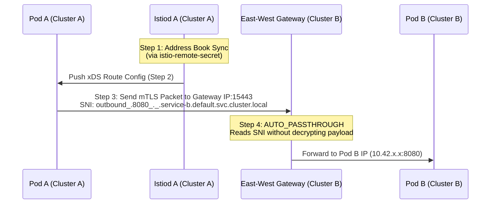

# 18.1 Istio Multi-Cluster Mesh Architecture & Deployment

This chapter covers the architecture, traffic routing mechanics, and step-by-step setup guides for deploying Istio across multiple Kubernetes clusters.

---

## 1. Multi-Cluster Core Mechanics — How "Magic" Routing Works

Before diving into deployment commands, it is essential to understand **how Istio routes cross-cluster traffic without needing a `VirtualService`**.

When a Pod in `Cluster A` calls `service-b.default.svc.cluster.local`, traffic flows seamlessly across cluster boundaries via the following 4-step internal logic:



### Step-by-Step Packet Journey
1. **The "Address Book" Sync (`istio-remote-secret`):**
   When `istio-remote-secret` is applied from Cluster B into Cluster A, Cluster A's `istiod` connects to Cluster B's K8s API server. It discovers all Services, Endpoints, and Pod IPs in Cluster B.
2. **xDS Route Injection:**
   `istiod` in Cluster A detects that `service-b` resides on a different network (`network2`). It sends an xDS update to Pod A's sidecar/ztunnel: *"To reach `service-b`, do NOT send directly to Pod B's IP. Instead, route to Cluster B's East-West Gateway IP on Port 15443."*
3. **The SNI Header Label:**
   Pod A's proxy wraps the TCP traffic in mTLS and attaches a Server Name Indication (**SNI**) header:
   `outbound_.8080_._.service-b.default.svc.cluster.local`
4. **The Gateway "Post Office" (`AUTO_PASSTHROUGH`):**
   The packet reaches Cluster B's East-West Gateway on port `15443`. Because the Gateway is configured with `mode: AUTO_PASSTHROUGH`, it **does not decrypt the packet**. It inspects the outer SNI header, matches `service-b.default.svc.cluster.local`, and passes the encrypted bytes directly to Pod B's internal IP.

> **Key Takeaway:** A `VirtualService` is **not required** for basic cross-cluster communication. Istio automatically handles cross-cluster endpoint discovery and SNI-based gateway routing. You only need a `VirtualService` if you want to override default behavior (e.g., 80/20 canary splits, fault injection, or retries).

---

## 2. Explanation of Multi-Cluster Scripts (`samples/multicluster`)

Istio provides standard helper files in `samples/multicluster/` to simplify setting up East-West gateways and control plane exposure:

* `gen-eastwest-gateway.sh`: A shell script that generates an `IstioOperator` custom resource tailored to deploy a dedicated `eastwestgateway` deployment listening on port `15443`.
* `expose-services.yaml`: Defines a `Gateway` CRD with `mode: AUTO_PASSTHROUGH` listening on port `15443` for host `*.local`. This enables cross-cluster application traffic.
## 3. Deployment Models

There are two primary multi-cluster topologies supported by Istio:

### Model 1: Primary-Remote (Shared Control Plane)
One "Primary" cluster hosts `istiod`. "Remote" clusters do not run `istiod`; their workloads receive xDS instructions directly from the Primary cluster's `istiod` across the network.

### Model 2: Multi-Primary (Recommended for Production)
Each cluster runs its own independent `istiod` control plane. Clusters synchronize endpoint state using `istio-remote-secret`.


---

## 4. Model 1: Primary-Remote (Shared Control Plane)
In this scenario, the primary cluster is `cluster1` and the remote cluster is `cluster2`. The following steps outline the deployment process.

### 4.1 Deploying a Primary Cluster (Cluster 1 - In Primary-Remote Model 1)

#### Step 4.1.1: Define Primary Cluster Manifest (`primary-cluster1.yaml`)
Create an `IstioOperator` configuration defining the mesh ID, cluster name, and network topology:
```yaml
apiVersion: install.istio.io/v1alpha1
kind: IstioOperator
spec:
  values:
    global:
      meshID: mesh1
      multiCluster:
        clusterName: cluster1
      network: network1
```

#### Step 4.1.2: Label the Control Plane Namespace
```bash
kubectl label namespace istio-system topology.istio.io/network=network1
```
* **Why do this?** When `istiod` boots in `istio-system`, it checks its namespace labels to establish its default network zone.
* **Under the hood:**
  1. **Network Inheritance:** Any workload managed by this `istiod` inherits `network1` by default.
  2. **xDS Routing Decision:** `istiod` compares source and destination networks:
     * **Same Network (`network1` == `network1`):** Routes directly to the destination Pod IP (`10.42.x.x`).
     * **Cross-Network (`network1` != `network2`):** Swaps the Pod IP with the target cluster's **East-West Gateway IP** on port `15443`.

#### Step 4.1.3: Install Control Plane with External Exposure Support
```bash
istioctl install --set values.pilot.env.EXTERNAL_ISTIOD=true -f primary-cluster1.yaml
```
* **Why do this?** By default, `istiod` expects all workloads to originate from inside the local cluster. Primary-Remote topologies require `istiod` to serve proxies across external network boundaries.
* **Under the hood:**
  1. **External Request Handling:** Configures `istiod` to accept external xDS discovery (`:15012`) and webhook injection (`:15017`) requests.
  2. **TLS SAN Updates:** Adjusts internal certificates so remote proxies connecting via the East-West Gateway trust the TLS handshake.

#### Step 4.1.4: Deploy East-West Gateway on Cluster 1
```bash
samples/multicluster/gen-eastwest-gateway.sh \
  --mesh mesh1 --cluster cluster1 --network network1 | istioctl install -y -f -
```
* **Why do this?** Standard Ingress Gateways handle public internet traffic. East-West Gateways handle internal cross-cluster (datacenter-to-datacenter) traffic.
* **Under the hood:**
  1. **Manifest Generation:** `gen-eastwest-gateway.sh` dynamically outputs an `IstioOperator` manifest for a dedicated `istio-eastwestgateway` deployment.
  2. **Service Provisioning:** Creates a Kubernetes `LoadBalancer` (or NodePort) service for external connectivity.
  3. **Metadata Mapping:** Labels the deployment with `topology.istio.io/network=network1`.

#### Step 4.1.5: Expose Istiod Control Plane
```bash
kubectl apply -n istio-system -f samples/multicluster/expose-istiod.yaml
```
* **Why do this?** Workloads in Remote clusters need to fetch xDS configurations from Cluster 1's `istiod` over the network.
* **Under the hood:**
  1. Opens ports `15012` (xDS gRPC) and `15017` (Webhooks) on the East-West Gateway.
  2. Creates a `VirtualService` routing port `15012` directly to Cluster 1's internal `istiod` pod.

#### Step 4.1.6: Expose Application Mesh Services
```bash
kubectl apply -n istio-system -f samples/multicluster/expose-services.yaml
```
* **Why do this?** Allows remote workloads to send application-level traffic (HTTP/gRPC/TCP) to local pods.
* **Under the hood:**
  1. **Listens on Port 15443:** Configures `istio-eastwestgateway` on port `15443`.
  2. **`AUTO_PASSTHROUGH` Mode:** Sets `tls.mode: AUTO_PASSTHROUGH`.
  3. **SNI Routing:** Reads the outer SNI header (`outbound_.8080_._.service-a.default.svc.cluster.local`) without decrypting the payload, passing encrypted mTLS bytes straight to the target Pod.

```
[Remote Pod (Cluster 2)]
       │
       │ 1. Looks up target service
       │ 2. Istiod instruction: "Send to Cluster 1 East-West GW IP:15443"
       ▼
[East-West Gateway (Cluster 1, Port 15443)]
       │
       │ 3. Reads SNI: outbound_.8080_._.service-a.default.svc.cluster.local
       │ 4. AUTO_PASSTHROUGH (No decryption)
       ▼
[Local Pod (Cluster 1, Service A)]
```

---

### 4.2 Deploying a Remote Cluster (Cluster 2 - In Primary-Remote Model 1)

#### Step 4.2.1: Retrieve Primary Cluster's East-West Gateway IP
run this in the context of Cluster 1 to get the external IP of the East-West Gateway for the remote cluster to connect to the control plane:
```bash
export EW_GATEWAY_CLUSTER1=$(kubectl --context=cluster1 -n istio-system get svc istio-eastwestgateway -o jsonpath='{.status.loadBalancer.ingress[0].ip}')
```
* **Why do this?** Remote proxies in Cluster 2 do not have an `istiod` running locally in their cluster. They must establish a network connection back to Cluster 1's `istiod` instance, which is exposed externally behind Cluster 1's East-West Gateway.
* **Under the hood:** Extracts the external LoadBalancer IP (or NodePort/DNS endpoint) of the `istio-eastwestgateway` service in Cluster 1 so it can be passed as the control plane discovery address (`remotePilotAddress`) for Cluster 2.

#### Step 4.2.2: Install Istio on Cluster 2 Using the `remote` Profile
```yaml
apiVersion: install.istio.io/v1alpha1
kind: IstioOperator
spec:
  profile: remote
  values:
    istiodRemote:
      injectionPath: /inject/cluster/cluster2/net/network2
    global:
      remotePilotAddress: ${EW_GATEWAY_CLUSTER1}
```
* **Why do this?** Prevents an `istiod` instance from being installed on Cluster 2 and configures Cluster 2's local "glue" components (mutating webhooks, ConfigMaps) to talk to Cluster 1.
* **Under the hood:**
  1. **The `istio-system` Creation:** This command **creates** the `istio-system` namespace on Cluster 2. Even though there is no `istiod` (the control plane binary) running here, the namespace is **not empty**.
  2. **Configures Injection Webhook:** Instead of a local injector, it installs a `MutatingWebhookConfiguration` that sends any new Pod's injection request to Cluster 1's `istiod` (via `${EW_GATEWAY_CLUSTER1}`).
  3. **Proxy Discovery Target (`remotePilotAddress`):** Injects `${EW_GATEWAY_CLUSTER1}:15012` into all sidecars/ztunnels in Cluster 2 so they know to fetch their configuration from the Primary cluster.

#### Step 4.2.3: Label Network & Set Control Plane Annotation on Cluster 2
```bash
kubectl label namespace istio-system topology.istio.io/network=network2
kubectl annotate namespace istio-system topology.istio.io/controlPlaneClusters=cluster1
```
* **Why do this?** This is the **identity registration**. Since there is no `istiod` in the remote cluster to "know" its location, we label the namespace so Cluster 1's `istiod` can read these values via the remote secret.
* **Under the hood:**
  1. **Remote "Signaling":** When you run Step 4 (Remote Secret), Cluster 1's `istiod` logs into Cluster 2. It looks at the `istio-system` namespace. By finding the `network2` label there, it automatically knows: *"Aha! Every pod in this remote cluster belongs to network2"*.
  2. **Control Plane Mapping:** The annotation `controlPlaneClusters=cluster1` tells local Istio tools (like `istioctl analyze`) that they shouldn't look for a local `istiod` pod—they should look at `cluster1`.
  3. **Workload Inheritance:** You don't label individual workloads. Every pod that gets injected in Cluster 2 will **inherit** the `network2` value from this namespace label during its configuration push.

#### Step 4.2.4: Grant Primary Cluster Access to Remote API Server (`istio-remote-secret`)
```bash
istioctl create-remote-secret --name=cluster2 --kubeconfig=cluster2.yaml | \ # Extracts the secret using Cluster2 context
  kubectl apply --kubeconfig=cluster1.yaml -f - # Apply the secret using Cluster1 context
```
* **Why do this?** Allows Cluster 1's `istiod` to discover Pods, Endpoints, and Services running inside Cluster 2's Kubernetes API server.
* **Under the hood:**
  1. **Token & Kubeconfig Generation (`istioctl create-remote-secret`):** Queries Cluster 2's API server, creates/retrieves a dedicated `istio-reader` ServiceAccount token, and packages a full `kubeconfig` payload targeting Cluster 2.
  2. **Secret Storage (`kubectl apply`):** Stores this `kubeconfig` inside a K8s Secret labeled `istio/multiCluster: "true"` inside Cluster 1's `istio-system` namespace.
  3. **Service Account Controller:** Cluster 1's `istiod` detects the new labeled Secret, opens an active client connection to Cluster 2's API server, and registers watchers for Endpoints/Services in Cluster 2.

#### Step 4.2.5: Deploy East-West Gateway on Cluster 2 & Expose Application Services
```bash
samples/multicluster/gen-eastwest-gateway.sh \
  --mesh mesh1 --cluster cluster2 --network network2 | istioctl install -y -f -

kubectl apply -n istio-system -f samples/multicluster/expose-services.yaml
```
* **Why do this?** Provides a entry point in Cluster 2 so workloads in Cluster 1 can send application-level traffic (HTTP/gRPC/TCP) to Pods running in Cluster 2.
* **Under the hood:**
  1. **Deploys Entry Gateway:** Provisions an `istio-eastwestgateway` Deployment and `LoadBalancer` Service on Cluster 2 labeled for `network2`.
  2. **`AUTO_PASSTHROUGH` Enablement:** Listens on port `15443` for incoming mTLS connections from Cluster 1, evaluates the `outbound_...` SNI header, and routes incoming encrypted bytes straight to Cluster 2's local target Pods without terminating TLS at the perimeter.

### 5. Topology Deep Dive: The Gateway "Reciprocity" Logic

A common question is: "Does *every* cluster need an East-West gateway?" 

The answer depends on **who needs to talk to whom**.

#### 5.1 When is the Primary Gateway Required?
You need an East-West Gateway on the **Primary Cluster** if:
1. **Model 1 (Primary-Remote):** The Remote cluster's objects (Sidecars and the Mutating Webhook) need to reach the Primary `istiod`.
2. **Cross-Traffic:** Any Remote cluster needs to call a service residing in the Primary cluster.

#### 5.2 When is the Remote Gateway Required?
You need an East-West Gateway on the **Remote Cluster** if:
1. **Discovery:** The Primary cluster (or any other Remote cluster) needs to call a service residing in this Remote cluster.

> **Summary:** If you want all clusters to be able to talk to each other, **yes**, every cluster (Primary and Remote) must have an East-West gateway exposed.

---

## 6. Multi-Primary Setup Difference

When deploying **Multi-Primary** (where both Cluster 1 and Cluster 2 run their own `istiod` instances):
1. Install both clusters as **Primary** clusters (Step 4.1 above).
2. Generate and exchange remote secrets **in both directions**:
   ```bash
   # Allow Cluster 1 to discover Cluster 2
   istioctl create-remote-secret --name=cluster2 --kubeconfig=cluster2.yaml | \
     kubectl apply --kubeconfig=cluster1.yaml -f -

   # Allow Cluster 2 to discover Cluster 1
   istioctl create-remote-secret --name=cluster1 --kubeconfig=cluster1.yaml | \
     kubectl apply --kubeconfig=cluster2.yaml -f -
   ```

---

## 6. Summary Matrix

| Task | Primary-Remote | Multi-Primary |
| :--- | :--- | :--- |
| **Control Plane Location** | Primary Cluster Only | Every Cluster |
| **`istio-remote-secret` direction** | Remote → Primary | Bidirectional (Both ways) |
| **East-West Gateway `expose-istiod.yaml`** | Required on Primary | Not required (Local `istiod` handles xDS) |
| **East-West Gateway `expose-services.yaml`** | Required on all clusters | Required on all clusters |
| **Resiliency on WAN/VPN Outage** | Remote cluster loses control plane updates | Both clusters operate completely independently |

---

## 7. Strategic Comparison: Which Model Should You Use?

Choosing between Primary-Remote and Multi-Primary is a trade-off between **operational simplicity** and **availability guarantees**.

### 7.1 Pros & Cons Table

| Feature | Primary-Remote (Model 1) | Multi-Primary (Model 2) |
| :--- | :--- | :--- |
| **Operational Overhead** | **Low:** Manage only one `istiod` instance. | **High:** Every cluster needs lifecycle management for `istiod`. |
| **Resource Usage** | **Efficient:** Remote clusters save RAM/CPU by skipping `istiod`. | **Heavier:** `istiod` overhead on every cluster. |
| **Blast Radius** | **Large:** Primary `istiod` failure affects the whole mesh's config. | **Small:** Control plane failure is isolated to that cluster. |
| **WAN Sensitivity** | **High:** Remote clusters need stable WAN for webhooks/XDS. | **Low:** Clusters only need connectivity for app-to-app traffic. |
| **Certificate Management**| **Centralized:** Root CA usually lives on Primary. | **Distributed:** Standard shared root CA is required on all. |

### 7.2 Decision Guide

#### Choose **Primary-Remote** IF:
*   You have a **Central Hub** (e.g., an Infrastructure/SRE cluster) and many small "Spoke" clusters.
*   The network latency between clusters is low (same region or high-speed interconnect).
*   You want a single point of truth for policy and certificate signing.

#### Choose **Multi-Primary** IF:
*   You are deploying across **Global Regions** (e.g., US-East to EU-West) where WAN links are less reliable.
*   You have strict **Compliance/Sovereignty** rules requiring local control plane autonomy.
*   You need the highest possible **Resiliency**; you want Cluster B to keep running even if Cluster A is completely wiped out.

---

## 8. Critical Considerations for Production

*   **Trust Domain/Root CA:** For mTLS to work across clusters, all clusters **must share the same Root CA**. You cannot use the default self-signed Istio certs; you must plug in your own "Intermediate CA" certificates.
*   **Non-Overlapping Pod IPs (Flat Network):** If you are NOT using East-West gateways (Direct mode), you MUST ensure your VPCs/Subnets don't have overlapping IP ranges for Pods.
*   **SNI Collision & Naming:** Ensure your service names are unique within the mesh or use federated naming conventions to avoid collisions at the Gateway.

---

## 9. Traffic Routing Logic: Locality & Global Load Balancing

A common question is: "What happens if a service with the same name exists in both clusters?"

### 9.1 Default Behavior: Global Round Robin
By default, if `curl` calls `httpbin.default.svc.cluster.local`, and that service exists in both Cluster 1 and Cluster 2:
1.  **Unified Endpoint List:** Istiod merges the endpoints from both clusters into a single list.
2.  **Load Balancing:** The sidecar will load balance traffic across **all** pods in **all** clusters (50/50 split if pod counts are equal).

### 9.2 Customizing with Locality Load Balancing
If you want to keep traffic local unless there is a failure, you use **Locality Load Balancing**:

*   **Locality Prioritization:** You can configure Istio to favor "local" endpoints (same cluster/zone) and only spill over to the remote cluster if the local pods are unhealthy.
*   **Failover Example:**
    ```yaml
    apiVersion: networking.istio.io/v1alpha3
    kind: DestinationRule
    metadata:
      name: httpbin-locality
    spec:
      host: httpbin.default.svc.cluster.local
      trafficPolicy:
        loadBalancer:
          localityLbSetting:
            enabled: true
            failover:
              - from: region1
                to: region2
    ```

### 9.3 Why is this beneficial?
1.  **Latency:** Keep traffic in the same datacenter to save time/cost.
2.  **High Availability (HA):** If all pods in Cluster 1 crash, Istio automatically routes the `curl` request to Cluster 2 via the East-West Gateway without the application even knowing there was a failure.

---

## 10. Envoy Deep Dive: How the Multi-Cluster Proxy Looks

When you run `istioctl proxy-config cluster`, you can see exactly how the Envoy sidecar represents these merged endpoints.

### 10.1 The "Outbound" Cluster
For a service named `httpbin.default.svc.cluster.local` on port `80`, Envoy creates a single cluster entry:
**Name:** `outbound|80||httpbin.default.svc.cluster.local`

### 10.2 The Endpoints (EDS)
If you inspect the endpoints for that cluster, you will see a mix of **Direct Pod IPs** and **Gateway Passthrough IPs**:

| Endpoint Type | IP Address | Port | Transport Protocol | Description |
| :--- | :--- | :--- | :--- | :--- |
| **Local Pod**| `10.42.1.15` | `80` | `internal_upstream` | Direct traffic to a pod in the **same cluster**. |
| **Remote Pod**| `1.2.3.4` | **`15443`** | **`tls` (SNI)** | Traffic sent to the **Cluster 2 Gateway IP**. |

### 10.3 Envoy Config Example (Simplified JSON)
```json
{
  "name": "outbound|80||httpbin.default.svc.cluster.local",
  "lb_endpoints": [
    {
      "locality": { "cluster": "cluster1" },
      "endpoint": {
        "address": { "socket_address": { "address": "10.42.1.15", "port_value": 80 } }
      }
    },
    {
      "locality": { "cluster": "cluster2" },
      "endpoint": {
        "address": { "socket_address": { "address": "1.2.3.4", "port_value": 15443 } },
        "metadata": {
          "filter_metadata": {
            "envoy.transport_socket_match": {
              "sni": "outbound_.80_._.httpbin.default.svc.cluster.local"
            }
          }
        }
      }
    }
  ]
}
```

> **The "Magic" of Port 15443:** Notice that for the remote cluster, Envoy doesn't use port 80. It automatically switches to **Port 15443** (the East-West Gateway) and attaches the **SNI** so the gateway knows where to send it.

### 10.4 What happens at the Gateway? (The SNI Handover)

When the packet hits the East-West Gateway at `1.2.3.4:15443`, the Gateway acts as a "Blind Transloader."

1.  **Inspection:** The Gateway sees a mTLS connection. It **cannot** see the HTTP data inside (it's encrypted), but it **can** read the plain-text **SNI Extension** in the TLS handshake: `outbound_.80_._.httpbin.default.svc.cluster.local`.
2.  **Mapping:** The Gateway looks at its own internal "Address Book" (xDS clusters). It sees an internal cluster that matches that long SNI string.
3.  **Port Extraction:** Inside the SNI string, Istio encodes the target port: `outbound_.80_...`. The Gateway parses that `80` and knows the traffic is destined for port 80 of the local service.
4.  **Forwarding:** It forwards the raw, encrypted bytes to the local Pod IP in Cluster 2.

### 10.5 The Gateway Configuration (`expose-services.yaml`)

This is the "Secret Sauce" that makes the Gateway act this way. It uses `AUTO_PASSTHROUGH` and matches the internal SNI pattern.

```yaml
apiVersion: networking.istio.io/v1alpha3
kind: Gateway
metadata:
  name: cross-network-gateway
  namespace: istio-system
spec:
  selector:
    istio: eastwestgateway
  servers:
    - port:
        number: 15443
        name: tls
        protocol: TLS
      tls:
        mode: AUTO_PASSTHROUGH  # CRITICAL: Do not decrypt!
      hosts:
        - "*.local"             # Match all internal k8s services
```

*   **`mode: AUTO_PASSTHROUGH`:** Tells Envoy: *"Don't try to find a certificate for this. Just look at the SNI and pass the bytes through to the cluster that matches that SNI name."*
*   **The Chain of Trust:** Because the Gateway never decrypts the packet, the **mTLS identity** remains between the Source Pod (Cluster 1) and Destination Pod (Cluster 2). The Gateway is just a high-speed courier.
