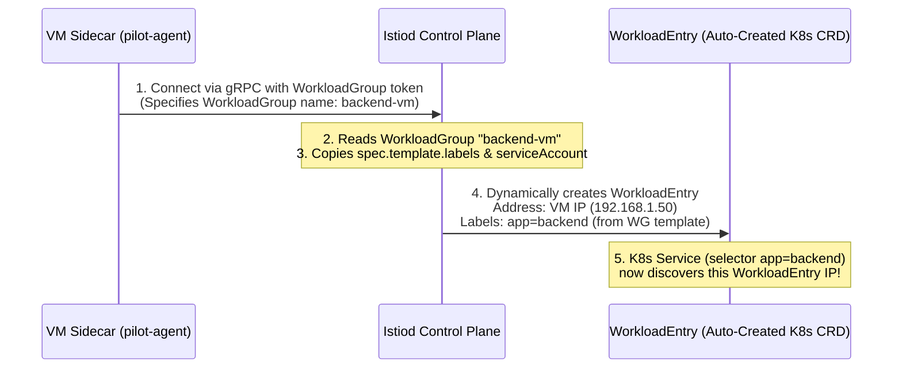
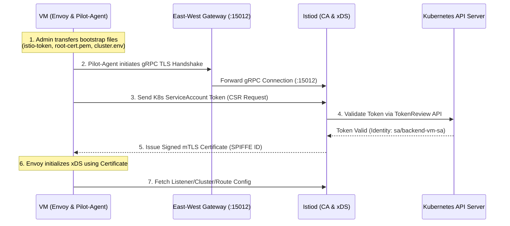

# 18.2 Integrating Virtual Machines & Legacy Workloads into Istio Mesh

Modernizing monolithic applications by migrating them into Kubernetes is a long-term journey. Many organizations must maintain workloads on Virtual Machines (VMs) or bare-metal servers due to compliance, database dependencies, or complex legacy architectures.

Istio allows VM-based workloads to become **first-class citizens** in the service mesh, enabling end-to-end mTLS encryption, uniform telemetry, traffic management, and authorization policies between Kubernetes Pods and VM instances.

---

## 1. Core Architecture & Requirements

To make a VM act like a Kubernetes Pod inside the mesh, three fundamental requirements must be met:

```
┌────────────────────────────────────────────────────────────────────────┐
│ Virtual Machine / Bare Metal Server                                   │
│                                                                        │
│   ┌──────────────────┐    gRPC (15012)     ┌───────────────────────┐   │
│   │ Legacy Application│ ◄───────────────►  │ Envoy Sidecar (systemd)│   │
│   └──────────────────┘    Localhost        └──────────┬────────────┘   │
└───────────────────────────────────────────────────────┼────────────────┘
                                                        │
                                                        │ mTLS / xDS
                                                        ▼
                                             ┌──────────────────────┐
                                             │ East-West Gateway    │
                                             │ (Kubernetes Cluster) │
                                             └──────────────────────┘
```

1. **Sidecar Process Outside Kubernetes:** Envoy runs directly as a `systemd` service on the Linux/Windows VM alongside the application process.
2. **Control Plane Connectivity:** The sidecar on the VM must reach Istiod to fetch configuration (xDS on port `15012`) and obtain certificates (CA on port `15012` / `15017`).
3. **Cryptographic Identity:** The VM requires a Kubernetes `ServiceAccount` identity bound to an mTLS X.509 certificate (SPIFFE ID: `spiffe://cluster.local/ns/<ns>/sa/<service-account>`).

---

## 2. Network Topologies: Single-Network vs. Multi-Network

How traffic flows between the Kubernetes cluster and the VM depends on the underlying CNI datapath. For an in-depth breakdown of how lower-layer CNI encapsulation and routing operate, see [00.k8s-networking-vxlan-bgp-ebpf.md](00.k8s-networking-vxlan-bgp-ebpf.md).

### 2.1 Single-Network Model (Flat Network)
* **Connectivity Requirement:** True **Flat Network CNI** or **VPC-native routing** (e.g., AWS VPC CNI, Azure CNI, Calico/Cilium with BGP peering to Top-of-Rack physical switches). 
  * In this mode, **Pod IPs and ClusterIPs are real, routable IP addresses** inside your corporate network/VPC. (no DNAT, no VXLAN overlay, no encapsulation)
* **Control Plane Path:** 
  * **Option A (Via Gateway - Standard):** The VM sidecar connects to Istiod via an **East-West Gateway** on port `15012` (avoiding the need to expose `istiod` directly via a NodePort or public K8s IP).
  * **Option B (Direct):** **Yes, this applies when using Direct BGP Mode / Native Routing.** Since `ClusterIP` and Pod CIDRs (`10.96.0.0/16`) are advertised via BGP to physical routers, the VM can resolve `istiod.istio-system.svc.cluster.local` and route directly to Istiod's `ClusterIP` (`10.96.0.10:15012`), bypassing the East-West gateway entirely!
* **Data Plane Path:** 
  * **How Direct Traffic Works:** Because Pod IPs are real VPC/BGP IPs, a Pod (`10.0.1.50`) can open a raw TCP socket straight to the VM IP (`10.0.2.100`), and the VM Envoy can reply straight back to `10.0.1.50`. **No NodePort, LoadBalancer, or Gateway is needed for application traffic.**
  * *Note on VXLAN Overlay:* If your CNI uses **VXLAN Overlay encapsulation** (e.g., standard Flannel, K3s default, or Cilium VXLAN mode), Pod IPs are wrapped in UDP port `4789`/`8472` packets and NATed behind K8s Node IPs. External VMs cannot route to Pod IPs directly, so you **cannot** use the Single-Network model. You must use the **Multi-Network (East-West Gateway) model** instead.

### 2.2 Multi-Network Model (Split Network)
* **Connectivity:** Kubernetes Pod IPs and VM IPs cannot route directly to each other (e.g., separate VPCs, VXLAN Overlay CNIs, isolated cloud regions, or strict firewall boundaries).
* **Control Plane Path:** The VM sidecar **MUST** reach Istiod through the **East-West Gateway** on port `15012`.
* **Data Plane Path:** All application-level traffic (HTTP/gRPC/TCP) between Kubernetes Pods and VM workloads **MUST** flow through the **East-West Gateway** on port `15443` using `AUTO_PASSTHROUGH` SNI routing.

> For a detailed comparison between VXLAN Overlays, BGP Native Routing, and eBPF datapath mechanics, refer to [00.k8s-networking-vxlan-bgp-ebpf.md](00.k8s-networking-vxlan-bgp-ebpf.md).

---

## 3. Istio Custom Resources for VMs: WorkloadGroup & WorkloadEntry

In Kubernetes, **Deployments** manage set of **Pods**. Istio introduces two equivalent custom resources to manage VM instances inside the mesh:

```
Kubernetes Concept              Istio VM Concept
┌──────────────────┐            ┌──────────────────┐
│   Deployment     │  ◄──────►  │  WorkloadGroup   │ (Template & Health Probe)
└────────┬─────────┘            └────────┬─────────┘
         │                               │
         ▼                               ▼
┌──────────────────┐            ┌──────────────────┐
│      Pod         │  ◄──────►  │  WorkloadEntry   │ (Single VM IP & State)
└──────────────────┘            └──────────────────┘
```

### 3.1 WorkloadGroup (The "Deployment" Equivalent)
A `WorkloadGroup` describes a logical pool of VM instances sharing common properties: labels, namespace, service account, and health checks.

```yaml
apiVersion: networking.istio.io/v1alpha3
kind: WorkloadGroup
metadata:
  name: backend-vm
  namespace: backend-vm
spec:
  metadata:
    labels:
      app: backend
  template:
    serviceAccount: backend-vm-sa
    labels:
      app: backend
      network: vm-network
  probe:
    timeoutSeconds: 5
    periodSeconds: 10
    successThreshold: 1
    failureThreshold: 3
    httpGet:
      path: /healthz
      port: 9000
```

* **`metadata.labels`:** Labels applied to the `WorkloadGroup` custom resource itself in Kubernetes.
* **`template.labels`:** The **template labels** that every dynamically generated or auto-registered `WorkloadEntry` will **inherit**! This is critical for Kubernetes Services to match the VM instances via `selector.app: backend`.
* **`probe`:** Configures active health checking performed by the Envoy proxy running on the VM. If the probe fails, Istiod marks the VM endpoint as unhealthy and stops routing mesh traffic to it.

### 3.2 WorkloadEntry (The "Pod" Equivalent)
A `WorkloadEntry` represents a **single VM instance** running in the mesh. When using manual registration (or when inspected after auto-registration), it maps a specific IP address to inherited template labels and service accounts.

```yaml
apiVersion: networking.istio.io/v1beta1
kind: WorkloadEntry
metadata:
  name: backend-vm-instance-1
  namespace: backend-vm
spec:
  serviceAccount: backend-vm-sa
  address: 192.168.1.50
  labels:
    app: backend        # Inherited from WorkloadGroup template.labels
    instance-id: vm-1   # Instance-specific label
```

### 3.3 Auto-Registration Mechanics (WorkloadGroup -> WorkloadEntry)
How does Istio attach a `WorkloadEntry` to a `WorkloadGroup`?



1. **The Linking Token:** When `istioctl x workload entry configure` generates the bootstrap package, it writes the target `WorkloadGroup` name into the `cluster.env` file (`ISTIO_META_WORKLOAD_NAME=backend-vm`).
2. **Registration Request:** When `pilot-agent` boots on the VM, it connects to Istiod and says: *"I am an instance registering for WorkloadGroup `backend-vm` from IP `192.168.1.50`."*
3. **Template Inheritance:** Istiod looks up the `backend-vm` `WorkloadGroup` resource, copies the `spec.template.labels` (e.g., `app: backend`) and `spec.template.serviceAccount`, and automatically generates the corresponding `WorkloadEntry` in Kubernetes.
4. **Service Selection:** Because the auto-generated `WorkloadEntry` now has `app: backend` in its `labels`, the Kubernetes `Service` selector immediately picks up the VM's IP address in its endpoint list!

### 3.4 Service Integration: K8s Service vs. ServiceEntry

To make VM workloads addressable inside the mesh, you have **two options**:

#### Option A: Using a Kubernetes Service (Recommended for standard workloads)
You create a standard Kubernetes `Service` with a `selector` matching the `template.labels` of your `WorkloadGroup`:

```yaml
apiVersion: v1
kind: Service
metadata:
  name: backend
  namespace: backend-vm
spec:
  ports:
  - port: 9000
    name: http
    targetPort: 9000
  selector:
    app: backend  # Matches the template.labels on WorkloadEntry/WorkloadGroup!
```
* **How it works:** Istiod automatically monitors `WorkloadEntry` CRDs and registers their IP addresses as endpoints of this Kubernetes `Service`.
* **DNS Name:** Workloads call `backend.backend-vm.svc.cluster.local`.

#### Option B: Using a ServiceEntry (When NO K8s Service exists)
Is a `ServiceEntry` auto-generated? **No.** Istio automatically creates the **`WorkloadEntry`**, but you must define the entry point (`Service` or `ServiceEntry`).

If you do NOT want to create a Kubernetes `Service` object, you can manually define a `ServiceEntry` that uses `workloadSelector` to bind to `WorkloadEntry` instances:

```yaml
apiVersion: networking.istio.io/v1alpha3
kind: ServiceEntry
metadata:
  name: external-vm-service
  namespace: backend-vm
spec:
  hosts:
  - backend-vm.internal.example.com  # Custom FQDN for the VM service
  ports:
  - number: 9000
    name: http
    protocol: HTTP
  resolution: STATIC
  location: MESH_INTERNAL
  workloadSelector:
    labels:
      app: backend  # Matches WorkloadEntry template.labels!
```

---

### 3.5 Applying Traffic Policies: VirtualService, DestinationRule, and AuthorizationPolicy

Once your VM is represented by a `Service` or `ServiceEntry`, you configure Istio traffic policies **EXACTLY the same way** as you do for Kubernetes Pods!

#### 1. Routing Traffic with VirtualService
You point the `VirtualService` host to the K8s Service name or the `ServiceEntry` host:

```yaml
apiVersion: networking.istio.io/v1alpha3
kind: VirtualService
metadata:
  name: backend-routing
  namespace: backend-vm
spec:
  hosts:
  - backend.backend-vm.svc.cluster.local
  http:
  - route:
    - destination:
        host: backend.backend-vm.svc.cluster.local
        port:
          number: 9000
      timeout: 5s
      retries:
        attempts: 3
        perTryTimeout: 2s
```

#### 2. Managing Connection Pools & mTLS with DestinationRule
Define subsets, connection limits, outlier detection, or mTLS settings targeting the VM service:

```yaml
apiVersion: networking.istio.io/v1alpha3
kind: DestinationRule
metadata:
  name: backend-dr
  namespace: backend-vm
spec:
  host: backend.backend-vm.svc.cluster.local
  trafficPolicy:
    tls:
      mode: ISTIO_MUTUAL  # Enforce mTLS to the VM sidecar!
    connectionPool:
      tcp:
        maxConnections: 100
    outlierDetection:
      consecutive5xxErrors: 3
      interval: 10s
      baseEjectionTime: 30s
```

#### 3. Securing the VM with AuthorizationPolicy
Protect the VM workload by restricting which Kubernetes ServiceAccounts or namespaces are allowed to call it:

```yaml
apiVersion: security.istio.io/v1beta1
kind: AuthorizationPolicy
metadata:
  name: secure-vm-backend
  namespace: backend-vm
spec:
  selector:
    matchLabels:
      app: backend  # Matches the WorkloadEntry label directly on the VM!
  action: ALLOW
  rules:
  - from:
    - source:
        principals: ["cluster.local/ns/frontend/sa/frontend-sa"]
    to:
    - operation:
        methods: ["GET", "POST"]
        ports: ["9000"]
```

---

## 4. Under the Hood: The VM Authentication & Bootstrapping Sequence

Connecting a VM sidecar to Istiod requires securely exchanging a short-lived Kubernetes ServiceAccount token for a long-lived SPIFFE/mTLS X.509 certificate.



### Deep Dive into the 5 Generated Bootstrap Files

The command `istioctl x workload entry configure` generates a package containing 5 critical files required on the VM:

| File Name | Description & Under-the-Hood Role |
| :--- | :--- |
| **`istio-token`** | A bounded Kubernetes ServiceAccount Token requested specifically for Istio CA audience (`istio-ca`). Transferred to the VM and used **once** during startup by `pilot-agent` to authenticate the certificate signing request (CSR). |
| **`root-cert.pem`** | The Root CA Certificate of the mesh. Used by the VM sidecar to verify Istiod's TLS certificate during the initial gRPC connection over port `15443`/`15012`. |
| **`cluster.env`** | Contains environment variables for the VM sidecar process (`CANONICAL_REVISION`, `ISTIO_META_WORKLOAD_NAME`, `ISTIO_META_NETWORK`, `SVC_ACCPUNT`). Tells `pilot-agent` which `WorkloadGroup` it belongs to. |
| **`mesh.yaml`** | Provides initial proxy configuration (trust domain, discovery address, health check probes) so Envoy knows how to locate Istiod before receiving full xDS config. |
| **`hosts`** | DNS entry added to the VM's `/etc/hosts` file (e.g., `10.0.0.1 istiod.istio-system.svc`). Forces local processes on the VM to resolve `istiod` to the **East-West Gateway IP**. |

---

## 5. Step-by-Step Deployment Guide for Onboarding a VM

### Step 1: Prepare the Kubernetes Cluster
Expose Istiod and mesh services via the East-West Gateway:

```bash
# 1. Deploy East-West Gateway
samples/multicluster/gen-eastwest-gateway.sh \
  --single-cluster | istioctl install -y -f -

# 2. Expose Istiod control plane over port 15012
kubectl apply -n istio-system -f samples/multicluster/expose-istiod.yaml

# 3. Expose cluster application services over port 15443
kubectl apply -n istio-system -f samples/multicluster/expose-services.yaml
```

### Step 2: Create Namespace & WorkloadGroup
```bash
kubectl create namespace backend-vm

kubectl apply -f - <<EOF
apiVersion: networking.istio.io/v1alpha3
kind: WorkloadGroup
metadata:
  name: backend-vm
  namespace: backend-vm
spec:
  metadata:
    labels:
      app: backend
  template:
    serviceAccount: backend-vm-sa
EOF
```

### Step 3: Generate Bootstrap Configuration Files
Run `istioctl` to generate the 5 required files for the VM:

```bash
istioctl x workload entry configure \
  --file WorkloadGroup.yaml \
  --outputIP <VM_IP_ADDRESS> \
  --clusterID cluster1 \
  --autoregister \
  --dir ./vm-bootstrap
```

### Step 4: Transfer Files to the VM
Securely copy the generated configuration files to the VM:

```bash
scp -r ./vm-bootstrap/* user@vm-instance.example.com:/etc/istio/config/
```

### Step 5: Install & Start Istio Sidecar on the VM
Log into the VM and install the Istio sidecar package (`istio-sidecar.deb` or `istio-sidecar.rpm`):

```bash
# On Debian/Ubuntu VM:
curl -LO https://gcsweb.istio.io/gcs/istio-release/releases/1.22.0/deb/istio-sidecar.deb
dpkg -i istio-sidecar.deb

# Copy configuration files into place
cp /etc/istio/config/cluster.env /var/lib/istio/envoy/
cp /etc/istio/config/mesh.yaml /etc/istio/config/
cp /etc/istio/config/root-cert.pem /etc/istio/config/
cp /etc/istio/config/istio-token /var/run/secrets/tokens/

# Append control plane hostname to /etc/hosts
cat /etc/istio/config/hosts >> /etc/hosts

# Start Istio sidecar service
systemctl start istio
systemctl enable istio
```

---

## 6. Traffic Flow & Data Plane Routing Mechanics

How the Envoy sidecar inside a Kubernetes Pod targets a VM depends on whether the mesh is running in a **Single-Network** or **Multi-Network** topology.

### 6.1 Single-Network Topology (Flat Network)
In a flat network (BGP native routing or VPC-native CNI), the Pod and VM can talk directly without an intermediate gateway:

```
[ K8s Pod (curl) ]
       │
       │ 1. DNS Query: backend.backend-vm.svc.cluster.local -> ClusterIP (10.96.100.5)
       │ 2. Envoy resolves endpoint: Direct VM IP (192.168.1.50:15006)
       │ 3. Establishes mTLS directly to VM Envoy Sidecar
       ▼
[ VM Envoy Sidecar (192.168.1.50:15006) ]
       │
       │ 4. Decrypts mTLS payload & forwards to 127.0.0.1:9000
       ▼
[ VM Application Process (Port 9000) ]
```

* **Envoy Cluster Endpoint:** `192.168.1.50:15006` (Direct VM IP).

---

### 6.2 Multi-Network Topology (Split Network)
When the K8s Pod and VM are on different networks (e.g. VXLAN Overlay CNI or separate VPCs), Pods cannot route directly to `192.168.1.50`. An **East-West Gateway** is required:

```
[ K8s Pod (curl) ]
       │
       │ 1. DNS Query: backend.backend-vm.svc.cluster.local -> ClusterIP
       │ 2. Envoy sees VM is on a different network (vm-network)
       │ 3. Envoy replaces VM IP with VM's East-West Gateway IP (e.g., 1.2.3.4:15443)
       │    and sets SNI: "outbound_.9000_._.backend.backend-vm.svc.cluster.local"
       ▼
[ East-West Gateway (1.2.3.4:15443) ]
       │
       │ 4. AUTO_PASSTHROUGH: Inspects outer SNI header WITHOUT decrypting mTLS
       │ 5. Forwards raw encrypted mTLS bytes to VM IP (192.168.1.50:15006)
       ▼
[ VM Envoy Sidecar (192.168.1.50:15006) ]
       │
       │ 6. Decrypts mTLS payload & forwards to 127.0.0.1:9000
       ▼
[ VM Application Process (Port 9000) ]
```

* **Envoy Cluster Endpoint:** `1.2.3.4:15443` (East-West Gateway IP).
* **Gateway Role:** Performs `AUTO_PASSTHROUGH` SNI routing. It does **not** decrypt the mTLS packet. End-to-end mTLS is preserved directly between the K8s Pod and the VM Envoy sidecar!
