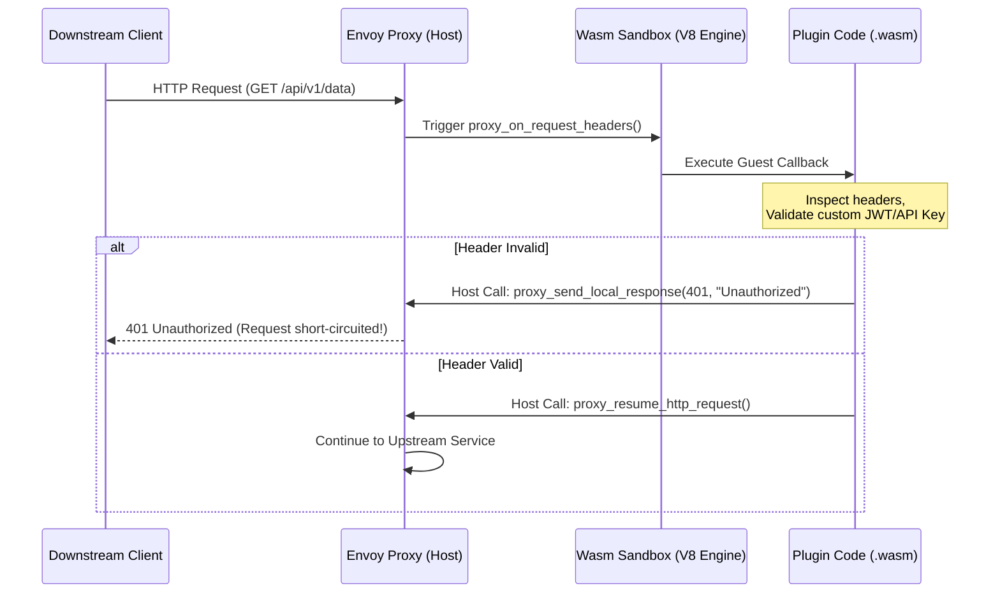

# 18.3 Extending Istio with Envoy WebAssembly (WasmPlugins)

As organizations scale their microservices on Istio, they often encounter specialized operational requirements that outgrow built-in mesh capabilities. These include custom security header validation, proprietary legacy authentication protocols, dynamic payload transformation, API rate-limiting against enterprise databases, or custom telemetry collection.

Traditionally, extending Envoy required writing custom C++ filters, compiling custom Envoy binaries, and maintaining fork pipelines—an approach that is slow, error-prone, and risky. 

**WebAssembly (Wasm)** changes this completely. Istio's `WasmPlugin` API allows developers to compile custom extension logic written in Rust, Go, C++, or Zig into sandboxed WebAssembly binaries, distribution via standard OCI container registries, and dynamically loading them into Envoy sidecars at runtime **without restarting proxies or recompiling Envoy**.

---

## 1. Evolution of Envoy Extensibility: C++ vs. Lua vs. Wasm

Understanding why Wasm exists requires comparing it against historical Envoy extension mechanisms:

```
┌────────────────────────────────────────────────────────────────────────┐
│ Envoy Proxy Architecture                                               │
│                                                                        │
│   Incoming TCP Stream                                                  │
│         │                                                              │
│         ▼                                                              │
│   ┌────────────────────────────────────────────────────────────────┐   │
│   │ Downstream Filter Chain                                        │   │
│   │  ├── Network Filters (L4): TLS Inspector, TCP Proxy             │   │
│   │  └── HTTP Connection Manager (L7)                              │   │
│   │       ├── Router Filter                                        │   │
│   │       ├── Istio AuthN / AuthZ Filters                          │   │
│   │       └── ┌──────────────────────────────────────────────┐     │   │
│   │           │ Envoy Wasm Filter Engine (Proxy-Wasm)        │     │   │
│   │           │   ┌──────────────────────────────────────┐   │     │   │
│   │           │   │ V8 / WAVM / Wasmtime Sandbox         │   │     │   │
│   │           │   │  └── Your Custom Plugin (.wasm)      │   │     │   │
│   │           │   └──────────────────────────────────────┘   │     │   │
│   │           └──────────────────────────────────────────────┘     │   │
│   └────────────────────────────────────────────────────────────────┘   │
└────────────────────────────────────────────────────────────────────────┘
```

| Metric / Mechanism | Native C++ Envoy Filter | Lua Scripting Filter | Wasm Filter (`WasmPlugin`) |
| :--- | :--- | :--- | :--- |
| **Development Language** | C++17 / C++20 | Lua | Rust, Go (TinyGo), C++, AssemblyScript, Zig |
| **Compilation Requirement** | Recompile full Envoy binary | Script injected into YAML | Compile code to portable `.wasm` binary |
| **Deployment Model** | Re-deploy full DaemonSet/Sidecar | Update Istio `EnvoyFilter` | OCI Registry (`oci://...`) pull at runtime |
| **Isolation & Safety** | ❌ **None.** C++ segfault crashes Envoy process! | ⚠️ Limited memory safety | ✅ **Memory-Safe Sandbox.** Plugin crash is contained. |
| **Performance** | ⚡ **Highest** (Native CPU instructions) | 🐌 Slow (Interpreted script) | ⚡ **Near-Native** (JIT compiled via V8/Wasmtime) |
| **Lifecycle Impact** | Requires proxy pod restart | Dynamic apply | Dynamic hot-reload without proxy restart |

---

## 2. Under the Hood: The Proxy-Wasm Specification & Runtime Mechanics

WebAssembly was originally designed for web browsers. To make Wasm work inside Envoy and other edge proxies, the community established the **Proxy-Wasm Application Binary Interface (ABI) Specification**.

### 2.1 Proxy-Wasm ABI Architecture
The Proxy-Wasm ABI defines a standardized set of host functions and callbacks that allow the Wasm guest binary to interact with Envoy's memory and request processing pipeline:



* **Host Calls (Envoy -> Wasm):** Functions Envoy invokes inside the Wasm plugin based on request lifecycle events (e.g., `onRequestHeaders()`, `onRequestBody()`, `onResponseHeaders()`, `onTick()`).
* **Guest Calls (Wasm -> Envoy):** Functions the Wasm plugin calls back into Envoy to read/write request headers, manipulate body bytes, query metadata, or initiate outbound HTTP calls (e.g., `getHeader()`, `addHeader()`, `sendLocalResponse()`).

### 2.2 Memory Isolation & Safety
Each `WasmPlugin` runs inside its own isolated **V8 or Wasmtime Virtual Machine (VM)** memory sandbox.
* If a Wasm plugin encounters a panic or memory out-of-bounds error, the V8 engine catches the exception and restarts the VM.
* **The main Envoy process continues running safely**, preserving connectivity for all other concurrent requests!

---

## 3. The `WasmPlugin` Custom Resource Manifest Breakdown

Istio provides a dedicated `WasmPlugin` API in the `extensions.istio.io/v1alpha1` group to manage the deployment, OCI image distribution, execution ordering, and configuration of Wasm plugins.

```yaml
apiVersion: extensions.istio.io/v1alpha1
kind: WasmPlugin
metadata:
  name: rate-limit-auth-plugin
  namespace: istio-system
spec:
  selector:
    matchLabels:
      app: backend-api
  url: oci://registry.example.com/wasm/auth-filter:v1.2.0
  imagePullPolicy: IfNotPresent
  imagePullSecret: regcred
  phase: AUTHN
  priority: 10
  type: HTTP
  match:
    - mode: SERVER
      ports:
        - number: 8080
  pluginConfig:
    max_requests_per_minute: 1000
    allowed_roles:
      - admin
      - service
  vmConfig:
    env:
      - name: POD_NAME
        valueFrom: HOST
```

### Key Field Deep Dive

| Field Name | Type / Values | Description & Under-the-Hood Role |
| :--- | :--- | :--- |
| **`url`** | `oci://...` or `https://...` | Location of the `.wasm` file. Istio supports pulling `.wasm` binaries packaged as OCI container images directly from registries (Harbor, Docker Hub, ECR). |
| **`imagePullSecret`** | `string` | Secret containing credentials to authenticate against private OCI container registries. |
| **`phase`** | `AUTHN`, `AUTHZ`, `STATS`, `UNSPECIFIED_PHASE` | Determines **WHERE** in Envoy's HTTP filter chain this plugin is injected relative to built-in Istio filters. |
| **`priority`** | `integer` (Default: `0`) | Controls execution order when **multiple** WasmPlugins are assigned to the same `phase`. Higher priority values execute first. |
| **`type`** | `HTTP` or `NETWORK` | `HTTP` (L7 filter processing HTTP headers/body) or `NETWORK` (L4 filter processing raw TCP byte streams). |
| **`match`** | `mode`, `ports` | Filters traffic direction: `CLIENT` (outbound traffic), `SERVER` (inbound traffic), or `CLIENT_AND_SERVER`. Can also restrict enforcement to specific target ports. |
| **`pluginConfig`** | `JSON / Struct` | Dynamic JSON/YAML configuration passed into the plugin's `onPluginStart()` callback. Allows tuning plugin behavior without recompiling the Wasm binary! |
| **`vmConfig`** | `Struct` | Environmental configuration injected into the V8 Wasm Sandbox environment upon proxy initialization. |

---

## 4. Execution Ordering: Filter Phases & Priorities

In Envoy, the order in which filters execute is critical for security and performance. Istio divides the L7 HTTP filter execution pipeline into 4 distinct **Phases**:

```
Request Direction: Downstream Client ──────────────────────────────────────────► Upstream App
                                                                                 │
┌─────────────────────────────────────────────────────────────────────────────┐  │
│ Envoy HTTP Filter Pipeline                                                  │  │
│                                                                             │  │
│  ┌──────────────────┐   ┌──────────────────┐   ┌──────────────────┐         │  │
│  │ 1. AUTHN Phase   │   │ 2. AUTHZ Phase   │   │ 3. STATS Phase   │         │  │
│  │ (Pre-Auth)       │   │ (Post-Auth)      │   │ (Telemetry)      │         │  │
│  ├──────────────────┤   ├──────────────────┤   ├──────────────────┤         │  │
│  │ WasmPlugins      │   │ Istio AuthZ      │   │ Istio Telemetry  │         │  │
│  │ (phase: AUTHN)   │   │ Policy Filter    │   │ Stats Filter     │         │  │
│  │                  │   │                  │   │                  │         │  │
│  │ Istio mTLS / JWT │   │ WasmPlugins      │   │ WasmPlugins      │         │  │
│  │ AuthN Filters    │   │ (phase: AUTHZ)   │   │ (phase: STATS)   │         │  │
│  └────────┬─────────┘   └────────┬─────────┘   └────────┬─────────┘         │  │
│           │                      │                      │                   │  │
│           ▼                      ▼                      ▼                   │  │
│  ┌──────────────────────────────────────────────────────────────────────┐   │  │
│  │ 4. UNSPECIFIED_PHASE (Default: Injected right before Router Filter)  │   │  │
│  └──────────────────────────────────────────────────────────────────────┘   │  │
└─────────────────────────────────────────────────────────────────────────────┘  │
                                                                                 │
Response Direction: Downstream Client ◄──────────────────────────────────────────┘
```

1. **`AUTHN` (Authentication Phase):**
   * Executes **BEFORE** Istio's built-in mTLS and RequestAuthentication (JWT) filters.
   * **Use Case:** Custom API key validation, signature verification, or extracting legacy auth tokens before Istio validates JWTs.
2. **`AUTHZ` (Authorization Phase):**
   * Executes **AFTER** Istio Authentication filters, but **BEFORE** Istio AuthorizationPolicies.
   * **Use Case:** Custom RBAC checks, fetching user claims from external LDAP/OPA systems.
3. **`STATS` (Stats & Observability Phase):**
   * Executes alongside Istio's telemetry reporting filter.
   * **Use Case:** Injecting custom Prometheus metrics, masking sensitive fields in access logs, or distributed tracing enrichment.
4. **`UNSPECIFIED_PHASE` (Default):**
   * Placed at the very end of the filter chain, immediately before traffic is handed to Envoy's `Router` filter to be sent upstream.
   * **Use Case:** Dynamic payload transformation, response body enrichment, header manipulation.

---

## 5. Ecosystem & Famous Open-Source Wasm Plugins to Study

When building production API platforms on Istio, you do not always need to write Wasm plugins from scratch. A rich open-source ecosystem exists:

```
┌────────────────────────────────────────────────────────────────────────┐
│ FAMOUS WASM PLUGIN ECOSYSTEM FOR ISTIO                                 │
└──────────────────────────────────┬─────────────────────────────────────┘
                                   │
      ┌────────────────────────────┼────────────────────────────┐
      ▼                            ▼                            ▼
┌──────────────┐             ┌──────────────┐            ┌──────────────┐
│ Coraza Wasm  │             │ Envoy OPA    │             │  Coraza /    │
│    WAF       │             │ (Open Policy)│             │ Rate-Limit   │
├──────────────┤             ├──────────────┤            ├──────────────┤
│ OWASP Core   │             │ Evaluates    │            │ Token Bucket │
│ Rule Set     │             │ Rego policies│            │ Local/Redis  │
│ SQLi/XSS Prot│             │ inside proxy │            │ Enforcement  │
└──────────────┘             └──────────────┘            └──────────────┘
```

### 5.1 Coraza Wasm WAF (Web Application Firewall)
* **What it is:** An enterprise-grade, OWASP-compliant Web Application Firewall compiled to WebAssembly for Envoy.
* **Why study it:** It executes OWASP Core Rule Sets (CRS) directly inside sidecars to block SQL Injection (SQLi), Cross-Site Scripting (XSS), and Remote Code Execution (RCE) at the sidecar perimeter before traffic reaches the container application!
* **GitHub:** `github.com/corazawaf/coraza-proxy-wasm`

### 5.2 OPA (Open Policy Agent) Proxy-Wasm
* **What it is:** Compiles Open Policy Agent (OPA) Rego policy decision trees directly into WebAssembly binaries.
* **Why study it:** Allows Envoy proxies to evaluate complex, fine-grained authorization rules locally in sub-millisecond execution times without making remote RPC calls to an external OPA server.
* **GitHub:** `github.com/open-policy-agent/opa`

### 5.3 ModSecurity / Header Transformation Plugins
* **What it is:** Lightweight plugins for sanitizing input headers, stripping internal tracing tokens, or calculating HMAC request signatures.

---

## 6. Hands-On Guide: Writing, Packaging & Deploying a WasmPlugin

Here is the step-by-step workflow to create a custom WasmPlugin in Rust using the `proxy-wasm-rust-sdk`.

### Step 1: Write the Rust Plugin Logic (`lib.rs`)
Initialize a Rust project and add `proxy-wasm` to `Cargo.toml`:

```rust
use proxy_wasm::traits::*;
use proxy_wasm::types::*;

proxy_wasm::main! {{
    proxy_wasm::set_log_level(LogLevel::Trace);
    proxy_wasm::set_root_factory(|_| -> Box<dyn RootContext> { Box::new(HeaderFilterRoot) });
}}

struct HeaderFilterRoot;
impl Context for HeaderFilterRoot {}
impl RootContext for HeaderFilterRoot {
    fn create_http_context(&self, _context_id: u32) -> Box<dyn HttpContext> {
        Box::new(HeaderFilter)
    }
}

struct HeaderFilter;
impl Context for HeaderFilter {}
impl HttpContext for HeaderFilter {
    fn on_http_request_headers(&mut self, _: usize, _: bool) -> Action {
        // Inject a custom header into the incoming request
        self.add_http_request_header("x-added-by-wasm", "istio-wasm-v1");
        
        // Read authorization header
        if let Some(auth_header) = self.get_http_request_header("authorization") {
            if auth_header.starts_with("Bearer secret-token") {
                return Action::Continue;
            }
        }

        // Short-circuit request if token is missing/invalid
        self.send_local_response(403, "Forbidden", vec![], Some(b"Invalid Security Token\n"));
        Action::Pause
    }
}
```

### Step 2: Compile to `.wasm` Target
```bash
# Add WebAssembly target to Rust toolchain
rustup target add wasm32-wasip1

# Compile release binary
cargo build --target wasm32-wasip1 --release
# Output: target/wasm32-wasip1/release/my_plugin.wasm
```

### Step 3: Package as OCI Image using Docker/Buildah
Create a `Dockerfile` to package the `.wasm` file into a scratch OCI container image:

```dockerfile
FROM scratch
COPY target/wasm32-wasip1/release/my_plugin.wasm /plugin.wasm
```

Build and push the image to your private container registry:

```bash
docker build -t private-registry.example.com/wasm/header-filter:v1.0.0 .
docker push private-registry.example.com/wasm/header-filter:v1.0.0
```

### Step 4: Deploy the `WasmPlugin` CRD in Istio
Create the Kubernetes manifest to apply the plugin to your backend workloads:

```yaml
apiVersion: extensions.istio.io/v1alpha1
kind: WasmPlugin
metadata:
  name: header-security-filter
  namespace: default
spec:
  selector:
    matchLabels:
      app: backend-service
  url: oci://private-registry.example.com/wasm/header-filter:v1.0.0
  imagePullPolicy: IfNotPresent
  phase: AUTHN
  priority: 100
```

Apply the manifest:
```bash
kubectl apply -f wasm-plugin.yaml
```

---

## 7. Operational & Troubleshooting Mechanics

When a `WasmPlugin` CRD is applied, Istio sidecars perform the following internal steps:

1. **OCI Image Pulling:** The `pilot-agent` process running inside the sidecar pod detects the new `WasmPlugin` configuration. It connects to `private-registry.example.com`, downloads the OCI image layer, and extracts `plugin.wasm` into a local container cache (`/var/lib/istio/data/`).
2. **V8 Compilation:** Envoy's internal V8 engine loads `plugin.wasm` and compiles it into JIT machine code.
3. **Hot-Reload:** Envoy atomically updates its active HTTP filter chain. **Zero existing TCP connections are dropped.**
4. **Verification Commands:**
   Inspect proxy configuration using `istioctl`:

   ```bash
   # Verify if Wasm module is loaded in Envoy
   istioctl proxy-config cluster <pod-name> -o json | grep -i wasm

   # Inspect Wasm execution logs from sidecar container
   kubectl logs <pod-name> -c istio-proxy | grep -i "wasm"
   ```
