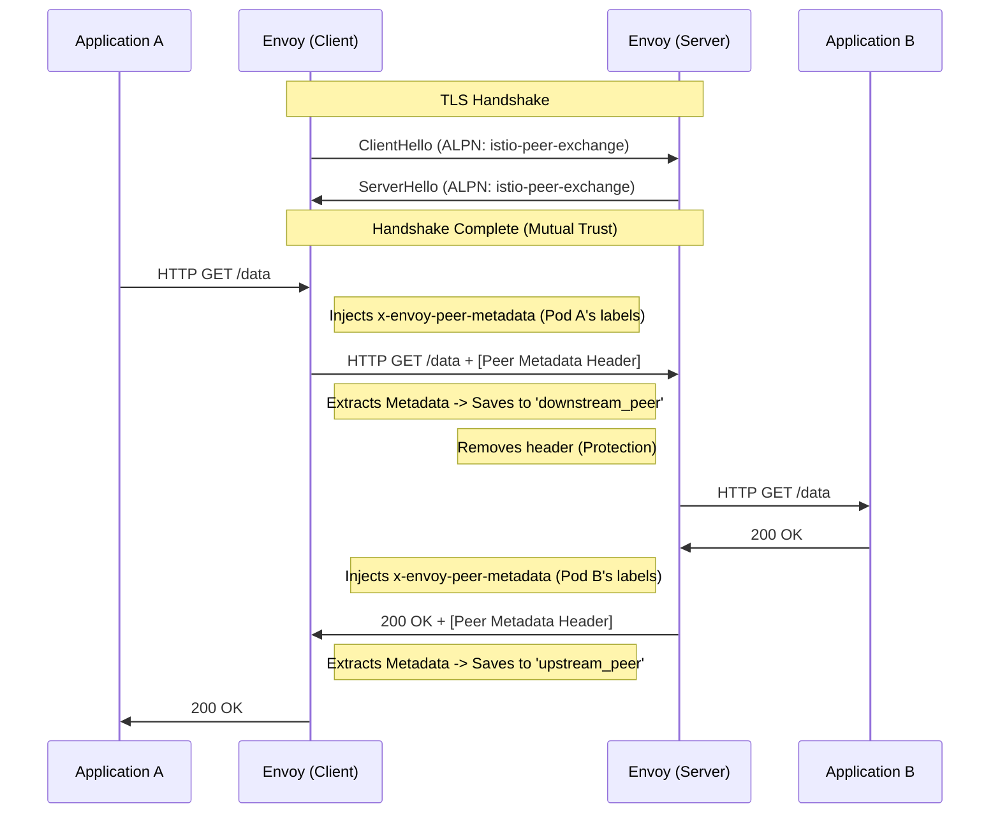

# Appendix: ALPN and the "Istio Business Card" Exchange

How do two Envoys know who they are talking to before a single byte of application data is sent? The secret is **ALPN (Application-Layer Protocol Negotiation)**.

---

## 1. What is ALPN?
In standard TLS (HTTPS), ALPN is an extension that allows the client and server to agree on a protocol (like `http/1.1` or `h2`) during the **handshake**.

Istio "hijacks" this mechanism. Instead of just saying "I speak HTTP/2," Istio proxies say:
> "I speak HTTP/2 **AND** I am an Istio Peer capable of exchanging metadata."

### 1.1 The Network Layer (Where does this live?)
*   **TLS/mTLS (Layer 4):** The Handshake happens here. It establishes the "tunnel."
*   **ALPN (The TLS Extension):** This is a small field *inside* the TLS Handshake. It is not an HTTP header; it is an "advertisement" sent before the encryption is even finished or HTTP starts.
*   **HTTP/2 / HTTP/1.1 (Layer 7):** This is the application data inside the tunnel.
*   **`x-envoy-peer-metadata` (Layer 7):** This is a **real HTTP Header**. It is sent *after* the TLS handshake is successful and the encrypted tunnel is open.

---

## 2. The "Handshake" vs. The "Header"
It is critical to separate these two steps:

| Feature | Stage | Format | Example |
| :--- | :--- | :--- | :--- |
| **ALPN** | TLS Handshake (L4) | List of Strings | `[istio-peer-exchange, h2, http/1.1]` |
| **SNI** | TLS Handshake (L4) | Single String | `outbound_.80._.myapp.ns.svc.cluster.local` |
| **Peer Metadata** | Request (L7) | HTTP Header | `x-envoy-peer-metadata: <base64-blob>` |

### How they work together:
1.  **Envoy A** sends `ClientHello`. It includes **ALPN** (a list of what it likes) and **SNI** (the name of the server it wants to talk to).
2.  **Envoy B** receives it. It has been "programmed" by Istiod (the Control Plane) to recognize `istio-peer-exchange`.
3.  **Agreement:** If Envoy B picks `istio-peer-exchange`, the two Envoys have a "gentleman's agreement" that they will now look for the `x-envoy-peer-metadata` header in the next step.

---

## 3. Security: Can an Internet Server "Hijack" my metadata?

The user asks: *"What if I'm communicating with an untrusted server, can it pick istio-peer-exchange to get my metadata?"*

The answer is **NO**, because of two layers of protection:

### A. Mutual TLS (mTLS) Trust
Istio proxies are configured to only perform Metadata Exchange if they are in **mTLS mode**.
*   In mTLS, the Client Envoy checks the Server's certificate against the **Mesh Root CA**.
*   An internet server (like Google) has a certificate signed by a public CA (like DigiCert), not your Istio Root CA.
*   The Client Envoy will realize: *"This is a public server, I will downgrade to standard TLS and disable the Istio-Peer features."*

### B. ALPN Selection is not enough
Even if a malicious server simulated the `istio-peer-exchange` string, the Client Envoy is smart:
1.  It checks if the connection is **mTLS (Mutual)**.
2.  It checks if the identity in the server certificate is a **Spiffe ID** from the same mesh.
3.  If any of these fail, it **never** sends the `x-envoy-peer-metadata` header.

### 4. What is "h2"?
`h2` is the ALPN identifier for **HTTP/2**. 
*   **HTTP/1.1** is bulky and opens many connections.
*   **HTTP/2 (h2)** is fast, multiplexed (many requests over 1 connection), and is the **default language of Istio**.
*   When Envoy and Google talk, they see they both support `h2` and they use that.

---

## 5. Who does the work? (Envoy vs. Istio)
You are exactly right:
*   **Envoy** is the "Soldier": It does the actual TCP/TLS handshake, attaches headers, and moves bytes.
*   **Istio (Istiod)** is the "General": It calculates the configuration. It tells Envoy: *"If you see a connection to this IP, add 'istio-peer-exchange' to your ALPN list and check for mTLS."*

---

## 4. Visualizing the Exchange

---

## 5. How Istio "Injects" this into Envoy
You might wonder: *Who tells Envoy what to put in that ALPN string?*

1.  **The `pilot-agent`**: When the sidecar starts, a small process called `pilot-agent` runs alongside Envoy.
2.  **The Environment**: `pilot-agent` reads the Pod's metadata (from `/etc/podinfo` or the API).
3.  **Bootstrap**: It generates the initial Envoy config (Bootstrap) that includes these metadata attributes.
4.  **XDS**: Istio (Control Plane) sends the "Clusters" and "Listeners" config to Envoy, explicitly adding `istio-peer-exchange` to the TLS contexts.

## 6. What happens without ALPN?
If you talk to an external website (e.g., `google.com`):
1.  Envoy A sends `istio-peer-exchange`.
2.  Google’s server has no idea what that is. It picks `h2`.
3.  Envoy A realizes: *"This is not an Istio peer. I will NOT send my metadata card."*
4.  **Result:** Your `upstream_peer` metrics will be empty for all external traffic. This is a security feature (you don't want to leak your internal pod labels to the internet!).
